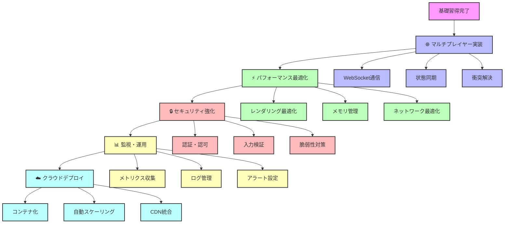

# 🚀 Advanced Topics - 上級開発者向けガイド

## 🎯 上級学習目標

**プロダクション品質のゲーム開発**: 企業レベルの技術スタンダード達成

- ✅ **大規模マルチプレイヤー対応** - 数百人同時接続
- ✅ **高可用性システム設計** - 99.9%稼働率
- ✅ **パフォーマンス最適化** - 60FPS安定動作
- ✅ **セキュリティ対策** - 企業レベルの安全性
- ✅ **監視・運用基盤** - DevOps完全対応

## 🗺️ 学習ロードマップ

## 📚 チュートリアル一覧

### 🌐 ネットワーキング・マルチプレイヤー

#### [マルチプレイヤー実装ガイド](./multiplayer-implementation-guide.md)
**難易度**: 上級 | **所要時間**: 6-8時間

リアルタイムマルチプレイヤー機能の完全実装。WebSocket、状態同期、コンフリクト解決を含む包括的ガイド。

**学習内容**:
- WebSocketサーバー・クライアント構築
- リアルタイム状態同期システム
- クライアント側予測とサーバー調整
- パケット順序保証と重複排除
- 負荷分散とスケーリング戦略

### ⚡ パフォーマンス最適化

#### レンダリング最適化マスタリング（準備中）
**難易度**: 上級 | **所要時間**: 4-6時間

Three.jsとWebGLを活用した高性能3Dレンダリングの実装。

**予定内容**:
- フラスタムカリング実装
- レベル・オブ・ディテール（LOD）システム
- インスタンス化レンダリング
- シェーダー最適化
- GPU並列処理活用

#### メモリ管理とGC最適化（準備中）
**難易度**: 上級 | **所要時間**: 3-4時間

JavaScript/TypeScriptにおけるメモリ効率的なプログラミング。

**予定内容**:
- ガベージコレクション最適化
- メモリプール管理
- WeakMap/WeakSet活用
- メモリリーク検出・修正
- プロファイリング手法

### 🔒 セキュリティ・信頼性

#### ゲームセキュリティ実装（準備中）
**難易度**: 上級 | **所要時間**: 5-6時間

セキュアなゲーム開発のベストプラクティス。

**予定内容**:
- JWT認証・認可システム
- レート制限・DDoS対策
- 入力検証・サニタイゼーション
- チート対策・整合性チェック
- OWASP対応セキュリティ監査

### 📊 監視・運用・DevOps

#### プロダクション監視システム（準備中）
**難易度**: 上級 | **所要時間**: 4-5時間

本格的な運用監視基盤の構築。

**予定内容**:
- Prometheus + Grafanaによるメトリクス監視
- 構造化ログとログ集約
- ヘルスチェック・アラート設計
- パフォーマンス分析・ボトルネック特定
- インシデント対応フロー

### ☁️ クラウド・インフラストラクチャ

#### AWS/Vercelデプロイメント戦略（準備中）
**難易度**: 上級 | **所要時間**: 6-8時間

スケーラブルなクラウドインフラの設計・実装。

**予定内容**:
- Docker化とコンテナオーケストレーション
- CDN統合とエッジコンピューティング
- オートスケーリング設定
- データベース分散・レプリケーション
- CI/CDパイプライン構築

## 🛠️ 実践プロジェクト

### プロダクション品質Minecraft Clone開発

上級チュートリアルの集大成として、以下の要件を満たすフル機能Minecraft Cloneを開発：

**技術要件**:
- [ ] 50人以上の同時接続対応
- [ ] 60FPS安定動作（4K解像度対応）
- [ ] リアルタイム音声チャット統合
- [ ] プラグインシステム実装
- [ ] モバイル対応（レスポンシブデザイン）

**運用要件**:
- [ ] 99.9%稼働率達成
- [ ] 平均レスポンス時間50ms以下
- [ ] 完全自動デプロイメント
- [ ] 24/7監視・アラート対応
- [ ] セキュリティ脆弱性0件

## 💡 学習戦略

### 効率的な上級スキル習得法

1. **実践ファースト**: 理論より実装を優先
2. **プロダクション意識**: 常に本番環境を想定
3. **メトリクス駆動**: データに基づく意思決定
4. **コミュニティ活用**: オープンソース貢献

### 推奨学習リソース

**書籍**:
- "Real-Time Rendering, Fourth Edition"
- "Designing Data-Intensive Applications"
- "Building Microservices"

**オンラインコース**:
- AWS Solutions Architect Professional
- Google Cloud Professional Cloud Architect
- Kubernetes Certified Application Developer

**コミュニティ**:
- Game Development Stack Exchange
- WebGL/Three.js Discord
- Effect-TS Community

## 📋 スキル評価チェックリスト

### システムアーキテクチャ（必須）
- [ ] マイクロサービス設計ができる
- [ ] 負荷分散・フェイルオーバー設計ができる
- [ ] データベース設計・最適化ができる
- [ ] キャッシュ戦略を適切に選択できる

### パフォーマンスエンジニアリング（必須）
- [ ] プロファイリングツールを使いこなせる
- [ ] ボトルネック特定・改善ができる
- [ ] メモリ使用量を最適化できる
- [ ] ネットワーク帯域を効率活用できる

### 運用・監視（推奨）
- [ ] 監視システムを設計・構築できる
- [ ] インシデント対応フローを構築できる
- [ ] 自動テスト・デプロイを構築できる
- [ ] セキュリティ監査を実施できる

### リーダーシップ（上級）
- [ ] 技術的な意思決定ができる
- [ ] チームの技術レビューを主導できる
- [ ] アーキテクチャ設計を他者に説明できる
- [ ] 技術的負債の管理ができる

## 🚀 次のステップ

上級チュートリアルを完了したら：

1. **オープンソース貢献**: Effect-TS、Three.jsなどへの貢献
2. **技術ブログ執筆**: 学習内容を記事として発信
3. **カンファレンス発表**: 技術コミュニティでの知見共有
4. **メンタリング**: 後輩開発者の指導・支援

---

**🎯 Advanced Learning Goal**: 企業で技術リードを務められるレベルの実装力と設計力を習得 ✅