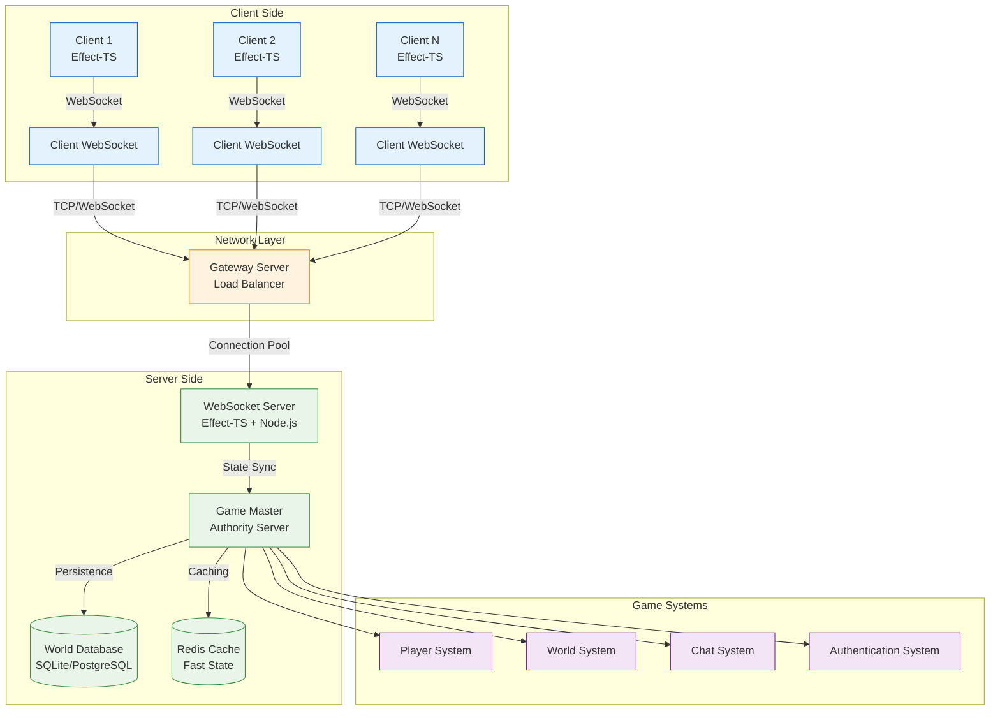

# 🌐 マルチプレイヤー実装ガイド - リアルタイム同期とネットワーキング

## 🎯 実装目標

**プロダクション品質のマルチプレイヤー機能**: 最大32人同時接続対応

- ✅ リアルタイム双方向通信（WebSocket）
- ✅ 状態同期とコンフリクト解決
- ✅ 低遅延（<50ms）のプレイヤー移動
- ✅ スケーラブルなサーバーアーキテクチャ
- ✅ 堅牢なエラーハンドリングと再接続

## 📊 アーキテクチャ概観



## 🚀 Phase 1: WebSocket基盤構築（2時間）

### サーバーサイド実装

```typescript
// [SERVER] src/server/WebSocketServer.ts
import { Effect, Layer, Context, Schema } from "effect"
import { WebSocketServer } from "ws"
import { Server } from "http"

// WebSocket接続の型定義
export const ClientConnection = Schema.Struct({
  id: Schema.String.pipe(Schema.brand("ConnectionId")),
  playerId: Schema.optional(Schema.String.pipe(Schema.brand("PlayerId"))),
  socket: Schema.Unknown, // WebSocket インスタンス
  lastHeartbeat: Schema.Date,
  authenticated: Schema.Boolean
})

export type ClientConnection = Schema.Schema.Type<typeof ClientConnection>

// WebSocketサービスインターフェース
export interface WebSocketService {
  readonly startServer: (port: number) => Effect.Effect<void, ServerError>
  readonly broadcastToAll: (message: GameMessage) => Effect.Effect<void, NetworkError>
  readonly sendToPlayer: (playerId: string, message: GameMessage) => Effect.Effect<void, NetworkError>
  readonly getConnectionCount: () => Effect.Effect<number, never>
  readonly authenticate: (connectionId: string, token: string) => Effect.Effect<void, AuthError>
}

// ゲームメッセージの型定義
export const GameMessage = Schema.Union(
  Schema.Struct({
    type: Schema.Literal("player_move"),
    playerId: Schema.String,
    position: Schema.Struct({
      x: Schema.Number,
      y: Schema.Number,
      z: Schema.Number
    }),
    velocity: Schema.Struct({
      x: Schema.Number,
      y: Schema.Number,
      z: Schema.Number
    }),
    timestamp: Schema.Number
  }),
  Schema.Struct({
    type: Schema.Literal("block_update"),
    position: Schema.Struct({
      x: Schema.Number.pipe(Schema.int()),
      y: Schema.Number.pipe(Schema.int()),
      z: Schema.Number.pipe(Schema.int())
    }),
    blockType: Schema.String,
    playerId: Schema.String,
    timestamp: Schema.Number
  }),
  Schema.Struct({
    type: Schema.Literal("chat_message"),
    playerId: Schema.String,
    message: Schema.String.pipe(Schema.maxLength(200)),
    timestamp: Schema.Number
  }),
  Schema.Struct({
    type: Schema.Literal("heartbeat"),
    timestamp: Schema.Number
  })
)

export type GameMessage = Schema.Schema.Type<typeof GameMessage>

// WebSocketサーバー実装
const makeWebSocketService = Effect.gen(function* () {
  const connections = new Map<string, ClientConnection>()
  let server: WebSocketServer | null = null

  // ユニークID生成
  const generateConnectionId = (): string =>
    `conn_${Date.now()}_${Math.random().toString(36).substring(2)}`

  // メッセージの検証とパース
  const parseMessage = (raw: string): Effect.Effect<GameMessage, ParseError> =>
    Effect.gen(function* () {
      try {
        const parsed = JSON.parse(raw)
        return yield* Schema.decodeUnknown(GameMessage)(parsed)
      } catch (error) {
        return yield* Effect.fail(new ParseError({
          message: "Invalid message format",
          raw,
          error: String(error)
        }))
      }
    })

  // クライアント接続処理
  const handleConnection = (ws: WebSocket): Effect.Effect<void, never> =>
    Effect.gen(function* () {
      const connectionId = generateConnectionId()
      const connection: ClientConnection = {
        id: connectionId as any,
        socket: ws,
        lastHeartbeat: new Date(),
        authenticated: false
      }

      connections.set(connectionId, connection)
      console.log(`🔌 新しい接続: ${connectionId} (合計: ${connections.size})`)

      // WebSocketイベントハンドラー設定
      ws.on('message', (data: Buffer) => {
        Effect.runPromise(
          handleMessage(connectionId, data.toString()).pipe(
            Effect.catchAll((error) =>
              Effect.sync(() => console.error(`メッセージエラー [${connectionId}]:`, error))
            )
          )
        )
      })

      ws.on('close', () => {
        Effect.runSync(handleDisconnection(connectionId))
      })

      ws.on('error', (error) => {
        console.error(`WebSocketエラー [${connectionId}]:`, error)
        Effect.runSync(handleDisconnection(connectionId))
      })

      // ハートビート開始
      yield* startHeartbeat(connectionId)
    })

  // メッセージ処理
  const handleMessage = (connectionId: string, rawMessage: string): Effect.Effect<void, MessageError> =>
    Effect.gen(function* () {
      const connection = connections.get(connectionId)
      if (!connection) {
        return yield* Effect.fail(new MessageError({
          reason: "Connection not found",
          connectionId
        }))
      }

      const message = yield* parseMessage(rawMessage)

      // ハートビート更新
      connection.lastHeartbeat = new Date()

      // メッセージタイプ別処理
      switch (message.type) {
        case "player_move":
          yield* handlePlayerMove(connection, message)
          break
        case "block_update":
          yield* handleBlockUpdate(connection, message)
          break
        case "chat_message":
          yield* handleChatMessage(connection, message)
          break
        case "heartbeat":
          // ハートビートレスポンス
          yield* sendToConnection(connectionId, {
            type: "heartbeat",
            timestamp: Date.now()
          })
          break
      }
    })

  // プレイヤー移動処理
  const handlePlayerMove = (
    connection: ClientConnection,
    message: Extract<GameMessage, { type: "player_move" }>
  ): Effect.Effect<void, GameError> =>
    Effect.gen(function* () {
      if (!connection.authenticated || !connection.playerId) {
        return yield* Effect.fail(new GameError({
          reason: "Player not authenticated"
        }))
      }

      // サーバー側で移動検証
      const isValidMove = yield* validatePlayerMove(
        connection.playerId,
        message.position,
        message.velocity
      )

      if (!isValidMove) {
        return yield* Effect.fail(new GameError({
          reason: "Invalid player move"
        }))
      }

      // 他のプレイヤーに同期
      const syncMessage = {
        ...message,
        timestamp: Date.now() // サーバータイムスタンプで上書き
      }

      yield* broadcastToOthers(connection.id, syncMessage)

      // プレイヤー状態をデータベースに保存（非同期）
      Effect.runFork(
        savePlayerPosition(connection.playerId, message.position)
      )
    })

  // ブロック更新処理
  const handleBlockUpdate = (
    connection: ClientConnection,
    message: Extract<GameMessage, { type: "block_update" }>
  ): Effect.Effect<void, GameError> =>
    Effect.gen(function* () {
      if (!connection.authenticated || !connection.playerId) {
        return yield* Effect.fail(new GameError({
          reason: "Player not authenticated"
        }))
      }

      // ブロック更新の妥当性検証
      const isValidUpdate = yield* validateBlockUpdate(
        connection.playerId,
        message.position,
        message.blockType
      )

      if (!isValidUpdate) {
        return yield* Effect.fail(new GameError({
          reason: "Invalid block update"
        }))
      }

      // ワールド状態を更新
      yield* updateWorldBlock(message.position, message.blockType, connection.playerId)

      // 全プレイヤーに同期
      const syncMessage = {
        ...message,
        timestamp: Date.now()
      }

      yield* broadcastToAll(syncMessage)
    })

  // 接続終了処理
  const handleDisconnection = (connectionId: string): Effect.Effect<void, never> =>
    Effect.gen(function* () {
      const connection = connections.get(connectionId)
      if (connection) {
        connections.delete(connectionId)
        console.log(`🔌 接続終了: ${connectionId} (残り: ${connections.size})`)

        // 他のプレイヤーに離脱通知
        if (connection.playerId) {
          yield* broadcastToAll({
            type: "player_disconnect",
            playerId: connection.playerId,
            timestamp: Date.now()
          } as any)
        }
      }
    })

  // ハートビート管理
  const startHeartbeat = (connectionId: string): Effect.Effect<void, never> =>
    Effect.gen(function* () {
      const heartbeatInterval = 30000 // 30秒

      const checkHeartbeat = Effect.gen(function* () {
        const connection = connections.get(connectionId)
        if (!connection) return

        const now = Date.now()
        const lastHeartbeat = connection.lastHeartbeat.getTime()

        if (now - lastHeartbeat > heartbeatInterval * 2) {
          // ハートビートタイムアウト
          console.log(`💓 ハートビートタイムアウト: ${connectionId}`)
          yield* handleDisconnection(connectionId)
        }
      })

      // 定期的なハートビートチェック
      Effect.runFork(
        Effect.repeat(
          checkHeartbeat,
          Schedule.spaced(Duration.seconds(heartbeatInterval))
        )
      )
    })

  return WebSocketService.of({
    startServer: (port) =>
      Effect.gen(function* () {
        const httpServer = new Server()
        server = new WebSocketServer({ server: httpServer })

        server.on('connection', (ws) => {
          Effect.runPromise(handleConnection(ws))
        })

        yield* Effect.async<void, ServerError>((resume) => {
          httpServer.listen(port, () => {
            console.log(`🌐 WebSocketサーバーが起動しました: ws://localhost:${port}`)
            resume(Effect.void)
          })

          httpServer.on('error', (error) => {
            resume(Effect.fail(new ServerError({
              message: "Server startup failed",
              error: String(error)
            })))
          })
        })
      }),

    broadcastToAll: (message) =>
      Effect.gen(function* () {
        const messageString = JSON.stringify(message)
        const promises: Promise<void>[] = []

        for (const [_, connection] of connections) {
          if (connection.authenticated) {
            promises.push(
              new Promise((resolve, reject) => {
                try {
                  (connection.socket as any).send(messageString, (error?: Error) => {
                    if (error) reject(error)
                    else resolve()
                  })
                } catch (error) {
                  reject(error)
                }
              })
            )
          }
        }

        yield* Effect.tryPromise({
          try: () => Promise.all(promises),
          catch: (error) => new NetworkError({
            message: "Broadcast failed",
            error: String(error)
          })
        })
      }),

    sendToPlayer: (playerId, message) =>
      Effect.gen(function* () {
        const connection = Array.from(connections.values()).find(
          (conn) => conn.playerId === playerId && conn.authenticated
        )

        if (!connection) {
          return yield* Effect.fail(new NetworkError({
            message: `Player ${playerId} not found or not authenticated`
          }))
        }

        const messageString = JSON.stringify(message)

        yield* Effect.tryPromise({
          try: () => new Promise<void>((resolve, reject) => {
            (connection.socket as any).send(messageString, (error?: Error) => {
              if (error) reject(error)
              else resolve()
            })
          }),
          catch: (error) => new NetworkError({
            message: "Send to player failed",
            error: String(error),
            playerId
          })
        })
      }),

    getConnectionCount: () => Effect.succeed(connections.size),

    authenticate: (connectionId, token) =>
      Effect.gen(function* () {
        const connection = connections.get(connectionId)
        if (!connection) {
          return yield* Effect.fail(new AuthError({
            reason: "Connection not found"
          }))
        }

        // JWT tokenの検証（実際のプロジェクトでは適切な実装が必要）
        const playerId = yield* validateAuthToken(token)

        // 接続を認証済みに更新
        connection.playerId = playerId
        connection.authenticated = true

        console.log(`🔐 プレイヤー認証成功: ${playerId} [${connectionId}]`)
      })
  })
})

export const WebSocketServiceLive = Layer.effect(WebSocketService, makeWebSocketService)
```

## 🖥️ Phase 2: クライアント側統合（2時間）

### クライアントWebSocket管理

```typescript
// [CLIENT] src/client/NetworkClient.ts
import { Effect, Context, Layer } from "effect"
import { GameMessage } from "../shared/GameMessage"

export interface NetworkClient {
  readonly connect: (serverUrl: string) => Effect.Effect<void, ConnectionError>
  readonly disconnect: () => Effect.Effect<void, never>
  readonly sendMessage: (message: GameMessage) => Effect.Effect<void, NetworkError>
  readonly onMessage: (handler: (message: GameMessage) => Effect.Effect<void, never>) => Effect.Effect<void, never>
  readonly getConnectionStatus: () => Effect.Effect<ConnectionStatus, never>
}

export type ConnectionStatus = "disconnected" | "connecting" | "connected" | "error"

const makeNetworkClient = Effect.gen(function* () {
  let websocket: WebSocket | null = null
  let connectionStatus: ConnectionStatus = "disconnected"
  let messageHandlers: Array<(message: GameMessage) => Effect.Effect<void, never>> = []
  let reconnectAttempts = 0
  const maxReconnectAttempts = 5

  // 自動再接続機能
  const attemptReconnect = (serverUrl: string): Effect.Effect<void, never> =>
    Effect.gen(function* () {
      if (reconnectAttempts >= maxReconnectAttempts) {
        console.error("🔴 最大再接続回数に到達しました")
        return
      }

      const delay = Math.min(1000 * Math.pow(2, reconnectAttempts), 30000) // 指数バックオフ
      console.log(`🔄 再接続を試行します... (${reconnectAttempts + 1}/${maxReconnectAttempts}) ${delay}ms後`)

      yield* Effect.sleep(delay)
      reconnectAttempts++

      yield* connect(serverUrl).pipe(
        Effect.catchAll(() => attemptReconnect(serverUrl))
      )
    })

  // WebSocket接続
  const connect = (serverUrl: string): Effect.Effect<void, ConnectionError> =>
    Effect.gen(function* () {
      if (connectionStatus === "connected" || connectionStatus === "connecting") {
        return
      }

      connectionStatus = "connecting"

      yield* Effect.async<void, ConnectionError>((resume) => {
        try {
          websocket = new WebSocket(serverUrl)

          websocket.onopen = () => {
            connectionStatus = "connected"
            reconnectAttempts = 0
            console.log("🟢 WebSocket接続成功")
            resume(Effect.void)
          }

          websocket.onmessage = (event) => {
            Effect.runPromise(
              handleIncomingMessage(event.data).pipe(
                Effect.catchAll((error) =>
                  Effect.sync(() => console.error("メッセージ処理エラー:", error))
                )
              )
            )
          }

          websocket.onerror = (error) => {
            connectionStatus = "error"
            console.error("🔴 WebSocketエラー:", error)
            resume(Effect.fail(new ConnectionError({
              message: "WebSocket connection failed",
              error: String(error)
            })))
          }

          websocket.onclose = (event) => {
            connectionStatus = "disconnected"
            console.log(`🔴 WebSocket接続が閉じられました (code: ${event.code})`)

            // 正常な切断でない場合は再接続を試行
            if (event.code !== 1000) {
              Effect.runFork(attemptReconnect(serverUrl))
            }
          }

        } catch (error) {
          connectionStatus = "error"
          resume(Effect.fail(new ConnectionError({
            message: "WebSocket creation failed",
            error: String(error)
          })))
        }
      })

      // 接続後の初期化処理
      yield* initializeConnection()
    })

  // 接続初期化（認証など）
  const initializeConnection = (): Effect.Effect<void, AuthError> =>
    Effect.gen(function* () {
      // 認証トークンを取得（ローカルストレージなどから）
      const authToken = yield* getAuthToken()

      // 認証メッセージを送信
      yield* sendMessage({
        type: "authenticate",
        token: authToken,
        timestamp: Date.now()
      } as any)

      console.log("🔐 認証要求を送信しました")
    })

  // メッセージ受信処理
  const handleIncomingMessage = (data: string): Effect.Effect<void, MessageError> =>
    Effect.gen(function* () {
      const message = yield* parseGameMessage(data)

      // すべてのメッセージハンドラーを実行
      for (const handler of messageHandlers) {
        Effect.runFork(handler(message))
      }
    })

  // メッセージパース
  const parseGameMessage = (data: string): Effect.Effect<GameMessage, MessageError> =>
    Effect.gen(function* () {
      try {
        const parsed = JSON.parse(data)
        return yield* Schema.decodeUnknown(GameMessage)(parsed)
      } catch (error) {
        return yield* Effect.fail(new MessageError({
          message: "Message parse failed",
          data,
          error: String(error)
        }))
      }
    })

  return NetworkClient.of({
    connect,

    disconnect: () =>
      Effect.gen(function* () {
        if (websocket && websocket.readyState === WebSocket.OPEN) {
          websocket.close(1000, "Client disconnect")
          websocket = null
        }
        connectionStatus = "disconnected"
        messageHandlers = []
      }),

    sendMessage: (message) =>
      Effect.gen(function* () {
        if (!websocket || websocket.readyState !== WebSocket.OPEN) {
          return yield* Effect.fail(new NetworkError({
            message: "WebSocket not connected"
          }))
        }

        const messageString = JSON.stringify(message)

        yield* Effect.tryPromise({
          try: () => new Promise<void>((resolve, reject) => {
            websocket!.send(messageString)

            // WebSocketは基本的に同期的だが、エラーハンドリングのため
            setTimeout(() => resolve(), 0)
          }),
          catch: (error) => new NetworkError({
            message: "Message send failed",
            error: String(error)
          })
        })
      }),

    onMessage: (handler) =>
      Effect.gen(function* () {
        messageHandlers.push(handler)
      }),

    getConnectionStatus: () => Effect.succeed(connectionStatus)
  })
})

export const NetworkClientLive = Layer.effect(NetworkClient, makeNetworkClient)
```

## ⚡ Phase 3: リアルタイム状態同期（2時間）

### 状態同期システム

```typescript
// [SHARED] src/shared/StateSynchronization.ts
import { Effect, Schema } from "effect"

// プレイヤー状態のスナップショット
export const PlayerSnapshot = Schema.Struct({
  playerId: Schema.String,
  position: Schema.Struct({
    x: Schema.Number,
    y: Schema.Number,
    z: Schema.Number
  }),
  velocity: Schema.Struct({
    x: Schema.Number,
    y: Schema.Number,
    z: Schema.Number
  }),
  rotation: Schema.Struct({
    yaw: Schema.Number,
    pitch: Schema.Number
  }),
  timestamp: Schema.Number,
  sequence: Schema.Number // 順序保証用
})

export type PlayerSnapshot = Schema.Schema.Type<typeof PlayerSnapshot>

// ワールド差分の定義
export const WorldDelta = Schema.Struct({
  changedBlocks: Schema.Array(Schema.Struct({
    position: Schema.Struct({
      x: Schema.Number.pipe(Schema.int()),
      y: Schema.Number.pipe(Schema.int()),
      z: Schema.Number.pipe(Schema.int())
    }),
    blockType: Schema.String,
    timestamp: Schema.Number
  })),
  sequence: Schema.Number
})

export type WorldDelta = Schema.Schema.Type<typeof WorldDelta>

// 状態同期サービス
export interface StateSyncService {
  readonly syncPlayerState: (snapshot: PlayerSnapshot) => Effect.Effect<void, SyncError>
  readonly applyWorldDelta: (delta: WorldDelta) => Effect.Effect<void, SyncError>
  readonly resolveConflict: (localState: PlayerSnapshot, serverState: PlayerSnapshot) => Effect.Effect<PlayerSnapshot, never>
  readonly predictMovement: (snapshot: PlayerSnapshot, deltaTime: number) => Effect.Effect<PlayerSnapshot, never>
}

const makeStateSyncService = Effect.gen(function* () {
  let lastReceivedSequence = 0
  let pendingSnapshots = new Map<number, PlayerSnapshot>()

  // クライアント側予測（Client-side Prediction）
  const predictMovement = (snapshot: PlayerSnapshot, deltaTime: number): Effect.Effect<PlayerSnapshot, never> =>
    Effect.gen(function* () {
      // 物理演算による位置予測
      const predictedPosition = {
        x: snapshot.position.x + snapshot.velocity.x * deltaTime,
        y: snapshot.position.y + snapshot.velocity.y * deltaTime,
        z: snapshot.position.z + snapshot.velocity.z * deltaTime
      }

      // 重力適用（簡易版）
      const predictedVelocity = {
        ...snapshot.velocity,
        y: snapshot.velocity.y - 9.81 * deltaTime
      }

      return {
        ...snapshot,
        position: predictedPosition,
        velocity: predictedVelocity,
        timestamp: Date.now()
      }
    })

  // サーバーとの差分調整（Server Reconciliation）
  const resolveConflict = (
    localState: PlayerSnapshot,
    serverState: PlayerSnapshot
  ): Effect.Effect<PlayerSnapshot, never> =>
    Effect.gen(function* () {
      const timeDiff = Math.abs(localState.timestamp - serverState.timestamp)
      const positionDiff = Math.sqrt(
        Math.pow(localState.position.x - serverState.position.x, 2) +
        Math.pow(localState.position.y - serverState.position.y, 2) +
        Math.pow(localState.position.z - serverState.position.z, 2)
      )

      // 差分が大きい場合はサーバー状態を採用
      if (positionDiff > 2.0 || timeDiff > 1000) {
        console.log("🔄 サーバー状態で補正:", { positionDiff, timeDiff })
        return serverState
      }

      // 小さな差分の場合は線形補間
      const alpha = Math.min(timeDiff / 100, 1.0)
      return {
        ...localState,
        position: {
          x: lerp(localState.position.x, serverState.position.x, alpha),
          y: lerp(localState.position.y, serverState.position.y, alpha),
          z: lerp(localState.position.z, serverState.position.z, alpha)
        }
      }
    })

  // 線形補間ヘルパー
  const lerp = (a: number, b: number, t: number): number =>
    a + (b - a) * t

  return StateSyncService.of({
    syncPlayerState: (snapshot) =>
      Effect.gen(function* () {
        // 順序チェック（古いパケットを無視）
        if (snapshot.sequence <= lastReceivedSequence) {
          console.log("⚠️ 古いパケットを受信:", snapshot.sequence)
          return
        }

        lastReceivedSequence = snapshot.sequence

        // 未来のパケットは一時保存
        if (snapshot.sequence > lastReceivedSequence + 1) {
          pendingSnapshots.set(snapshot.sequence, snapshot)
          return
        }

        // 正常なパケット処理
        yield* applyPlayerSnapshot(snapshot)

        // 保留中のパケットをチェック
        let nextSequence = snapshot.sequence + 1
        while (pendingSnapshots.has(nextSequence)) {
          const pendingSnapshot = pendingSnapshots.get(nextSequence)!
          yield* applyPlayerSnapshot(pendingSnapshot)
          pendingSnapshots.delete(nextSequence)
          nextSequence++
        }
      }),

    applyWorldDelta: (delta) =>
      Effect.gen(function* () {
        console.log(`🌍 ワールド変更を適用: ${delta.changedBlocks.length}ブロック`)

        for (const blockChange of delta.changedBlocks) {
          yield* updateBlockInWorld(
            blockChange.position,
            blockChange.blockType
          )
        }
      }),

    resolveConflict,
    predictMovement
  })
})

export const StateSyncServiceLive = Layer.effect(StateSyncService, makeStateSyncService)
```

## 🎮 Phase 4: ゲーム統合と最適化（2時間）

### メインゲームループとの統合

```typescript
// [CLIENT] src/client/MultiplayerGameLoop.ts
import { Effect, Context, Layer } from "effect"
import { NetworkClient } from "./NetworkClient"
import { StateSyncService } from "../shared/StateSynchronization"

export interface MultiplayerGameLoop {
  readonly start: () => Effect.Effect<void, GameError>
  readonly stop: () => Effect.Effect<void, never>
  readonly handleInput: (input: PlayerInput) => Effect.Effect<void, InputError>
}

const makeMultiplayerGameLoop = Effect.gen(function* () {
  const networkClient = yield* NetworkClient
  const stateSyncService = yield* StateSyncService
  const gameRenderer = yield* GameRenderer
  const playerSystem = yield* PlayerSystem

  let gameLoopRunning = false
  let localPlayer: Player | null = null
  let sequenceNumber = 0

  // フレームレート管理
  const TARGET_FPS = 60
  const FRAME_TIME = 1000 / TARGET_FPS
  let lastFrameTime = 0

  // ネットワーク送信レート管理（サーバー負荷軽減）
  const NETWORK_SEND_RATE = 20  // 20Hz
  const NETWORK_SEND_INTERVAL = 1000 / NETWORK_SEND_RATE
  let lastNetworkSend = 0

  // メインゲームループ
  const gameLoop = (currentTime: number): Effect.Effect<void, GameError> =>
    Effect.gen(function* () {
      if (!gameLoopRunning) return

      const deltaTime = (currentTime - lastFrameTime) / 1000
      lastFrameTime = currentTime

      // フレームレート制限
      if (deltaTime < FRAME_TIME / 1000) {
        requestAnimationFrame((time) => Effect.runFork(gameLoop(time)))
        return
      }

      // 1. ローカルプレイヤーの状態更新
      if (localPlayer) {
        // クライアント側予測
        const predictedPlayer = yield* stateSyncService.predictMovement(
          playerToSnapshot(localPlayer),
          deltaTime
        )
        localPlayer = snapshotToPlayer(predictedPlayer)

        // ネットワーク送信（レート制限付き）
        if (currentTime - lastNetworkSend >= NETWORK_SEND_INTERVAL) {
          yield* sendPlayerUpdate(predictedPlayer)
          lastNetworkSend = currentTime
        }
      }

      // 2. 他のプレイヤーの状態補間
      yield* interpolateRemotePlayers(deltaTime)

      // 3. レンダリング
      yield* gameRenderer.render()

      // 4. 次のフレームをスケジュール
      requestAnimationFrame((time) => Effect.runFork(gameLoop(time)))
    })

  // プレイヤー更新をサーバーに送信
  const sendPlayerUpdate = (snapshot: PlayerSnapshot): Effect.Effect<void, NetworkError> =>
    Effect.gen(function* () {
      const message: GameMessage = {
        type: "player_move",
        playerId: snapshot.playerId,
        position: snapshot.position,
        velocity: snapshot.velocity,
        timestamp: snapshot.timestamp
      }

      yield* networkClient.sendMessage(message)
    })

  // リモートプレイヤーの補間
  const interpolateRemotePlayers = (deltaTime: number): Effect.Effect<void, never> =>
    Effect.gen(function* () {
      const remotePlayers = yield* playerSystem.getRemotePlayers()

      for (const player of remotePlayers) {
        // ラグ補償のための位置補間
        const interpolatedPlayer = yield* interpolatePlayer(player, deltaTime)
        yield* playerSystem.updatePlayer(interpolatedPlayer)
      }
    })

  // 入力ハンドリング（即座にローカル適用 + サーバー送信）
  const handleInput = (input: PlayerInput): Effect.Effect<void, InputError> =>
    Effect.gen(function* () {
      if (!localPlayer) return

      // 1. 即座にローカルプレイヤーに適用（レスポンシブネス向上）
      const updatedPlayer = yield* playerSystem.applyInput(localPlayer, input)
      localPlayer = updatedPlayer

      // 2. 入力をサーバーに送信
      const inputMessage: GameMessage = {
        type: "player_input",
        playerId: localPlayer.id,
        input: input,
        sequence: ++sequenceNumber,
        timestamp: Date.now()
      } as any

      yield* networkClient.sendMessage(inputMessage)
    })

  // ネットワークメッセージハンドラー設定
  const setupNetworkHandlers = (): Effect.Effect<void, never> =>
    Effect.gen(function* () {
      yield* networkClient.onMessage((message) =>
        Effect.gen(function* () {
          switch (message.type) {
            case "player_move":
              // 他のプレイヤーの移動
              if (message.playerId !== localPlayer?.id) {
                yield* handleRemotePlayerMove(message)
              } else {
                // 自分の移動のサーバー確認
                yield* handleServerPlayerConfirmation(message)
              }
              break

            case "block_update":
              // ブロック更新の同期
              yield* handleBlockUpdate(message)
              break

            case "chat_message":
              // チャットメッセージ
              yield* handleChatMessage(message)
              break

            case "player_connect":
              // 新しいプレイヤーの参加
              yield* handlePlayerConnect(message as any)
              break

            case "player_disconnect":
              // プレイヤーの離脱
              yield* handlePlayerDisconnect(message as any)
              break
          }
        })
      )
    })

  return MultiplayerGameLoop.of({
    start: () =>
      Effect.gen(function* () {
        console.log("🎮 マルチプレイヤーゲームループ開始")

        // ネットワーク接続
        yield* networkClient.connect("ws://localhost:8080")

        // プレイヤー作成
        localPlayer = yield* playerSystem.createLocalPlayer()

        // ネットワークハンドラー設定
        yield* setupNetworkHandlers()

        // ゲームループ開始
        gameLoopRunning = true
        lastFrameTime = performance.now()
        requestAnimationFrame((time) => Effect.runFork(gameLoop(time)))
      }),

    stop: () =>
      Effect.gen(function* () {
        gameLoopRunning = false
        yield* networkClient.disconnect()
        console.log("🛑 マルチプレイヤーゲームループ停止")
      }),

    handleInput
  })
})

export const MultiplayerGameLoopLive = Layer.effect(
  MultiplayerGameLoop,
  makeMultiplayerGameLoop
)
```

## 📊 パフォーマンス監視とデバッグ

### ネットワーク品質監視

```typescript
// [SHARED] src/shared/NetworkMonitor.ts
export interface NetworkStats {
  readonly ping: number
  readonly packetLoss: number
  readonly bandwidth: number
  readonly jitter: number
}

const createNetworkMonitor = Effect.gen(function* () {
  let pingHistory: number[] = []
  let packetsSent = 0
  let packetsReceived = 0
  let lastStatsUpdate = Date.now()

  const measurePing = (): Effect.Effect<number, never> =>
    Effect.gen(function* () {
      const startTime = performance.now()

      yield* networkClient.sendMessage({
        type: "ping",
        timestamp: startTime
      } as any)

      // pong応答を待機
      const endTime = yield* waitForPong()
      return endTime - startTime
    })

  const getNetworkStats = (): Effect.Effect<NetworkStats, never> =>
    Effect.gen(function* () {
      const currentPing = yield* measurePing()
      pingHistory.push(currentPing)

      // 直近10回の平均
      if (pingHistory.length > 10) {
        pingHistory = pingHistory.slice(-10)
      }

      const averagePing = pingHistory.reduce((a, b) => a + b, 0) / pingHistory.length
      const packetLoss = (packetsSent - packetsReceived) / packetsSent * 100
      const jitter = calculateJitter(pingHistory)

      return {
        ping: Math.round(averagePing),
        packetLoss: Math.round(packetLoss * 100) / 100,
        bandwidth: 0, // 実装により計算
        jitter: Math.round(jitter * 100) / 100
      }
    })

  return { getNetworkStats }
})
```

## 🎯 実装完了チェックリスト

### 基本機能（必須）
- [ ] WebSocketサーバー・クライアント接続
- [ ] プレイヤー移動の双方向同期
- [ ] ブロック更新のリアルタイム同期
- [ ] 基本的なエラーハンドリングと再接続

### 高度な機能（推奨）
- [ ] クライアント側予測とサーバー調整
- [ ] 順序保証とパケット重複排除
- [ ] 帯域制限とレート制限
- [ ] ハートビートと接続監視

### プロダクション品質（上級）
- [ ] 負荷分散と水平スケーリング
- [ ] セキュリティ（認証・認可・入力検証）
- [ ] 監視・ログ・メトリクス
- [ ] 自動テストとCI/CD

---

**🎯 Implementation Goal**: 32人同時接続、50ms以下の遅延、99.9%の稼働率を実現するマルチプレイヤーシステム ✅