# 🎮 基本ゲーム開発 - 実践的Minecraft Clone構築

## 🧭 ナビゲーション

> **📍 現在位置**: [ホーム](../../README.md) → [チュートリアル](../README.md) → **基本ゲーム開発**
> **🎯 最終目標**: 動作するMinecraft Cloneの基本機能実装
> **⏱️ 所要時間**: 90分読解 + 4-6時間実装
> **👤 対象**: 中級TypeScript開発者・ゲーム開発初心者

### 📋 学習前状況チェック

**✅ 必須スキル（すべて必要）**:

- [ ] [Getting Started](../getting-started/README.md)チュートリアル完了
- [ ] [Effect-TS Fundamentals](../effect-ts-fundamentals/README.md)の基本編修了
- [ ] TypeScript中級レベル（Interface、Generic、Union Type）
- [ ] Three.jsの基本概念（Scene, Camera, Renderer）
- [ ] ゲームループ・フレームレートの理解

**🟡 推奨スキル（あると加速）**:

- [ ] Clean Architectureの基本知識
- [ ] DDD（ドメイン駆動設計）経験
- [ ] WebGLプログラミング経験
- [ ] ゲームエンジン使用経験

**🚨 不安な項目がある場合**:

1. **Effect-TS基礎**: [Effect-TS Basics](../effect-ts-fundamentals/effect-ts-basics.md)で復習
2. **TypeScript基礎**: [開発規約](../../how-to/development/development-conventions.md)で確認
3. **Three.js基礎**: [公式チュートリアル](https://threejs.org/docs/)で学習

**⚡ 実践を通じて学ぶ本格的ゲーム開発**

Effect-TS 3.17+の最新パターンを活用し、DDD + ECS アーキテクチャによる堅牢で拡張性の高いMinecraft Cloneを段階的に構築します。

> **📚 API学習アプローチ**: このチュートリアルでは学習に必要な**基本APIのみ**を紹介します
>
> - **簡略化**: 理解しやすさを優先した最小限のAPI仕様
> - **完全版**: 全API仕様は [API Reference](../../reference/api/README.md) で確認
> - **設計理由**: アーキテクチャの判断基準は [Explanations](../../explanations/README.md) で解説

## 🎯 チュートリアル概要

### 📊 学習成果マップ

```mermaid
mindmap
  root((基本ゲーム開発))
    アーキテクチャ
      [DDD設計パターン]
      [ECS システム]
      [Layer分離]
      [依存性注入]
    ワールド生成
      [チャンクシステム]
      [地形生成]
      [ブロック配置]
      [最適化手法]
    プレイヤーシステム
      [移動制御]
      [衝突判定]
      [インベントリ]
      [状態管理]
    レンダリング
      [Three.js統合]
      [シーンマネジメント]
      [パフォーマンス]
      [視錐台カリング]
```



### 🚀 段階的実装フロー

```mermaid
flowchart TD
    A[環境セットアップ] --> B[基本アーキテクチャ]
    B --> C[ワールドシステム]
    C --> D[プレイヤーシステム]
    D --> E[レンダリングシステム]
    E --> F[物理エンジン統合]
    F --> G[ゲームループ]
    G --> H[最適化]

    B --> B1[Effect-TS Service定義]
    B --> B2[Context & Layer構築]

    C --> C1[チャンクジェネレーター]
    C --> C2[地形アルゴリズム]
    C --> C3[ブロック管理]

    D --> D1[Player Entity]
    D --> D2[Movement System]
    D --> D3[Inventory System]

    E --> E1[Three.js Scene]
    E --> E2[Mesh Management]
    E --> E3[Camera Control]

    classDef setup fill:#ffeb3b,stroke:#f57c00,stroke-width:2px
    classDef arch fill:#e3f2fd,stroke:#1565c0,stroke-width:2px
    classDef impl fill:#e8f5e8,stroke:#388e3c,stroke-width:2px

    class A setup
    class B,B1,B2 arch
    class C,C1,C2,C3,D,D1,D2,D3,E,E1,E2,E3,F,G,H impl
```



## 📋 実装チェックリスト

### Phase 1: 基礎アーキテクチャ (30分)

- [ ] **Effect-TSプロジェクト初期化** - 最新3.17+パターンでの環境構築
- [ ] **Domain Layer** - DDD Aggregate、Entity、Value Object定義
- [ ] **Application Layer** - UseCase、Service、Repository Interface
- [ ] **Infrastructure Layer** - Three.js、WebGL統合基盤
- [ ] **Presentation Layer** - UI、Input Handler、Renderer統合

### Phase 2: ワールドシステム (60分)

- [ ] **チャンクシステム** - 16×16×256ブロックチャンク管理
- [ ] **地形生成** - パーリンノイズによるリアルな地形
- [ ] **ブロック配置・破壊** - リアルタイムワールド編集
- [ ] **永続化システム** - チャンクデータ保存・読み込み

### Phase 3: プレイヤーシステム (45分)

- [ ] **プレイヤー Entity** - 位置、速度、状態管理
- [ ] **移動システム** - WASD、ジャンプ、重力物理
- [ ] **衝突判定** - ブロックとの物理的相互作用
- [ ] **カメラ制御** - First Person View実装

### Phase 4: レンダリング (45分)

- [ ] **Three.js統合** - Scene、Renderer、Camera構成
- [ ] **チャンクメッシュ生成** - 効率的なジオメトリ構築
- [ ] **テクスチャシステム** - ブロック種類別テクスチャ管理
- [ ] **視錐台カリング** - パフォーマンス最適化

### Phase 5: 統合・最適化 (30分)

- [ ] **ゲームループ** - 60FPS安定動作
- [ ] **メモリ管理** - チャンク読み込み・解放最適化
- [ ] **エラーハンドリング** - 堅牢なエラー処理
- [ ] **デバッグツール** - 開発効率化ツール

## 🏗️ Phase 1: 基礎アーキテクチャ構築

### 🔧 プロジェクト初期化

まず、Effect-TS 3.17+の最新パターンでプロジェクトを初期化します：

```bash
# プロジェクトディレクトリ作成
mkdir minecraft-clone-basic
cd minecraft-clone-basic

# 必要なパッケージインストール
npm init -y
npm install effect @effect/schema @effect/platform three @types/three
npm install -D typescript vite @types/node vitest

# TypeScript設定
cat > tsconfig.json << 'EOF'
{
  "compilerOptions": {
    "target": "ES2022",
    "module": "ESNext",
    "moduleResolution": "bundler",
    "strict": true,
    "esModuleInterop": true,
    "skipLibCheck": true,
    "forceConsistentCasingInFileNames": true,
    "declaration": true,
    "outDir": "dist",
    "rootDir": "src"
  },
  "include": ["src/**/*"],
  "exclude": ["node_modules", "dist"]
}
EOF
```

### 📐 アーキテクチャレイヤー定義

Effect-TS 3.17+パターンに基づくクリーンアーキテクチャを構築：

```typescript
// src/domain/world/entities/Block.ts
import { Schema, Match, pipe } from 'effect'

export const BlockType = Schema.Literal('air', 'stone', 'grass', 'dirt', 'wood', 'leaves', 'sand', 'water')

export type BlockType = Schema.Schema.Type<typeof BlockType>

export const Block = Schema.Struct({
  type: BlockType,
  position: Schema.Struct({
    x: Schema.Number.pipe(Schema.int()),
    y: Schema.Number.pipe(Schema.int(), Schema.between(0, 255)),
    z: Schema.Number.pipe(Schema.int()),
  }),
  metadata: Schema.optional(Schema.Record(Schema.String, Schema.Unknown)),
})

export type Block = Schema.Schema.Type<typeof Block>

// ブロック操作のドメインロジック
export const BlockOperations = {
  isBreakable: (block: Block): boolean => block.type !== 'air',

  canPlaceOn: (targetBlock: Block, newBlockType: BlockType): boolean =>
    targetBlock.type === 'air' || targetBlock.type === 'water',

  getHardness: (blockType: BlockType): number => {
    const hardnessMap: Record<BlockType, number> = {
      air: 0,
      stone: 1.5,
      grass: 0.6,
      dirt: 0.5,
      wood: 2.0,
      leaves: 0.2,
      sand: 0.5,
      water: 0,
    }
    return hardnessMap[blockType]
  },
}
```

```typescript
// src/domain/world/entities/Chunk.ts
import { Schema, Effect } from 'effect'
import { Block } from './Block.js'

export const ChunkCoordinate = Schema.Struct({
  x: Schema.Number.pipe(Schema.int()),
  z: Schema.Number.pipe(Schema.int()),
})

export type ChunkCoordinate = Schema.Schema.Type<typeof ChunkCoordinate>

export const Chunk = Schema.Struct({
  coordinate: ChunkCoordinate,
  blocks: Schema.Array(Schema.Array(Schema.Array(Block))), // [x][z][y]
  generated: Schema.Boolean,
  modified: Schema.Boolean,
  lastAccessed: Schema.Date,
})

export type Chunk = Schema.Schema.Type<typeof Chunk>

// チャンク操作のドメインロジック
export const ChunkOperations = {
  // ワールド座標からチャンク座標への変換
  worldToChunk: (worldX: number, worldZ: number): ChunkCoordinate => ({
    x: Math.floor(worldX / 16),
    z: Math.floor(worldZ / 16),
  }),

  // ワールド座標からチャンク内座標への変換
  worldToLocal: (worldX: number, worldY: number, worldZ: number) => ({
    x: ((worldX % 16) + 16) % 16,
    y: worldY,
    z: ((worldZ % 16) + 16) % 16,
  }),

  // 指定座標のブロックを取得
  getBlockAt: (chunk: Chunk, localX: number, localY: number, localZ: number): Block | null => {
    return pipe(
      Match.value({ localX, localY, localZ }),
      Match.when(
        ({ localX, localY, localZ }) =>
          localX < 0 || localX >= 16 || localY < 0 || localY >= 256 || localZ < 0 || localZ >= 16,
        () => null
      ),
      Match.orElse(() => chunk.blocks[localX]?.[localZ]?.[localY] || null)
    )
  },

  // ブロックを設置
  setBlockAt: (
    chunk: Chunk,
    localX: number,
    localY: number,
    localZ: number,
    block: Block
  ): Effect.Effect<Chunk, never> =>
    Effect.sync(() => {
      return pipe(
        Match.value({ localX, localY, localZ }),
        Match.when(
          ({ localX, localY, localZ }) =>
            localX < 0 || localX >= 16 || localY < 0 || localY >= 256 || localZ < 0 || localZ >= 16,
          () => chunk
        ),
        Match.orElse(() => {
          const newBlocks = chunk.blocks.map((xBlocks, x) =>
            x === localX
              ? xBlocks.map((zBlocks, z) =>
                  z === localZ ? zBlocks.map((existingBlock, y) => (y === localY ? block : existingBlock)) : zBlocks
                )
              : xBlocks
          )

          return {
            ...chunk,
            blocks: newBlocks,
            modified: true,
            lastAccessed: new Date(),
          }
        })
      )
    }),
}
```

```typescript
// src/domain/player/entities/Player.ts
import { Schema } from 'effect'

export const Position = Schema.Struct({
  x: Schema.Number,
  y: Schema.Number.pipe(Schema.between(-64, 320)),
  z: Schema.Number,
})

export const Velocity = Schema.Struct({
  x: Schema.Number,
  y: Schema.Number,
  z: Schema.Number,
})

export const Player = Schema.Struct({
  id: Schema.String.pipe(Schema.brand('PlayerId')),
  position: Position,
  velocity: Velocity,
  rotation: Schema.Struct({
    yaw: Schema.Number, // 左右回転
    pitch: Schema.Number, // 上下回転
  }),
  onGround: Schema.Boolean,
  health: Schema.Number.pipe(Schema.between(0, 20), Schema.brand('Health')),
  gameMode: Schema.Literal('survival', 'creative', 'spectator'),
  selectedSlot: Schema.Number.pipe(Schema.between(0, 8)),
})

export type Player = Schema.Schema.Type<typeof Player>
export type Position = Schema.Schema.Type<typeof Position>
export type Velocity = Schema.Schema.Type<typeof Velocity>

// プレイヤー操作のドメインロジック
export const PlayerOperations = {
  // 重力適用
  applyGravity: (player: Player, deltaTime: number): Player => {
    return pipe(
      Match.value(player.onGround),
      Match.when(
        (onGround) => onGround,
        () => player
      ),
      Match.orElse(() => ({
        ...player,
        velocity: {
          ...player.velocity,
          y: Math.max(player.velocity.y - 9.81 * deltaTime, -50), // 最大落下速度制限
        },
      }))
    )
  },

  // 移動適用
  applyMovement: (player: Player, deltaTime: number): Player => ({
    ...player,
    position: {
      x: player.position.x + player.velocity.x * deltaTime,
      y: player.position.y + player.velocity.y * deltaTime,
      z: player.position.z + player.velocity.z * deltaTime,
    },
  }),

  // ジャンプ
  jump: (player: Player): Player => {
    return pipe(
      Match.value(player.onGround),
      Match.when(
        (onGround) => !onGround,
        () => player
      ),
      Match.orElse(() => ({
        ...player,
        velocity: {
          ...player.velocity,
          y: 8.0, // ジャンプ力
        },
        onGround: false,
      }))
    )
  },

  // 移動入力処理
  handleMovementInput: (
    player: Player,
    input: { forward: boolean; backward: boolean; left: boolean; right: boolean },
    deltaTime: number
  ): Player => {
    const speed = player.gameMode === 'creative' ? 10.0 : 4.3 // m/s
    let forwardMovement = 0
    let sidewaysMovement = 0

    pipe(
      Match.value(input.forward),
      Match.when(true, () => {
        forwardMovement += 1
      }),
      Match.orElse(() => void 0)
    )
    pipe(
      Match.value(input.backward),
      Match.when(true, () => {
        forwardMovement -= 1
      }),
      Match.orElse(() => void 0)
    )
    pipe(
      Match.value(input.right),
      Match.when(true, () => {
        sidewaysMovement += 1
      }),
      Match.orElse(() => void 0)
    )
    pipe(
      Match.value(input.left),
      Match.when(true, () => {
        sidewaysMovement -= 1
      }),
      Match.orElse(() => void 0)
    )

    // 斜め移動の正規化
    const length = Math.sqrt(forwardMovement * forwardMovement + sidewaysMovement * sidewaysMovement)
    pipe(
      Match.value(length),
      Match.when(
        (len) => len > 0,
        (len) => {
          forwardMovement /= len
          sidewaysMovement /= len
        }
      ),
      Match.orElse(() => void 0)
    )

    // プレイヤーの向きに基づく移動方向計算
    const yaw = player.rotation.yaw
    const moveX = forwardMovement * Math.sin(yaw) + sidewaysMovement * Math.cos(yaw)
    const moveZ = forwardMovement * Math.cos(yaw) - sidewaysMovement * Math.sin(yaw)

    return {
      ...player,
      velocity: {
        x: moveX * speed,
        y: player.velocity.y, // Y軸速度は別途管理
        z: moveZ * speed,
      },
    }
  },
}
```

### 🏛️ Application Layer: Service定義

```typescript
// src/application/services/WorldService.ts
import { Context, Effect, Layer } from 'effect'
import { Chunk, ChunkCoordinate } from '../../domain/world/entities/Chunk.js'
import { Block } from '../../domain/world/entities/Block.js'

// サービスインターフェース定義
export interface WorldService {
  readonly generateChunk: (coordinate: ChunkCoordinate) => Effect.Effect<Chunk, WorldError>
  readonly loadChunk: (coordinate: ChunkCoordinate) => Effect.Effect<Chunk, WorldError>
  readonly saveChunk: (chunk: Chunk) => Effect.Effect<void, WorldError>
  readonly getBlock: (x: number, y: number, z: number) => Effect.Effect<Block | null, WorldError>
  readonly setBlock: (x: number, y: number, z: number, block: Block) => Effect.Effect<void, WorldError>
}

// エラー定義 - Effect-TS 関数型パターン
import { Schema } from 'effect'

export const WorldError = Schema.TaggedError('WorldError')({
  cause: Schema.Union(
    Schema.Literal('ChunkNotFound'),
    Schema.Literal('GenerationFailed'),
    Schema.Literal('SaveFailed'),
    Schema.Literal('LoadFailed')
  ),
  coordinate: Schema.optional(ChunkCoordinate),
  message: Schema.optional(Schema.String),
})

// Context Tag
export const WorldService = Context.GenericTag<WorldService>('WorldService')

// 地形生成ロジック
const generateTerrain = (chunkX: number, chunkZ: number): Block[][][] => {
  const blocks: Block[][][] = Array(16)
    .fill(null)
    .map(() =>
      Array(16)
        .fill(null)
        .map(() => Array(256).fill(null))
    )

  for (let x = 0; x < 16; x++) {
    for (let z = 0; z < 16; z++) {
      const worldX = chunkX * 16 + x
      const worldZ = chunkZ * 16 + z

      // シンプルなパーリンノイズ風地形生成
      const height = Math.floor(64 + Math.sin(worldX * 0.01) * 16 + Math.cos(worldZ * 0.01) * 16)

      for (let y = 0; y < 256; y++) {
        const blockType = pipe(
          Match.value(y),
          Match.when(
            (yPos) => yPos < height - 3,
            () => 'stone' as const
          ),
          Match.when(
            (yPos) => yPos < height - 1,
            () => 'dirt' as const
          ),
          Match.when(
            (yPos) => yPos < height,
            () => 'grass' as const
          ),
          Match.orElse(() => 'air' as const)
        )

        blocks[x][z][y] = {
          type: blockType,
          position: { x: worldX, y, z: worldZ },
        }
      }
    }
  }

  return blocks
}

// サービス実装
const makeWorldService = Effect.gen(function* () {
  const chunkCache = new Map<string, Chunk>()

  return WorldService.of({
    generateChunk: (coordinate) =>
      Effect.gen(function* () {
        try {
          const blocks = generateTerrain(coordinate.x, coordinate.z)

          const chunk: Chunk = {
            coordinate,
            blocks,
            generated: true,
            modified: false,
            lastAccessed: new Date(),
          }

          const key = `${coordinate.x},${coordinate.z}`
          chunkCache.set(key, chunk)

          return chunk
        } catch (error) {
          return yield* Effect.fail(
            new WorldError('GenerationFailed', coordinate, `Failed to generate chunk: ${error}`)
          )
        }
      }),

    loadChunk: (coordinate) =>
      Effect.gen(function* () {
        const key = `${coordinate.x},${coordinate.z}`
        const cached = chunkCache.get(key)

        return yield* pipe(
          Match.value(cached),
          Match.when(
            (c) => c != null,
            (c) =>
              Effect.succeed({
                ...c,
                lastAccessed: new Date(),
              })
          ),
          Match.orElse(() => WorldService.generateChunk(coordinate))
        )
      }),

    saveChunk: (chunk) =>
      Effect.sync(() => {
        const key = `${chunk.coordinate.x},${chunk.coordinate.z}`
        chunkCache.set(key, {
          ...chunk,
          modified: false,
          lastAccessed: new Date(),
        })
      }),

    getBlock: (x, y, z) =>
      Effect.gen(function* () {
        const chunkCoord = {
          x: Math.floor(x / 16),
          z: Math.floor(z / 16),
        }

        const chunk = yield* WorldService.loadChunk(chunkCoord)
        const localX = ((x % 16) + 16) % 16
        const localZ = ((z % 16) + 16) % 16

        return chunk.blocks[localX]?.[localZ]?.[y] || null
      }),

    setBlock: (x, y, z, block) =>
      Effect.gen(function* () {
        const chunkCoord = {
          x: Math.floor(x / 16),
          z: Math.floor(z / 16),
        }

        const chunk = yield* WorldService.loadChunk(chunkCoord)
        const localX = ((x % 16) + 16) % 16
        const localZ = ((z % 16) + 16) % 16

        const updatedBlocks = chunk.blocks.map((xBlocks, xi) =>
          xi === localX
            ? xBlocks.map((zBlocks, zi) =>
                zi === localZ ? zBlocks.map((existingBlock, yi) => (yi === y ? block : existingBlock)) : zBlocks
              )
            : xBlocks
        )

        const updatedChunk: Chunk = {
          ...chunk,
          blocks: updatedBlocks,
          modified: true,
          lastAccessed: new Date(),
        }

        yield* WorldService.saveChunk(updatedChunk)
      }),
  })
})

export const WorldServiceLive = Layer.effect(WorldService, makeWorldService)
```

```typescript
// src/application/services/PlayerService.ts
import { Context, Effect, Layer } from 'effect'
import { Player, PlayerOperations } from '../../domain/player/entities/Player.js'

export interface PlayerService {
  readonly createPlayer: (id: string) => Effect.Effect<Player, PlayerError>
  readonly updatePlayer: (player: Player) => Effect.Effect<Player, PlayerError>
  readonly handleInput: (player: Player, input: InputState, deltaTime: number) => Effect.Effect<Player, PlayerError>
  readonly applyPhysics: (player: Player, deltaTime: number) => Effect.Effect<Player, PlayerError>
}

export interface InputState {
  movement: {
    forward: boolean
    backward: boolean
    left: boolean
    right: boolean
    jump: boolean
  }
  mouse: {
    deltaX: number
    deltaY: number
  }
}

export const PlayerError = Schema.TaggedError('PlayerError')({
  cause: Schema.Union(Schema.Literal('CreateFailed'), Schema.Literal('UpdateFailed'), Schema.Literal('PhysicsFailed')),
  message: Schema.optional(Schema.String),
})

export const PlayerService = Context.GenericTag<PlayerService>('PlayerService')

const makePlayerService = Effect.gen(function* () {
  const players = new Map<string, Player>()

  return PlayerService.of({
    createPlayer: (id) =>
      Effect.gen(function* () {
        const player: Player = {
          id: id as any, // Brand型の簡易実装
          position: { x: 0, y: 70, z: 0 },
          velocity: { x: 0, y: 0, z: 0 },
          rotation: { yaw: 0, pitch: 0 },
          onGround: false,
          health: 20 as any, // Brand型の簡易実装
          gameMode: 'survival',
          selectedSlot: 0,
        }

        players.set(id, player)
        return player
      }),

    updatePlayer: (player) =>
      Effect.gen(function* () {
        players.set(player.id, player)
        return player
      }),

    handleInput: (player, input, deltaTime) =>
      Effect.gen(function* () {
        let updatedPlayer = player

        // マウス入力による視点回転
        updatedPlayer = {
          ...updatedPlayer,
          rotation: {
            yaw: updatedPlayer.rotation.yaw + input.mouse.deltaX * 0.001,
            pitch: Math.max(
              -Math.PI / 2,
              Math.min(Math.PI / 2, updatedPlayer.rotation.pitch + input.mouse.deltaY * 0.001)
            ),
          },
        }

        // 移動入力処理
        updatedPlayer = PlayerOperations.handleMovementInput(updatedPlayer, input.movement, deltaTime)

        // ジャンプ処理
        updatedPlayer = pipe(
          Match.value(input.movement.jump),
          Match.when(true, () => PlayerOperations.jump(updatedPlayer)),
          Match.orElse(() => updatedPlayer)
        )

        return updatedPlayer
      }),

    applyPhysics: (player, deltaTime) =>
      Effect.gen(function* () {
        let updatedPlayer = player

        // 重力適用
        updatedPlayer = PlayerOperations.applyGravity(updatedPlayer, deltaTime)

        // 移動適用
        updatedPlayer = PlayerOperations.applyMovement(updatedPlayer, deltaTime)

        // 簡易的な地面判定（実際のプロジェクトでは衝突判定が必要）
        updatedPlayer = pipe(
          Match.value(updatedPlayer.position.y),
          Match.when(
            (y) => y <= 64,
            () => ({
              ...updatedPlayer,
              position: { ...updatedPlayer.position, y: 64 },
              velocity: { ...updatedPlayer.velocity, y: 0 },
              onGround: true,
            })
          ),
          Match.orElse(() => ({
            ...updatedPlayer,
            onGround: false,
          }))
        )

        return updatedPlayer
      }),
  })
})

export const PlayerServiceLive = Layer.effect(PlayerService, makePlayerService)
```

## 🎮 Phase 2: レンダリングシステム統合

### 🎨 Three.js統合基盤

```typescript
// src/infrastructure/rendering/ThreeJSRenderer.ts
import { Context, Effect, Layer } from 'effect'
import * as THREE from 'three'
import { Chunk } from '../../domain/world/entities/Chunk.js'
import { Player } from '../../domain/player/entities/Player.js'

export interface RenderService {
  readonly initialize: (canvas: HTMLCanvasElement) => Effect.Effect<void, RenderError>
  readonly render: () => Effect.Effect<void, RenderError>
  readonly renderChunk: (chunk: Chunk) => Effect.Effect<void, RenderError>
  readonly updateCamera: (player: Player) => Effect.Effect<void, RenderError>
  readonly dispose: () => Effect.Effect<void, never>
}

export const RenderError = Schema.TaggedError('RenderError')({
  cause: Schema.Union(
    Schema.Literal('InitializationFailed'),
    Schema.Literal('RenderFailed'),
    Schema.Literal('ChunkRenderFailed')
  ),
  message: Schema.optional(Schema.String),
})

export const RenderService = Context.GenericTag<RenderService>('RenderService')

const makeRenderService = Effect.gen(function* () {
  let renderer: THREE.WebGLRenderer | null = null
  let scene: THREE.Scene | null = null
  let camera: THREE.PerspectiveCamera | null = null
  const chunkMeshes = new Map<string, THREE.Mesh>()

  // ブロックテクスチャマップ
  const blockTextures = new Map<string, THREE.Texture>()

  // テクスチャ初期化
  const initializeTextures = () => {
    const textureLoader = new THREE.TextureLoader()

    // 簡易的なカラーテクスチャ生成（実際のプロジェクトでは画像ファイルを使用）
    const createColorTexture = (color: string) => {
      const canvas = document.createElement('canvas')
      canvas.width = canvas.height = 16
      const ctx = canvas.getContext('2d')!
      ctx.fillStyle = color
      ctx.fillRect(0, 0, 16, 16)
      return new THREE.CanvasTexture(canvas)
    }

    blockTextures.set('stone', createColorTexture('#808080'))
    blockTextures.set('grass', createColorTexture('#00FF00'))
    blockTextures.set('dirt', createColorTexture('#8B4513'))
    blockTextures.set('wood', createColorTexture('#DEB887'))
    blockTextures.set('leaves', createColorTexture('#228B22'))
    blockTextures.set('sand', createColorTexture('#F4A460'))
  }

  // チャンクメッシュ生成
  const generateChunkMesh = (chunk: Chunk): THREE.Mesh => {
    const geometry = new THREE.BufferGeometry()
    const vertices: number[] = []
    const normals: number[] = []
    const uvs: number[] = []
    const materials: THREE.MeshLambertMaterial[] = []

    // マテリアルマップ
    const materialMap = new Map<string, number>()
    let materialIndex = 0

    for (let x = 0; x < 16; x++) {
      for (let z = 0; z < 16; z++) {
        for (let y = 0; y < 256; y++) {
          const block = chunk.blocks[x][z][y]

          pipe(
            Match.value(block),
            Match.when(
              (b) => !b || b.type === 'air',
              () => void 0  // continue equivalent
            ),
            Match.orElse((b) => {
              // マテリアル作成/取得
              pipe(
                Match.value(materialMap.has(b.type)),
                Match.when(false, () => {
                  const texture = blockTextures.get(b.type)
                  const material = new THREE.MeshLambertMaterial({
                    map: texture,
                    transparent: b.type === 'leaves',
                  })
                  materials.push(material)
                  materialMap.set(b.type, materialIndex++)
                }),
                Match.orElse(() => void 0)
              )
            })
          )

          // 各面の可視性チェック（最適化のため）
          const faces = [
            {
              normal: [0, 1, 0],
              vertices: [
                [0, 1, 0],
                [1, 1, 0],
                [1, 1, 1],
                [0, 1, 1],
              ],
            }, // top
            {
              normal: [0, -1, 0],
              vertices: [
                [0, 0, 1],
                [1, 0, 1],
                [1, 0, 0],
                [0, 0, 0],
              ],
            }, // bottom
            {
              normal: [0, 0, 1],
              vertices: [
                [0, 0, 1],
                [0, 1, 1],
                [1, 1, 1],
                [1, 0, 1],
              ],
            }, // front
            {
              normal: [0, 0, -1],
              vertices: [
                [1, 0, 0],
                [1, 1, 0],
                [0, 1, 0],
                [0, 0, 0],
              ],
            }, // back
            {
              normal: [1, 0, 0],
              vertices: [
                [1, 0, 1],
                [1, 1, 1],
                [1, 1, 0],
                [1, 0, 0],
              ],
            }, // right
            {
              normal: [-1, 0, 0],
              vertices: [
                [0, 0, 0],
                [0, 1, 0],
                [0, 1, 1],
                [0, 0, 1],
              ],
            }, // left
          ]

          faces.forEach((face) => {
            // 面の頂点データ追加
            const baseIndex = vertices.length / 3

            face.vertices.forEach((vertex) => {
              vertices.push(x + vertex[0], y + vertex[1], z + vertex[2])
              normals.push(...face.normal)
              uvs.push(vertex[0], vertex[1])
            })

            // インデックス追加（2つの三角形で四角形を構成）
            // この実装は簡略化されており、実際にはBufferGeometryのindexを使用すべき
          })
        }
      }
    }

    geometry.setAttribute('position', new THREE.Float32BufferAttribute(vertices, 3))
    geometry.setAttribute('normal', new THREE.Float32BufferAttribute(normals, 3))
    geometry.setAttribute('uv', new THREE.Float32BufferAttribute(uvs, 2))

    // 複数マテリアルの場合は最初のものを使用（簡略化）
    const material = materials[0] || new THREE.MeshLambertMaterial({ color: 0xffffff })

    return new THREE.Mesh(geometry, material)
  }

  return RenderService.of({
    initialize: (canvas) =>
      Effect.gen(function* () {
        try {
          // レンダラー初期化
          renderer = new THREE.WebGLRenderer({
            canvas,
            antialias: true,
            alpha: false,
          })
          renderer.setSize(canvas.clientWidth, canvas.clientHeight)
          renderer.setPixelRatio(window.devicePixelRatio)
          renderer.shadowMap.enabled = true
          renderer.shadowMap.type = THREE.PCFSoftShadowMap

          // シーン初期化
          scene = new THREE.Scene()
          scene.background = new THREE.Color(0x87ceeb) // スカイブルー
          scene.fog = new THREE.Fog(0x87ceeb, 50, 1000)

          // カメラ初期化
          camera = new THREE.PerspectiveCamera(75, canvas.clientWidth / canvas.clientHeight, 0.1, 1000)

          // ライティング
          const ambientLight = new THREE.AmbientLight(0xffffff, 0.6)
          scene.add(ambientLight)

          const directionalLight = new THREE.DirectionalLight(0xffffff, 0.4)
          directionalLight.position.set(50, 50, 50)
          directionalLight.castShadow = true
          scene.add(directionalLight)

          // テクスチャ初期化
          initializeTextures()
        } catch (error) {
          return yield* Effect.fail(new RenderError('InitializationFailed', `Failed to initialize renderer: ${error}`))
        }
      }),

    render: () =>
      Effect.gen(function* () {
        yield* pipe(
          Match.value({ renderer, scene, camera }),
          Match.when(
            ({ renderer, scene, camera }) => !renderer || !scene || !camera,
            () => Effect.fail(new RenderError('RenderFailed', 'Renderer not initialized'))
          ),
          Match.orElse(() => Effect.succeed(void 0))
        )

        try {
          renderer.render(scene, camera)
        } catch (error) {
          return yield* Effect.fail(new RenderError('RenderFailed', `Render failed: ${error}`))
        }
      }),

    renderChunk: (chunk) =>
      Effect.gen(function* () {
        yield* pipe(
          Match.value(scene),
          Match.when(
            (s) => !s,
            () => Effect.fail(new RenderError('ChunkRenderFailed', 'Scene not initialized'))
          ),
          Match.orElse(() => Effect.succeed(void 0))
        )

        try {
          const key = `${chunk.coordinate.x},${chunk.coordinate.z}`

          // 既存のメッシュがあれば削除
          const existingMesh = chunkMeshes.get(key)
          pipe(
            Match.value(existingMesh),
            Match.when(
              (mesh) => !!mesh,
              (mesh) => {
                scene.remove(mesh!)
                mesh!.geometry.dispose()
                pipe(
                  Match.value(mesh!.material),
                  Match.when(
                    (material) => Array.isArray(material),
                    (material) => (material as THREE.Material[]).forEach((mat) => mat.dispose())
                  ),
                  Match.orElse((material) => (material as THREE.Material).dispose())
                )
              }
            ),
            Match.orElse(() => void 0)
          )

          // 新しいメッシュ生成
          const mesh = generateChunkMesh(chunk)
          mesh.position.set(chunk.coordinate.x * 16, 0, chunk.coordinate.z * 16)

          scene.add(mesh)
          chunkMeshes.set(key, mesh)
        } catch (error) {
          return yield* Effect.fail(new RenderError('ChunkRenderFailed', `Failed to render chunk: ${error}`))
        }
      }),

    updateCamera: (player) =>
      Effect.gen(function* () {
        yield* pipe(
          Match.value(camera),
          Match.when(
            (c) => !c,
            () => Effect.fail(new RenderError('RenderFailed', 'Camera not initialized'))
          ),
          Match.orElse(() => Effect.succeed(void 0))
        )

        // プレイヤーの位置と回転に基づいてカメラ更新
        camera.position.set(
          player.position.x,
          player.position.y + 1.8, // 目の高さ
          player.position.z
        )

        // 回転行列を使用して視線方向計算
        const direction = new THREE.Vector3()
        direction.setFromSphericalCoords(1, Math.PI / 2 - player.rotation.pitch, player.rotation.yaw)

        camera.lookAt(camera.position.x + direction.x, camera.position.y + direction.y, camera.position.z + direction.z)
      }),

    dispose: () =>
      Effect.sync(() => {
        // メッシュクリーンアップ
        chunkMeshes.forEach((mesh) => {
          pipe(
            Match.value(scene),
            Match.when(
              (s) => !!s,
              (s) => s!.remove(mesh)
            ),
            Match.orElse(() => void 0)
          )
          mesh.geometry.dispose()
          pipe(
            Match.value(mesh.material),
            Match.when(
              (material) => Array.isArray(material),
              (material) => (material as THREE.Material[]).forEach((mat) => mat.dispose())
            ),
            Match.orElse((material) => (material as THREE.Material).dispose())
          )
        })
        chunkMeshes.clear()

        // テクスチャクリーンアップ
        blockTextures.forEach((texture) => texture.dispose())
        blockTextures.clear()

        // レンダラークリーンアップ
        pipe(
          Match.value(renderer),
          Match.when(
            (r) => !!r,
            (r) => {
              r!.dispose()
              renderer = null
            }
          ),
          Match.orElse(() => void 0)
        )
        }

        scene = null
        camera = null
      }),
  })
})

export const RenderServiceLive = Layer.effect(RenderService, makeRenderService)
```

## 🎮 Phase 3: ゲームループと統合

### 🔄 メインゲームループ

```typescript
// src/application/GameApplication.ts
import { Context, Effect, Layer, Schedule } from 'effect'
import { WorldService } from './services/WorldService.js'
import { PlayerService, InputState } from './services/PlayerService.js'
import { RenderService } from '../infrastructure/rendering/ThreeJSRenderer.js'

export interface GameApplication {
  readonly initialize: (canvas: HTMLCanvasElement) => Effect.Effect<void, GameError>
  readonly start: () => Effect.Effect<void, GameError>
  readonly stop: () => Effect.Effect<void, never>
  readonly handleInput: (input: InputState) => Effect.Effect<void, GameError>
}

export const GameError = Schema.TaggedError('GameError')({
  cause: Schema.Union(
    Schema.Literal('InitializationFailed'),
    Schema.Literal('GameLoopFailed'),
    Schema.Literal('InputFailed')
  ),
  message: Schema.optional(Schema.String),
})

export const GameApplication = Context.GenericTag<GameApplication>('GameApplication')

const makeGameApplication = Effect.gen(function* () {
  const worldService = yield* WorldService
  const playerService = yield* PlayerService
  const renderService = yield* RenderService

  let isRunning = false
  let currentPlayer: any = null
  let lastTime = 0

  // ゲームループの実行
  const gameLoop = (currentTime: number): Effect.Effect<void, GameError> =>
    Effect.gen(function* () {
      const deltaTime = (currentTime - lastTime) / 1000 // 秒単位
      lastTime = currentTime

      // 最大100ms制限チェック
      const shouldContinue = pipe(
        Match.value({ currentPlayer, isRunning, deltaTime }),
        Match.when(
          ({ currentPlayer, isRunning, deltaTime }) => !currentPlayer || !isRunning || deltaTime > 0.1,
          () => false
        ),
        Match.orElse(() => true)
      )

      if (!shouldContinue) {
        return
      }

      // 物理演算
      const updatedPlayer = yield* playerService.applyPhysics(currentPlayer, deltaTime)
      currentPlayer = yield* playerService.updatePlayer(updatedPlayer)

      // カメラ更新
      yield* renderService.updateCamera(currentPlayer)

      // レンダリング
      yield* renderService.render()

      // 次のフレーム予約
      pipe(
        Match.value(isRunning),
        Match.when(
          (running) => running,
          () => {
            Effect.sync(() => {
              requestAnimationFrame((time) => {
                Effect.runSync(gameLoop(time))
              })
            })
          }
        ),
        Match.orElse(() => void 0)
      )
    })

  return GameApplication.of({
    initialize: (canvas) =>
      Effect.gen(function* () {
        try {
          // レンダリングシステム初期化
          yield* renderService.initialize(canvas)

          // プレイヤー作成
          currentPlayer = yield* playerService.createPlayer('main-player')

          // 初期チャンク生成とレンダリング
          const initialChunks = [
            { x: 0, z: 0 },
            { x: 1, z: 0 },
            { x: -1, z: 0 },
            { x: 0, z: 1 },
            { x: 0, z: -1 },
            { x: 1, z: 1 },
            { x: -1, z: -1 },
            { x: 1, z: -1 },
            { x: -1, z: 1 },
          ]

          for (const coord of initialChunks) {
            const chunk = yield* worldService.generateChunk(coord)
            yield* renderService.renderChunk(chunk)
          }
        } catch (error) {
          return yield* Effect.fail(new GameError('InitializationFailed', `Game initialization failed: ${error}`))
        }
      }),

    start: () =>
      Effect.gen(function* () {
        isRunning = true
        lastTime = performance.now()

        // ゲームループ開始
        yield* Effect.sync(() => {
          requestAnimationFrame((time) => {
            Effect.runSync(gameLoop(time))
          })
        })
      }),

    stop: () =>
      Effect.sync(() => {
        isRunning = false
      }),

    handleInput: (input) =>
      Effect.gen(function* () {
        const shouldContinue = pipe(
          Match.value(currentPlayer),
          Match.when(
            (player) => !player,
            () => false
          ),
          Match.orElse(() => true)
        )

        if (!shouldContinue) return

        try {
          const deltaTime = 1 / 60 // 固定デルタタイム（簡略化）
          const updatedPlayer = yield* playerService.handleInput(currentPlayer, input, deltaTime)
          currentPlayer = yield* playerService.updatePlayer(updatedPlayer)
        } catch (error) {
          return yield* Effect.fail(new GameError('InputFailed', `Input handling failed: ${error}`))
        }
      }),
  })
})

export const GameApplicationLive = Layer.effect(GameApplication, makeGameApplication)

// メインアプリケーションレイヤー
export const AppLayer = Layer.mergeAll(WorldServiceLive, PlayerServiceLive, RenderServiceLive, GameApplicationLive)
```

### 🎯 HTMLエントリーポイント

```html
<!-- public/index.html -->
<!DOCTYPE html>
<html lang="ja">
  <head>
    <meta charset="UTF-8" />
    <meta name="viewport" content="width=device-width, initial-scale=1.0" />
    <title>Minecraft Clone - Basic Implementation</title>
    <style>
      body {
        margin: 0;
        padding: 0;
        overflow: hidden;
        background: #000;
        font-family: Arial, sans-serif;
      }

      #gameCanvas {
        display: block;
        cursor: none;
      }

      #ui {
        position: absolute;
        top: 10px;
        left: 10px;
        color: white;
        z-index: 100;
        font-size: 14px;
        text-shadow: 2px 2px 4px rgba(0, 0, 0, 0.8);
      }

      #crosshair {
        position: absolute;
        top: 50%;
        left: 50%;
        width: 20px;
        height: 20px;
        margin: -10px 0 0 -10px;
        z-index: 100;
        pointer-events: none;
      }

      #crosshair::before,
      #crosshair::after {
        content: '';
        position: absolute;
        background: white;
      }

      #crosshair::before {
        width: 2px;
        height: 20px;
        left: 9px;
        top: 0;
      }

      #crosshair::after {
        width: 20px;
        height: 2px;
        left: 0;
        top: 9px;
      }

      #instructions {
        position: absolute;
        bottom: 20px;
        left: 20px;
        color: white;
        z-index: 100;
        font-size: 12px;
        text-shadow: 2px 2px 4px rgba(0, 0, 0, 0.8);
      }
    </style>
  </head>
  <body>
    <canvas id="gameCanvas"></canvas>

    <div id="ui">
      <div>FPS: <span id="fps">0</span></div>
      <div>位置: <span id="position">0, 0, 0</span></div>
      <div>向き: <span id="rotation">0°, 0°</span></div>
    </div>

    <div id="crosshair"></div>

    <div id="instructions">
      <div>WASD: 移動 | Space: ジャンプ | Mouse: 視点変更</div>
      <div>Escape: ポインターロック解除</div>
    </div>

    <script type="module" src="/src/main.ts"></script>
  </body>
</html>
```

```typescript
// src/main.ts
import { Effect } from 'effect'
import { GameApplication, AppLayer, GameError } from './application/GameApplication.js'
import { InputState } from './application/services/PlayerService.js'

// 入力状態管理
interface InputManagerInterface {
  readonly getInputState: () => InputState
}

const makeInputManager = (canvas: HTMLCanvasElement): InputManagerInterface => {
  const keys = new Set<string>()
  const mouseMovement = { x: 0, y: 0 }
  let isPointerLocked = false

  const setupEventListeners = () => {
    // キーボードイベント
    document.addEventListener('keydown', (e) => {
      keys.add(e.code)
      pipe(
        Match.value(e.code),
        Match.when(
          (code) => code === 'Escape',
          () => document.exitPointerLock()
        ),
        Match.orElse(() => void 0)
      )
    })

    document.addEventListener('keyup', (e) => {
      keys.delete(e.code)
    })

    // マウスイベント
    canvas.addEventListener('click', () => {
      canvas.requestPointerLock()
    })

    document.addEventListener('pointerlockchange', () => {
      isPointerLocked = document.pointerLockElement === canvas
    })

    document.addEventListener('mousemove', (e) => {
      pipe(
        Match.value(isPointerLocked),
        Match.when(
          (locked) => locked,
          () => {
            mouseMovement.x = e.movementX
            mouseMovement.y = e.movementY
          }
        ),
        Match.orElse(() => void 0)
      )
    })
  }

  setupEventListeners()

  return {
    getInputState: (): InputState => {
      const input: InputState = {
        movement: {
          forward: keys.has('KeyW'),
          backward: keys.has('KeyS'),
          left: keys.has('KeyA'),
          right: keys.has('KeyD'),
          jump: keys.has('Space'),
        },
        mouse: {
          deltaX: mouseMovement.x,
          deltaY: mouseMovement.y,
        },
      }

      // マウス移動量をリセット
      mouseMovement.x = 0
      mouseMovement.y = 0

      return input
    },
  }
}

// パフォーマンス監視
interface PerformanceMonitorInterface {
  readonly recordFrame: () => void
}

const makePerformanceMonitor = (): PerformanceMonitorInterface => {
  let frameCount = 0
  let lastTime = 0
  let fps = 0

  const updateFPS = () => {
    fps = frameCount
    frameCount = 0

    const fpsElement = document.getElementById('fps')
    pipe(
      Match.value(fpsElement),
      Match.when(
        (element) => !!element,
        (element) => {
          element!.textContent = fps.toString()
        }
      ),
      Match.orElse(() => void 0)
    )
  }

  setInterval(() => updateFPS(), 1000)

  return {
    recordFrame: () => {
      frameCount++
    },
  }
}

// メイン関数
const main = Effect.gen(function* () {
  const canvas = document.getElementById('gameCanvas') as HTMLCanvasElement
  pipe(
    Match.value(canvas),
    Match.when(
      (c) => !c,
      () => {
        throw new Error('Canvas element not found')
      }
    ),
    Match.orElse(() => void 0)
  )

  // Canvas サイズを画面に合わせる
  const resizeCanvas = () => {
    canvas.width = window.innerWidth
    canvas.height = window.innerHeight
  }

  resizeCanvas()
  window.addEventListener('resize', resizeCanvas)

  // ゲームアプリケーション取得
  const gameApp = yield* GameApplication

  // 入力マネージャーとパフォーマンス監視初期化
  const inputManager = new InputManager(canvas)
  const perfMonitor = new PerformanceMonitor()

  // ゲーム初期化
  yield* gameApp.initialize(canvas)

  // 入力処理ループ
  const inputLoop = () => {
    const input = inputManager.getInputState()

    Effect.runSync(
      gameApp
        .handleInput(input)
        .pipe(Effect.catchAll((error: GameError) => Effect.sync(() => console.error('Input error:', error))))
    )

    perfMonitor.recordFrame()
    requestAnimationFrame(inputLoop)
  }

  // ゲーム開始
  yield* gameApp.start()
  inputLoop()

  console.log('🎮 Minecraft Clone基本実装が正常に開始されました！')
})

// アプリケーション実行
const runApp = main.pipe(
  Effect.provide(AppLayer),
  Effect.catchAll((error) =>
    Effect.gen(function* () {
      yield* Effect.logError(`Application failed: ${error}`)

      // DOM操作もEffectで管理
      yield* Effect.sync(() => {
        document.body.innerHTML = `
          <div style="color: white; text-align: center; margin-top: 50px;">
            <h2>ゲーム開始に失敗しました</h2>
            <p>${error.message}</p>
            <p>ブラウザのコンソールで詳細を確認してください。</p>
          </div>`
      })

      return Effect.fail(error)
    })
  )
)

Effect.runPromise(runApp)
  `
})
```

## 🎯 学習成果と次のステップ

### ✅ 完成した基本機能

チュートリアルを完了すると、以下の機能を持つMinecraft Cloneが動作します：

1. **🏗️ アーキテクチャ基盤**
   - Effect-TS 3.17+による堅牢な関数型アーキテクチャ
   - DDD + ECSパターンの実装
   - 明確なレイヤー分離とSeparation of Concerns

2. **🌍 ワールドシステム**
   - チャンクベースの無限ワールド
   - リアルタイム地形生成
   - 効率的なメモリ管理

3. **🎮 プレイヤーシステム**
   - 滑らかな移動・回転制御
   - 物理演算（重力、ジャンプ）
   - First Person Viewカメラ

4. **🎨 レンダリングシステム**
   - Three.js統合によるWebGLレンダリング
   - 効率的なメッシュ生成
   - リアルタイムフレームレート

### 🚀 拡張可能なアーキテクチャ

構築したアーキテクチャは以下の高度な機能に対応可能です：

```typescript
// 将来的な拡張例
interface AdvancedFeatures {
  // ブロック相互作用
  readonly blockInteraction: {
    placeBlock: (position: Position, blockType: BlockType) => Effect.Effect<void, GameError>
    breakBlock: (position: Position) => Effect.Effect<Block | null, GameError>
  }

  // マルチプレイヤー
  readonly multiplayer: {
    connectToServer: (serverUrl: string) => Effect.Effect<void, NetworkError>
    syncPlayerState: (player: Player) => Effect.Effect<void, NetworkError>
  }

  // 高度な物理
  readonly physics: {
    collisionDetection: (entity: Entity, world: World) => Effect.Effect<CollisionResult[], PhysicsError>
    fluidSimulation: (world: World) => Effect.Effect<void, PhysicsError>
  }

  // インベントリシステム
  readonly inventory: {
    addItem: (item: Item, quantity: number) => Effect.Effect<void, InventoryError>
    craftItem: (recipe: Recipe) => Effect.Effect<Item, CraftingError>
  }
}
```

### 📚 推奨学習パス

基本実装を完了した後の学習順序：

1. **🔧 高度な機能実装**
   - [ブロック相互作用システム](../../explanations/game-mechanics/core-features/block-system.md)
   - [物理エンジン統合](../../explanations/game-mechanics/core-features/physics-system.md)
   - [インベントリシステム](../../explanations/game-mechanics/core-features/inventory-system.md)

2. **⚡ パフォーマンス最適化**
   - [レンダリング最適化](../../how-to/development/03-performance-optimization.md)
   - [メモリ管理](../../explanations/design-patterns/optimization-patterns.md)
   - [チャンク最適化](../../explanations/game-mechanics/core-features/chunk-system.md)

3. **🌐 マルチプレイヤー対応**
   - [WebSocket統合](../../explanations/architecture/http-api-specification.md#websocket-apis)
   - [状態同期](../../explanations/design-patterns/integration-patterns.md)
   - [サーバー統合](../../how-to/deployment/08-ci-cd-deployment.md)

4. **🧪 テストとデバッグ**
   - [Property-Based Testing](../../how-to/testing/07-effect-ts-testing-patterns.md)
   - [パフォーマンステスト](../../how-to/testing/06-advanced-testing-techniques.md)
   - [デバッグ技法](../../how-to/troubleshooting/09-debugging-guide.md)

### 🏆 習得したスキル

`★ Insight ─────────────────────────────────────`
このチュートリアルを通じて習得したスキルは、現代的な大規模Webアプリケーション開発に直接適用できます。特にEffect-TSによる関数型プログラミングパターンは、Netflix、Spotify、Airbnbなどのテック企業で採用されている最先端のアプローチです。
`─────────────────────────────────────────────────`

**✅ 技術スキル**

- Effect-TS 3.17+による型安全な関数型プログラミング
- DDDアーキテクチャパターンの実装
- Three.js/WebGLを使用したハイパフォーマンス3Dレンダリング
- リアルタイムアプリケーションの設計と実装

**✅ アーキテクチャスキル**

- レイヤードアーキテクチャの設計
- 依存性注入とInversion of Control
- エラーハンドリングと例外安全性
- パフォーマンスを考慮した設計パターン

**✅ 実践的開発スキル**

- 大規模プロジェクトの構造化
- モジュール分離とコード再利用
- デバッグとパフォーマンス分析
- 段階的なリファクタリング

---

### 🎮 成功の証明

チュートリアル完了時に以下が動作していれば成功です：

- [ ] **60FPS安定動作**: ブラウザで滑らかなゲーム体験
- [ ] **WASD移動**: プレイヤーキャラクターの自然な移動
- [ ] **マウス視点制御**: First Person Viewカメラの直感的操作
- [ ] **地形レンダリング**: チャンクベースの3D地形表示
- [ ] **物理演算**: 重力とジャンプの現実的な動作

**🚀 プロダクションレベルのMinecraft Clone基本機能実装完了！**

---

_📍 現在のドキュメント階層_: **[Home](../../README.md)** → **[Tutorials](../README.md)** → **基本ゲーム開発**

_🔗 関連リソース_: [Getting Started](../getting-started/README.md) • [Effect-TS Fundamentals](../effect-ts-fundamentals/README.md) • [Development Guide](../../how-to/development/README.md) • [Architecture](../../explanations/architecture/README.md)
