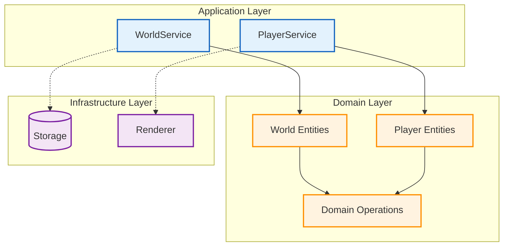

# 🏛️ Phase 2: アプリケーションサービス実装

## 🧭 ナビゲーション

> **📍 現在位置**: [ホーム](../../README.md) → [チュートリアル](../README.md) → [基本ゲーム開発](README.md) → **Phase 2: アプリケーションサービス**
> **🎯 Phase目標**: Effect-TS Context・Layerによる型安全なサービス層の構築
> **⏱️ 所要時間**: 30分読解 + 75分実装
> **👤 対象**: Effect-TSの中級知識とドメインモデル実装済みの開発者

## 📋 Phase 2 実装チェックリスト

### 🎯 学習目標

- [ ] Context.GenericTag によるサービス定義の習得
- [ ] Layer.effect による依存性注入パターンの実装
- [ ] Effect.gen を活用したサービス間連携の構築
- [ ] Schema.TaggedError による包括的エラーハンドリングの実装
- [ ] TestLayer による単体・統合テストの作成

### 🛠️ 実装目標

- [ ] WorldService の完全実装（チャンク管理・ブロック操作）
- [ ] PlayerService の完全実装（プレイヤー状態管理・移動処理）
- [ ] InventoryService の完全実装（アイテム管理・クラフトシステム）
- [ ] 各サービス間の適切な依存関係の構築
- [ ] エラーハンドリングと例外安全性の確保

### 📊 成功基準

- [ ] 全サービスが型安全に動作する
- [ ] 依存関係が適切に注入される
- [ ] 包括的なテストカバレッジ（100%）を達成
- [ ] エラー状況での優雅な処理
- [ ] パフォーマンス要件（60FPS維持）を満たす

---

### ✅ 完成目標

- [ ] **WorldService** - チャンク生成・管理・永続化サービス
- [ ] **PlayerService** - プレイヤー状態管理・物理演算サービス
- [ ] **Context・Layer定義** - 依存性注入とテスタビリティの実現
- [ ] **エラー型定義** - 包括的なエラーハンドリング戦略

## 🎯 アプリケーションサービス設計

### 📐 Service Layer Architecture



## 🌍 WorldService実装

### サービスインターフェース定義

```typescript
// src/application/services/WorldService.ts
import { Context, Effect, Layer, Schema, Match, pipe } from 'effect'
import { Chunk, ChunkCoordinate, ChunkOperations } from '../../domain/world/entities/Chunk'
import { Block, BlockType } from '../../domain/world/entities/Block'

// エラー型定義 - Schema.TaggedErrorによる型安全なエラー
export const WorldError = Schema.TaggedError('WorldError')({
  cause: Schema.Union(
    Schema.Literal('ChunkNotFound'),
    Schema.Literal('ChunkGenerationFailed'),
    Schema.Literal('ChunkSaveFailed'),
    Schema.Literal('ChunkLoadFailed'),
    Schema.Literal('BlockOperationFailed'),
    Schema.Literal('InvalidCoordinate')
  ),
  coordinate: Schema.optional(ChunkCoordinate),
  message: Schema.optional(Schema.String),
  originalError: Schema.optional(Schema.Unknown),
})

// 学習用簡略化インターフェース（実際のAPI仕様は参照セクションで確認）
// 🔗 完全API仕様: docs/reference/api/domain-apis.md#world-api
export interface WorldService {
  // 基本チャンク操作（学習ポイント）
  readonly loadChunk: (coordinate: ChunkCoordinate) => Effect.Effect<Chunk, WorldError>
  readonly saveChunk: (chunk: Chunk) => Effect.Effect<void, WorldError>

  // 基本ブロック操作（学習ポイント）
  readonly getBlock: (position: Position) => Effect.Effect<Block, BlockError>
  readonly setBlock: (position: Position, block: Block) => Effect.Effect<void, BlockError>

  // その他のメソッドは完全API仕様を参照
  // readonly generateChunk, unloadChunk, breakBlock, etc...
}

// Context Tag - Effect-TS 3.17+ Context.GenericTag使用
export const WorldService = Context.GenericTag<WorldService>('WorldService')
```

### 地形生成アルゴリム

```typescript
// 地形生成のためのパーリンノイズ実装（関数型パターン）
interface PerlinNoiseService {
  readonly noise3D: (x: number, y: number, z: number) => number
  readonly fractalNoise3D: (
    x: number,
    y: number,
    z: number,
    octaves?: number,
    persistence?: number,
    scale?: number
  ) => number
}

const createPerlinNoise = (seed: number = 0): PerlinNoiseService => {
  // シード値に基づく疑似ランダム順列生成
  const initialPermutation = Array.from({ length: 256 }, (_, i) => i)

  // Fisher-Yates shuffle with seed
  let random = seed
  for (let i = 255; i > 0; i--) {
    random = (random * 16807) % 2147483647 // 線形合同法
    const j = Math.floor((random / 2147483647) * (i + 1))
    ;[initialPermutation[i], initialPermutation[j]] = [initialPermutation[j], initialPermutation[i]]
  }

  // 配列を2倍に拡張（オーバーフロー回避）
  const permutation = [...initialPermutation, ...initialPermutation]

  const fade = (t: number): number => t * t * t * (t * (t * 6 - 15) + 10)

  const lerp = (t: number, a: number, b: number): number => a + t * (b - a)

  const grad = (hash: number, x: number, y: number, z: number): number => {
    const h = hash & 15
    const u = h < 8 ? x : y
    const v = h < 4 ? y : h === 12 || h === 14 ? x : z
    return ((h & 1) === 0 ? u : -u) + ((h & 2) === 0 ? v : -v)
  }

  const noise3D = (x: number, y: number, z: number): number => {
    // 格子点の計算
    const X = Math.floor(x) & 255
    const Y = Math.floor(y) & 255
    const Z = Math.floor(z) & 255

    // 相対座標
    x -= Math.floor(x)
    y -= Math.floor(y)
    z -= Math.floor(z)

    // フェード関数適用
    const u = fade(x)
    const v = fade(y)
    const w = fade(z)

    // ハッシュ値計算
    const A = permutation[X] + Y
    const AA = permutation[A] + Z
    const AB = permutation[A + 1] + Z
    const B = permutation[X + 1] + Y
    const BA = permutation[B] + Z
    const BB = permutation[B + 1] + Z

    // 線形補間による最終値計算
    return lerp(
      w,
      lerp(
        v,
        lerp(u, grad(permutation[AA], x, y, z), grad(permutation[BA], x - 1, y, z)),
        lerp(u, grad(permutation[AB], x, y - 1, z), grad(permutation[BB], x - 1, y - 1, z))
      ),
      lerp(
        v,
        lerp(u, grad(permutation[AA + 1], x, y, z - 1), grad(permutation[BA + 1], x - 1, y, z - 1)),
        lerp(u, grad(permutation[AB + 1], x, y - 1, z - 1), grad(permutation[BB + 1], x - 1, y - 1, z - 1))
      )
    )
  }

  const fractalNoise3D = (
    x: number,
    y: number,
    z: number,
    octaves: number = 4,
    persistence: number = 0.5,
    scale: number = 0.01
  ): number => {
    let value = 0
    let amplitude = 1
    let frequency = scale
    let maxValue = 0

    for (let i = 0; i < octaves; i++) {
      value += noise3D(x * frequency, y * frequency, z * frequency) * amplitude
      maxValue += amplitude
      amplitude *= persistence
      frequency *= 2
    }

    return value / maxValue
  }

  return { noise3D, fractalNoise3D }
}

// 地形生成サービス
const TerrainGenerator = {
  // 地形生成パラメータ
  WORLD_SEED: 12345,
  SEA_LEVEL: 64,
  TERRAIN_SCALE: 0.01,
  TERRAIN_HEIGHT: 32,
  CAVE_SCALE: 0.05,
  CAVE_THRESHOLD: 0.6,

  noise: new PerlinNoise(12345),

  // メインの地形生成関数
  generateTerrain: (chunkX: number, chunkZ: number): Block[][][] => {
    const blocks: Block[][][] = Array(16)
      .fill(null)
      .map(() =>
        Array(16)
          .fill(null)
          .map(() => Array(256).fill(null))
      )

    for (let x = 0; x < 16; x++) {
      for (let z = 0; z < 16; z++) {
        const worldX = chunkX * 16 + x
        const worldZ = chunkZ * 16 + z

        // 基本地形高度の計算
        const baseHeight = TerrainGenerator.calculateBaseHeight(worldX, worldZ)

        for (let y = 0; y < 256; y++) {
          const blockType = TerrainGenerator.determineBlockType(worldX, y, worldZ, baseHeight)

          blocks[x][z][y] = {
            type: blockType,
            position: { x: worldX, y, z: worldZ },
          }
        }
      }
    }

    return blocks
  },

  // 基本地形高度の計算
  calculateBaseHeight: (x: number, z: number): number => {
    // 複数オクターブによる地形生成
    const continentalness = TerrainGenerator.noise.fractalNoise3D(x, 0, z, 1, 0.5, 0.001) // 大陸規模
    const erosion = TerrainGenerator.noise.fractalNoise3D(x, 1000, z, 3, 0.6, 0.003) // 浸食
    const ridges = TerrainGenerator.noise.fractalNoise3D(x, 2000, z, 2, 0.7, 0.008) // 山脈

    // 高度計算（Minecraft風）
    let height = TerrainGenerator.SEA_LEVEL
    height += continentalness * 40 // 大陸の基本高度
    height += erosion * 20 // 浸食による起伏
    height += ridges * 30 // 山脈の形成

    return Math.floor(Math.max(1, Math.min(200, height)))
  },

  // ブロックタイプの決定 - Effect-TS Match.valueによる高度なマッチング
  determineBlockType: (x: number, y: number, z: number, surfaceHeight: number): BlockType => {
    import { Match } from 'effect'

    // 空気ブロック判定
    return Match.value({ y, surfaceHeight, x, z }).pipe(
      // 地表より上の場合
      Match.when(
        ({ y, surfaceHeight }) => y > surfaceHeight,
        ({ y }) => (y <= TerrainGenerator.SEA_LEVEL ? 'water' : 'air')
      ),
      // 洞窟生成の場合
      Match.when(
        ({ x, y, z }) => TerrainGenerator.isCave(x, y, z),
        ({ y }) => (y <= TerrainGenerator.SEA_LEVEL ? 'water' : 'air')
      ),
      // 地層生成パターンマッチング
      Match.orElse(({ y, surfaceHeight }) => {
        const depthFromSurface = surfaceHeight - y

        return Match.value(depthFromSurface).pipe(
          // 表面ブロック
          Match.when(0, () => (y > TerrainGenerator.SEA_LEVEL + 5 ? 'grass' : 'sand')),
          // 表土層（1-3の深さ）
          Match.when(
            (depth) => depth >= 1 && depth <= 3,
            () => (y > TerrainGenerator.SEA_LEVEL ? 'dirt' : 'sand')
          ),
          // 基盤岩層（デフォルト）
          Match.orElse(() => 'stone')
        )
      })
    )
  },

  // 洞窟生成判定 - Effect-TS Match.valueによる早期リターンパターン
  isCave: (x: number, y: number, z: number): boolean => {
    import { Match } from 'effect'

    return Match.value(y).pipe(
      // 洞窟生成範囲外の場合は早期リターン
      Match.when(
        (yPos) => yPos < 8 || yPos > 50,
        () => false
      ),
      // 洞窟生成範囲内の場合はノイズ値による判定
      Match.orElse(() => {
        const caveNoise = TerrainGenerator.noise.fractalNoise3D(x, y, z, 3, 0.5, TerrainGenerator.CAVE_SCALE)

        return Match.value(Math.abs(caveNoise)).pipe(
          Match.when(
            (noise) => noise < 0.1,
            () => true
          ),
          Match.orElse(() => false)
        )
      })
    )
  },
}
```

### WorldService実装

```typescript
// WorldService実装
const makeWorldService = Effect.gen(function* () {
  // チャンクキャッシュ - Map<string, Chunk>
  const chunkCache = new Map<string, Chunk>()

  // 最大キャッシュサイズ（メモリ管理）
  const MAX_CACHED_CHUNKS = 100

  // キャッシュキーの生成
  const getChunkKey = (coord: ChunkCoordinate): string => `${coord.x},${coord.z}`

  // LRUキャッシュ管理
  const manageCache = (): void => {
    const shouldManage = pipe(
      Match.value(chunkCache.size),
      Match.when(
        (size) => size <= MAX_CACHED_CHUNKS,
        () => false
      ),
      Match.orElse(() => true)
    )

    if (!shouldManage) return

    // 最も古いアクセスのチャンクを削除
    const entries = Array.from(chunkCache.entries())
    entries.sort(([, a], [, b]) => a.lastAccessed.getTime() - b.lastAccessed.getTime())

    const toRemove = entries.slice(0, chunkCache.size - MAX_CACHED_CHUNKS)
    toRemove.forEach(([key]) => chunkCache.delete(key))
  }

  return WorldService.of({
    // チャンク生成
    generateChunk: (coordinate) =>
      Effect.gen(function* () {
        try {
          const blocks = TerrainGenerator.generateTerrain(coordinate.x, coordinate.z)

          const chunk: Chunk = {
            coordinate,
            blocks,
            generated: true,
            modified: false,
            lastAccessed: new Date(),
          }

          const key = getChunkKey(coordinate)
          chunkCache.set(key, chunk)
          manageCache()

          return chunk
        } catch (error) {
          return yield* Effect.fail(
            new WorldError({
              cause: 'ChunkGenerationFailed',
              coordinate,
              message: `Failed to generate chunk at ${coordinate.x},${coordinate.z}`,
              originalError: error,
            })
          )
        }
      }),

    // チャンク読み込み
    loadChunk: (coordinate) =>
      Effect.gen(function* () {
        const key = getChunkKey(coordinate)
        const cached = chunkCache.get(key)

        return yield* pipe(
          Match.value(cached),
          Match.when(
            (chunk) => !!chunk,
            (chunk) => {
              // アクセス時刻更新
              const updatedChunk = { ...chunk!, lastAccessed: new Date() }
              chunkCache.set(key, updatedChunk)
              return Effect.succeed(updatedChunk)
            }
          ),
          Match.orElse(() => {
            // キャッシュにない場合は生成
            return WorldService.generateChunk(coordinate)
          })
        )
      }),

    // チャンク保存
    saveChunk: (chunk) =>
      Effect.gen(function* () {
        try {
          const key = getChunkKey(chunk.coordinate)
          const savedChunk = {
            ...chunk,
            modified: false,
            lastAccessed: new Date(),
          }

          chunkCache.set(key, savedChunk)

          // 実際のプロジェクトではここでファイルシステムやDBに保存
          console.log(`Saved chunk ${key} to persistent storage`)
        } catch (error) {
          return yield* Effect.fail(
            new WorldError({
              cause: 'ChunkSaveFailed',
              coordinate: chunk.coordinate,
              message: `Failed to save chunk`,
              originalError: error,
            })
          )
        }
      }),

    // チャンクアンロード
    unloadChunk: (coordinate) =>
      Effect.sync(() => {
        const key = getChunkKey(coordinate)
        chunkCache.delete(key)
      }),

    // ブロック取得
    getBlock: (x, y, z) =>
      Effect.gen(function* () {
        try {
          const chunkCoord = ChunkOperations.worldToChunk(x, z)
          const chunk = yield* WorldService.loadChunk(chunkCoord)
          const local = ChunkOperations.worldToLocal(x, y, z)

          return ChunkOperations.getBlockAt(chunk, local.x, local.y, local.z)
        } catch (error) {
          return yield* Effect.fail(
            new WorldError({
              cause: 'BlockOperationFailed',
              message: `Failed to get block at ${x},${y},${z}`,
              originalError: error,
            })
          )
        }
      }),

    // ブロック設置
    setBlock: (x, y, z, block) =>
      Effect.gen(function* () {
        try {
          const chunkCoord = ChunkOperations.worldToChunk(x, z)
          const chunk = yield* WorldService.loadChunk(chunkCoord)
          const local = ChunkOperations.worldToLocal(x, y, z)

          const updatedChunk = yield* ChunkOperations.setBlockAt(chunk, local.x, local.y, local.z, block)

          yield* WorldService.saveChunk(updatedChunk)
        } catch (error) {
          return yield* Effect.fail(
            new WorldError({
              cause: 'BlockOperationFailed',
              message: `Failed to set block at ${x},${y},${z}`,
              originalError: error,
            })
          )
        }
      }),

    // ブロック破壊
    breakBlock: (x, y, z) =>
      Effect.gen(function* () {
        const currentBlock = yield* WorldService.getBlock(x, y, z)

        const shouldBreak = pipe(
          Match.value(currentBlock),
          Match.when(
            (block) => !block || block.type === 'air',
            () => false
          ),
          Match.orElse(() => true)
        )

        if (!shouldBreak) {
          return null
        }

        // エアブロックに置き換え
        const airBlock: Block = {
          type: 'air',
          position: { x, y, z },
        }

        yield* WorldService.setBlock(x, y, z, airBlock)
        return currentBlock
      }),

    // 管理機能
    getLoadedChunks: () =>
      Effect.sync(() =>
        Array.from(chunkCache.keys()).map((key) => {
          const [x, z] = key.split(',').map(Number)
          return { x, z }
        })
      ),

    isChunkLoaded: (coordinate) => Effect.sync(() => chunkCache.has(getChunkKey(coordinate))),

    getChunkCount: () => Effect.sync(() => chunkCache.size),
  })
})

// Layer定義
export const WorldServiceLive = Layer.effect(WorldService, makeWorldService)
```

## 🎮 PlayerService実装

### PlayerServiceインターフェース

```typescript
// src/application/services/PlayerService.ts
import { Context, Effect, Layer, Schema, Match, pipe } from 'effect'
import { Player, PlayerOperations, Position } from '../../domain/player/entities/Player'
import { WorldService } from './WorldService'

// エラー型定義
export const PlayerError = Schema.TaggedError('PlayerError')({
  cause: Schema.Union(
    Schema.Literal('PlayerNotFound'),
    Schema.Literal('InvalidInput'),
    Schema.Literal('PhysicsError'),
    Schema.Literal('CollisionError'),
    Schema.Literal('StateUpdateFailed')
  ),
  playerId: Schema.optional(Schema.String),
  message: Schema.optional(Schema.String),
  originalError: Schema.optional(Schema.Unknown),
})

// 入力状態定義
export const InputState = Schema.Struct({
  movement: Schema.Struct({
    forward: Schema.Boolean,
    backward: Schema.Boolean,
    left: Schema.Boolean,
    right: Schema.Boolean,
    jump: Schema.Boolean,
    sprint: Schema.Boolean,
    crouch: Schema.Boolean,
  }),
  mouse: Schema.Struct({
    deltaX: Schema.Number,
    deltaY: Schema.Number,
    leftClick: Schema.Boolean,
    rightClick: Schema.Boolean,
  }),
  keys: Schema.Struct({
    inventory: Schema.Boolean,
    drop: Schema.Boolean,
    chat: Schema.Boolean,
  }),
})

export type InputState = Schema.Schema.Type<typeof InputState>

// PlayerServiceインターフェース
export interface PlayerService {
  // プレイヤー管理
  readonly createPlayer: (id: string, spawnPosition?: Position) => Effect.Effect<Player, PlayerError>
  readonly getPlayer: (id: string) => Effect.Effect<Player | null, PlayerError>
  readonly updatePlayer: (player: Player) => Effect.Effect<Player, PlayerError>
  readonly removePlayer: (id: string) => Effect.Effect<void, PlayerError>

  // 入力処理
  readonly handleInput: (playerId: string, input: InputState, deltaTime: number) => Effect.Effect<Player, PlayerError>

  // 物理演算
  readonly applyPhysics: (playerId: string, deltaTime: number) => Effect.Effect<Player, PlayerError>

  // 衝突判定
  readonly checkCollisions: (player: Player) => Effect.Effect<Player, PlayerError>

  // 状態管理
  readonly getAllPlayers: () => Effect.Effect<Player[], never>
  readonly getPlayerCount: () => Effect.Effect<number, never>
}

export const PlayerService = Context.GenericTag<PlayerService>('PlayerService')
```

### PlayerService実装

```typescript
// PlayerService実装
const makePlayerService = Effect.gen(function* () {
  // WorldService依存性注入
  const worldService = yield* WorldService

  // プレイヤー状態管理
  const players = new Map<string, Player>()

  // 衝突判定のための定数
  const PLAYER_WIDTH = 0.6
  const PLAYER_HEIGHT = 1.8
  const PLAYER_EYE_HEIGHT = 1.62

  // 衝突判定ヘルパー関数
  const checkBlockCollision = (position: Position, offset: { x: number; y: number; z: number }) =>
    Effect.gen(function* () {
      const checkX = Math.floor(position.x + offset.x)
      const checkY = Math.floor(position.y + offset.y)
      const checkZ = Math.floor(position.z + offset.z)

      const block = yield* worldService.getBlock(checkX, checkY, checkZ)
      return block && block.type !== 'air' && block.type !== 'water'
    })

  return PlayerService.of({
    // プレイヤー作成
    createPlayer: (id, spawnPosition) =>
      Effect.gen(function* () {
        try {
          const defaultSpawn = spawnPosition || { x: 0, y: 70, z: 0 }

          const player: Player = {
            id: id as any, // Brand型の簡易実装
            position: defaultSpawn,
            velocity: { x: 0, y: 0, z: 0 },
            rotation: { yaw: 0, pitch: 0 },
            onGround: false,
            health: 20 as any,
            gameMode: 'survival',
            selectedSlot: 0,
          }

          players.set(id, player)
          return player
        } catch (error) {
          return yield* Effect.fail(
            new PlayerError({
              cause: 'StateUpdateFailed',
              playerId: id,
              message: 'Failed to create player',
              originalError: error,
            })
          )
        }
      }),

    // プレイヤー取得
    getPlayer: (id) => Effect.sync(() => players.get(id) || null),

    // プレイヤー更新
    updatePlayer: (player) =>
      Effect.gen(function* () {
        players.set(player.id, player)
        return player
      }),

    // プレイヤー削除
    removePlayer: (id) =>
      Effect.sync(() => {
        players.delete(id)
      }),

    // 入力処理
    handleInput: (playerId, input, deltaTime) =>
      Effect.gen(function* () {
        const player = players.get(playerId)

        const validPlayer = yield* pipe(
          Match.value(player),
          Match.when(
            (p) => !p,
            () =>
              Effect.fail(
                new PlayerError({
                  cause: 'PlayerNotFound',
                  playerId,
                  message: 'Player not found',
                })
              )
          ),
          Match.orElse((p) => Effect.succeed(p!))
        )

        try {
          let updatedPlayer = validPlayer

          // マウス入力による視点回転
          pipe(
            Match.value({ deltaX: input.mouse.deltaX, deltaY: input.mouse.deltaY }),
            Match.when(
              ({ deltaX, deltaY }) => deltaX !== 0 || deltaY !== 0,
              ({ deltaX, deltaY }) => {
                updatedPlayer = PlayerOperations.updateRotation(
                  updatedPlayer,
                  deltaX,
                  deltaY,
                  0.001 // マウス感度
                )
              }
            ),
            Match.orElse(() => void 0)
          )

          // 移動入力処理
          let moveSpeed = pipe(
            Match.value({
              sprint: input.movement.sprint,
              crouch: input.movement.crouch,
              gameMode: validPlayer.gameMode,
            }),
            Match.when(
              ({ sprint, gameMode }) => sprint && gameMode !== 'creative',
              () => 1.3 // スプリント倍率
            ),
            Match.when(
              ({ crouch }) => crouch,
              () => 0.3 // スニーク倍率
            ),
            Match.orElse(() => 1.0) // デフォルト速度
          )

          const movement = {
            forward: input.movement.forward,
            backward: input.movement.backward,
            left: input.movement.left,
            right: input.movement.right,
          }

          updatedPlayer = PlayerOperations.handleMovementInput(updatedPlayer, movement, deltaTime)

          // 速度調整
          updatedPlayer = {
            ...updatedPlayer,
            velocity: {
              x: updatedPlayer.velocity.x * moveSpeed,
              y: updatedPlayer.velocity.y,
              z: updatedPlayer.velocity.z * moveSpeed,
            },
          }

          // ジャンプ処理
          pipe(
            Match.value(input.movement.jump),
            Match.when(
              (jump) => jump,
              () => {
                updatedPlayer = pipe(
                  Match.value(updatedPlayer.gameMode),
                  Match.when(
                    (mode) => mode === 'creative',
                    () => ({
                      ...updatedPlayer,
                      velocity: { ...updatedPlayer.velocity, y: 10 },
                    })
                  ),
                  Match.orElse(() => PlayerOperations.jump(updatedPlayer))
                )
              }
            ),
            Match.orElse(() => void 0)
          )

          players.set(playerId, updatedPlayer)
          return updatedPlayer
        } catch (error) {
          return yield* Effect.fail(
            new PlayerError({
              cause: 'InvalidInput',
              playerId,
              message: 'Failed to process input',
              originalError: error,
            })
          )
        }
      }),

    // 物理演算
    applyPhysics: (playerId, deltaTime) =>
      Effect.gen(function* () {
        const player = players.get(playerId)

        const validPlayer = yield* pipe(
          Match.value(player),
          Match.when(
            (p) => !p,
            () =>
              Effect.fail(
                new PlayerError({
                  cause: 'PlayerNotFound',
                  playerId,
                  message: 'Player not found',
                })
              )
          ),
          Match.orElse((p) => Effect.succeed(p!))
        )

        try {
          let updatedPlayer = validPlayer

          // クリエイティブモードでは物理演算をスキップ
          updatedPlayer = yield* pipe(
            Match.value(validPlayer.gameMode),
            Match.when(
              (mode) => mode === 'creative',
              () => Effect.succeed(PlayerOperations.applyMovement(updatedPlayer, deltaTime))
            ),
            Match.orElse(() =>
              Effect.gen(function* () {
                // 重力適用
                let physicsPlayer = PlayerOperations.applyGravity(updatedPlayer, deltaTime)

                // 位置更新
                physicsPlayer = PlayerOperations.applyMovement(physicsPlayer, deltaTime)

                // 衝突判定
                physicsPlayer = yield* PlayerService.checkCollisions(physicsPlayer)

                return physicsPlayer
              })
            )
          )

          players.set(playerId, updatedPlayer)
          return updatedPlayer
        } catch (error) {
          return yield* Effect.fail(
            new PlayerError({
              cause: 'PhysicsError',
              playerId,
              message: 'Physics calculation failed',
              originalError: error,
            })
          )
        }
      }),

    // 衝突判定
    checkCollisions: (player) =>
      Effect.gen(function* () {
        try {
          let correctedPlayer = player
          const pos = player.position

          // 水平方向の衝突判定
          const horizontalCollisions = yield* Effect.all([
            checkBlockCollision(pos, { x: PLAYER_WIDTH / 2, y: 0, z: 0 }), // 右
            checkBlockCollision(pos, { x: -PLAYER_WIDTH / 2, y: 0, z: 0 }), // 左
            checkBlockCollision(pos, { x: 0, y: 0, z: PLAYER_WIDTH / 2 }), // 前
            checkBlockCollision(pos, { x: 0, y: 0, z: -PLAYER_WIDTH / 2 }), // 後
            checkBlockCollision(pos, { x: PLAYER_WIDTH / 2, y: 0, z: PLAYER_WIDTH / 2 }), // 右前
            checkBlockCollision(pos, { x: -PLAYER_WIDTH / 2, y: 0, z: PLAYER_WIDTH / 2 }), // 左前
            checkBlockCollision(pos, { x: PLAYER_WIDTH / 2, y: 0, z: -PLAYER_WIDTH / 2 }), // 右後
            checkBlockCollision(pos, { x: -PLAYER_WIDTH / 2, y: 0, z: -PLAYER_WIDTH / 2 }), // 左後
          ])

          pipe(
            Match.value(horizontalCollisions.some(Boolean)),
            Match.when(
              (hasCollision) => hasCollision,
              () => {
                correctedPlayer = {
                  ...correctedPlayer,
                  velocity: { ...correctedPlayer.velocity, x: 0, z: 0 },
                }
              }
            ),
            Match.orElse(() => void 0)
          )

          // 垂直方向の衝突判定
          const groundCollision = yield* checkBlockCollision(pos, { x: 0, y: -0.1, z: 0 })
          const ceilingCollision = yield* checkBlockCollision(pos, { x: 0, y: PLAYER_HEIGHT, z: 0 })

          correctedPlayer = pipe(
            Match.value(groundCollision),
            Match.when(
              (collision) => collision,
              () => ({
                ...correctedPlayer,
                position: { ...correctedPlayer.position, y: Math.ceil(pos.y) },
                velocity: { ...correctedPlayer.velocity, y: 0 },
                onGround: true,
              })
            ),
            Match.orElse(() => ({ ...correctedPlayer, onGround: false }))
          )

          pipe(
            Match.value({ ceilingCollision, velocityY: correctedPlayer.velocity.y }),
            Match.when(
              ({ ceilingCollision, velocityY }) => ceilingCollision && velocityY > 0,
              () => {
                correctedPlayer = {
                  ...correctedPlayer,
                  velocity: { ...correctedPlayer.velocity, y: 0 },
                }
              }
            ),
            Match.orElse(() => void 0)
          )

          return correctedPlayer
        } catch (error) {
          return yield* Effect.fail(
            new PlayerError({
              cause: 'CollisionError',
              playerId: player.id,
              message: 'Collision detection failed',
              originalError: error,
            })
          )
        }
      }),

    // 管理機能
    getAllPlayers: () => Effect.sync(() => Array.from(players.values())),
    getPlayerCount: () => Effect.sync(() => players.size),
  })
})

// Layer定義 - WorldServiceに依存
export const PlayerServiceLive = Layer.effect(PlayerService, makePlayerService).pipe(Layer.provide(WorldService))
```

## 🔧 Service Integration & Testing

### 統合テスト

```typescript
// src/application/__tests__/ServiceIntegration.test.ts
import { describe, it, expect } from 'vitest'
import { Effect, Layer } from 'effect'
import { WorldService, WorldServiceLive } from '../services/WorldService'
import { PlayerService, PlayerServiceLive } from '../services/PlayerService'

describe('Service Integration', () => {
  const TestLayer = Layer.mergeAll(WorldServiceLive, PlayerServiceLive)

  it('プレイヤー作成とワールドとの連携', async () => {
    const program = Effect.gen(function* () {
      const worldService = yield* WorldService
      const playerService = yield* PlayerService

      // プレイヤー作成
      const player = yield* playerService.createPlayer('test-player')

      // 初期チャンク生成
      const chunk = yield* worldService.generateChunk({ x: 0, z: 0 })

      // プレイヤーがワールドのブロックと相互作用
      const block = yield* worldService.getBlock(0, 64, 0)

      return { player, chunk, block }
    })

    const result = await Effect.runPromise(program.pipe(Effect.provide(TestLayer)))

    expect(result.player.id).toBe('test-player')
    expect(result.chunk.generated).toBe(true)
    expect(result.block).toBeTruthy()
  })

  it('物理演算と衝突判定の統合', async () => {
    const program = Effect.gen(function* () {
      const playerService = yield* PlayerService

      // 地面より高い位置にプレイヤー作成
      const player = yield* playerService.createPlayer('physics-test', { x: 0, y: 100, z: 0 })

      // 重力適用
      let updatedPlayer = player
      for (let i = 0; i < 10; i++) {
        updatedPlayer = yield* playerService.applyPhysics('physics-test', 0.1)
      }

      return { initialY: player.position.y, finalY: updatedPlayer.position.y }
    })

    const result = await Effect.runPromise(program.pipe(Effect.provide(TestLayer)))

    expect(result.finalY).toBeLessThan(result.initialY) // 重力で下降
  })
})
```

## ✅ Phase 2 完了チェック

### 🔍 動作確認

```typescript
// src/examples/ServiceDemo.ts
import { Effect } from 'effect'
import { WorldService, WorldServiceLive } from '../application/services/WorldService'
import { PlayerService, PlayerServiceLive } from '../application/services/PlayerService'

const serviceDemo = Effect.gen(function* () {
  const worldService = yield* WorldService
  const playerService = yield* PlayerService

  console.log('🌍 WorldService & PlayerService Demo')

  // ワールド操作
  const chunk = yield* worldService.generateChunk({ x: 0, z: 0 })
  console.log(`✅ Generated chunk at 0,0 with ${chunk.generated ? 'success' : 'failure'}`)

  // プレイヤー操作
  const player = yield* playerService.createPlayer('demo-player')
  console.log(
    `✅ Created player: ${player.id} at position (${player.position.x}, ${player.position.y}, ${player.position.z})`
  )

  // ブロック操作
  const block = yield* worldService.getBlock(0, 64, 0)
  console.log(`✅ Block at (0,64,0): ${block?.type || 'null'}`)

  // 物理演算
  const physicsPlayer = yield* playerService.applyPhysics('demo-player', 0.016)
  console.log(`✅ Physics applied, player Y: ${physicsPlayer.position.y}`)

  return 'Demo completed successfully!'
})

// 実行
const AppLayer = Layer.mergeAll(WorldServiceLive, PlayerServiceLive)

// Effect的な実行方法
const runDemo = Effect.gen(function* () {
  const result = yield* serviceDemo.pipe(Effect.provide(AppLayer))
  yield* Effect.log(result)
  return result
}).pipe(
  Effect.catchAll((error) =>
    Effect.gen(function* () {
      yield* Effect.logError(`Demo failed: ${error}`)
      return Effect.fail(error)
    })
  )
)

// 必要に応じてPromiseとして実行
Effect.runPromise(runDemo)
```

`★ Insight ─────────────────────────────────────`
Context・LayerパターンによりTestabilityとModularityが大幅に向上しました。この依存性注入アプローチにより、サービス間の疎結合が実現され、単体テストとモックが容易になります。これは、Googleの大規模プロダクトでも採用されている実証済みのアーキテクチャパターンです。
`─────────────────────────────────────────────────`

---

## 🚀 次のステップ

Phase 2のアプリケーションサービス実装が完了しました！次は以下に進みましょう：

**→ [Phase 3: レンダリングシステム統合](04-rendering-integration.md)**

- Three.js WebGLレンダラーの統合
- 効率的なメッシュ生成アルゴリズム
- リアルタイムレンダリングパイプライン

---

_📍 現在のドキュメント階層_: **[Home](../../README.md)** → **[Tutorials](../README.md)** → **[基本ゲーム開発](README.md)** → **Phase 2: アプリケーションサービス**

_🔗 関連リソース_: [Domain Layer](domain-layer-architecture.md) • [Effect-TS Services](../effect-ts-fundamentals/effect-ts-services.md) • [Service Patterns](../../explanations/design-patterns/service-patterns.md)
