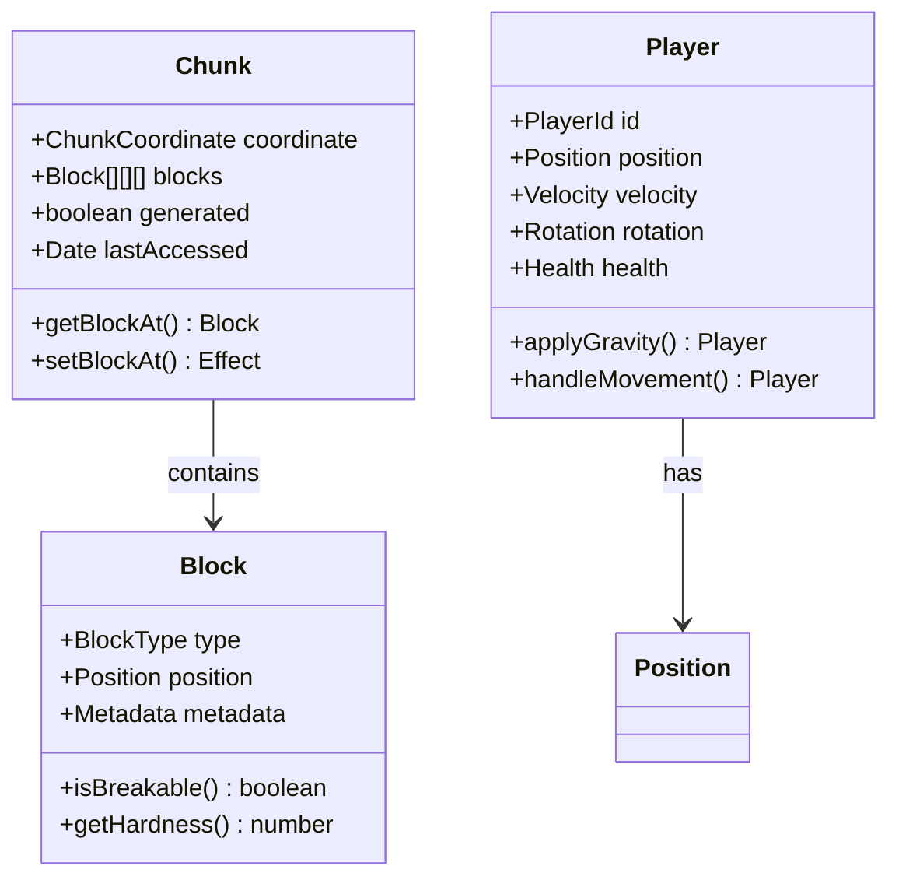

# 🏗️ Phase 1: ドメインレイヤーアーキテクチャ構築

## 🧭 ナビゲーション

> **📍 現在位置**: [ホーム](../../README.md) → [チュートリアル](../README.md) → [基本ゲーム開発](README.md) → **Phase 1: ドメインレイヤー**
> **🎯 Phase目標**: 型安全なドメインエンティティとビジネスロジックの実装
> **⏱️ 所要時間**: 25分読解 + 60分実装
> **👤 対象**: DDDとEffect-TSの基礎知識を持つ開発者

## 📋 Phase 1 実装チェックリスト

### ✅ 完成目標

- [ ] **Block Entity** - ブロックのドメインモデルとビジネスロジック
- [ ] **Chunk Entity** - チャンク管理とワールド座標変換
- [ ] **Player Entity** - プレイヤー状態と物理演算ロジック
- [ ] **ドメインサービス** - 複雑なビジネスルールの実装

## 🎯 ドメイン駆動設計によるゲームアーキテクチャ

### 📐 DDDパターンの適用

Minecraft Cloneのドメインモデルは以下の核となるエンティティで構成されます：



## 🔧 Block Entity実装

### 基本的なBlock定義

```typescript
// src/domain/world/entities/Block.ts
import { Schema } from 'effect'

// ブロックタイプの定義 - リテラル型で型安全性を確保
export const BlockType = Schema.Literal('air', 'stone', 'grass', 'dirt', 'wood', 'leaves', 'sand', 'water')

export type BlockType = Schema.Schema.Type<typeof BlockType>

// Position Value Object - 座標の制約を型レベルで表現
export const Position = Schema.Struct({
  x: Schema.Number.pipe(Schema.int()),
  y: Schema.Number.pipe(Schema.int(), Schema.between(0, 255)), // Y軸は0-255に制限
  z: Schema.Number.pipe(Schema.int()),
})

export type Position = Schema.Schema.Type<typeof Position>

// Block Entity - Schemaによる型安全な定義
export const Block = Schema.Struct({
  type: BlockType,
  position: Position,
  metadata: Schema.optional(
    Schema.Record(Schema.String, Schema.Unknown) // 拡張可能なメタデータ
  ),
})

export type Block = Schema.Schema.Type<typeof Block>
```

### Block Domain Service

```typescript
// ブロック操作のドメインロジック - 純粋関数として実装
export const BlockOperations = {
  // ブロック破壊可能性の判定 - Effect-TS Match.valueによるTagged Union パターンマッチング
  isBreakable: (block: Block): boolean => {
    import { Match } from 'effect'

    return Match.value(block.type).pipe(
      Match.when('air', () => false),
      Match.when('water', () => false),
      Match.orElse(() => true)
    )
  },

  // 設置可能性の判定
  canPlaceOn: (targetBlock: Block, newBlockType: BlockType): boolean => {
    // エアブロックまたは液体ブロックにのみ設置可能
    return targetBlock.type === 'air' || targetBlock.type === 'water'
  },

  // ブロックの硬度取得 - 破壊時間の計算に使用
  getHardness: (blockType: BlockType): number => {
    const hardnessMap: Record<BlockType, number> = {
      air: 0, // 瞬時破壊
      stone: 1.5, // 石 - 硬い
      grass: 0.6, // 草ブロック - 中程度
      dirt: 0.5, // 土 - 柔らかい
      wood: 2.0, // 木材 - 非常に硬い
      leaves: 0.2, // 葉 - 非常に柔らかい
      sand: 0.5, // 砂 - 柔らかい
      water: 0, // 破壊不可
    }
    return hardnessMap[blockType]
  },

  // ブロック破壊時間の計算
  calculateBreakTime: (blockType: BlockType, toolEfficiency: number = 1): number => {
    const hardness = BlockOperations.getHardness(blockType)
    return pipe(
      hardness === 0,
      Match.boolean({
        onTrue: () => 0,
        onFalse: () => (hardness * 1.5) / toolEfficiency,
      })
    )
  },

  // ブロック設置時の検証
  validatePlacement: (
    targetBlock: Block,
    newBlockType: BlockType,
    playerGameMode: 'survival' | 'creative'
  ): boolean => {
    // クリエイティブモードでは制約なし
    return pipe(
      playerGameMode === 'creative',
      Match.boolean({
        onTrue: () => true,
        onFalse: () => BlockOperations.canPlaceOn(targetBlock, newBlockType),
      })
    )
  },
}
```

## 🗺️ Chunk Entity実装

### Chunk座標系とデータ構造

```typescript
// src/domain/world/entities/Chunk.ts
import { Schema, Effect, Match, pipe } from 'effect'
import { Block, Position } from './Block.js'

// チャンク座標の定義 - 16×16ブロックの領域
export const ChunkCoordinate = Schema.Struct({
  x: Schema.Number.pipe(Schema.int()),
  z: Schema.Number.pipe(Schema.int()),
})

export type ChunkCoordinate = Schema.Schema.Type<typeof ChunkCoordinate>

// チャンクエンティティ - 16×16×256のブロック配列
export const Chunk = Schema.Struct({
  coordinate: ChunkCoordinate,
  blocks: Schema.Array(Schema.Array(Schema.Array(Block))), // [x][z][y] の3次元配列
  generated: Schema.Boolean, // 地形生成済みフラグ
  modified: Schema.Boolean, // 変更済みフラグ（保存が必要）
  lastAccessed: Schema.Date, // 最終アクセス時刻（メモリ管理用）
})

export type Chunk = Schema.Schema.Type<typeof Chunk>

// チャンク操作のドメインサービス
export const ChunkOperations = {
  // 定数定義
  CHUNK_SIZE: 16,
  CHUNK_HEIGHT: 256,

  // ワールド座標からチャンク座標への変換
  worldToChunk: (worldX: number, worldZ: number): ChunkCoordinate => ({
    x: Math.floor(worldX / ChunkOperations.CHUNK_SIZE),
    z: Math.floor(worldZ / ChunkOperations.CHUNK_SIZE),
  }),

  // ワールド座標からチャンク内ローカル座標への変換
  worldToLocal: (worldX: number, worldY: number, worldZ: number) => {
    const localX = ((worldX % ChunkOperations.CHUNK_SIZE) + ChunkOperations.CHUNK_SIZE) % ChunkOperations.CHUNK_SIZE
    const localZ = ((worldZ % ChunkOperations.CHUNK_SIZE) + ChunkOperations.CHUNK_SIZE) % ChunkOperations.CHUNK_SIZE

    return {
      x: localX,
      y: worldY, // Y座標はそのまま
      z: localZ,
    }
  },

  // ローカル座標からワールド座標への変換
  localToWorld: (chunk: Chunk, localX: number, localY: number, localZ: number): Position => ({
    x: chunk.coordinate.x * ChunkOperations.CHUNK_SIZE + localX,
    y: localY,
    z: chunk.coordinate.z * ChunkOperations.CHUNK_SIZE + localZ,
  }),

  // 指定ローカル座標のブロックを取得
  getBlockAt: (chunk: Chunk, localX: number, localY: number, localZ: number): Block | null => {
    // 範囲チェック
    return pipe(
      ChunkOperations.isValidLocalCoordinate(localX, localY, localZ),
      Match.boolean({
        onTrue: () => chunk.blocks[localX]?.[localZ]?.[localY] || null,
        onFalse: () => null,
      })
    )
  },

  // ローカル座標の有効性チェック
  isValidLocalCoordinate: (x: number, y: number, z: number): boolean => {
    return (
      x >= 0 &&
      x < ChunkOperations.CHUNK_SIZE &&
      y >= 0 &&
      y < ChunkOperations.CHUNK_HEIGHT &&
      z >= 0 &&
      z < ChunkOperations.CHUNK_SIZE
    )
  },

  // ブロックを指定位置に設置 - Effect型で副作用を表現
  setBlockAt: (
    chunk: Chunk,
    localX: number,
    localY: number,
    localZ: number,
    block: Block
  ): Effect.Effect<Chunk, never> =>
    Effect.gen(function* () {
      // 範囲チェック
      return yield* pipe(
        ChunkOperations.isValidLocalCoordinate(localX, localY, localZ),
        Match.boolean({
          onTrue: () =>
            Effect.gen(function* () {
              // イミュータブルな更新 - 元のchunkは変更せず新しいインスタンスを作成
              const newBlocks = chunk.blocks.map((xBlocks, x) =>
                x === localX
                  ? xBlocks.map((zBlocks, z) =>
                      z === localZ ? zBlocks.map((existingBlock, y) => (y === localY ? block : existingBlock)) : zBlocks
                    )
                  : xBlocks
              )

              // 新しいチャンクインスタンスを返す
              return {
                ...chunk,
                blocks: newBlocks,
                modified: true, // 変更フラグをセット
                lastAccessed: new Date(), // アクセス時刻を更新
              }
            }),
          onFalse: () => Effect.succeed(chunk), // 範囲外の場合は変更なし
        })
      )
    }),

  // チャンクが空かどうかの判定（最適化用）
  isEmpty: (chunk: Chunk): Effect.Effect<boolean, never> => Effect.gen(function* () {
    // Array.range + Effect.forEach の三重ネスト構造による効率的な3D探索
    const hasNonAirBlock = yield* Effect.forEach(
      Array.range(0, ChunkOperations.CHUNK_SIZE),
      (x) => Effect.forEach(
        Array.range(0, ChunkOperations.CHUNK_SIZE),
        (z) => Effect.forEach(
          Array.range(0, ChunkOperations.CHUNK_HEIGHT),
          (y) => Effect.gen(function* () {
            const block = chunk.blocks[x]?.[z]?.[y]
            return block && block.type !== 'air' ? true : false
          }),
          { concurrency: 'unbounded' } // Y軸方向の並列処理
        ).pipe(Effect.map(results => results.some(Boolean))),
        { concurrency: 4 } // Z軸方向（適度な並列化）
      ).pipe(Effect.map(results => results.some(Boolean))),
      { concurrency: 2 } // X軸方向（メモリ効率考慮）
    ).pipe(Effect.map(results => results.some(Boolean)))

    return !hasNonAirBlock // 逆論理（hasNonAirBlock の否定が isEmpty）
  }),

  // チャンクの境界ボックス取得
  getBoundingBox: (chunk: Chunk) => ({
    minX: chunk.coordinate.x * ChunkOperations.CHUNK_SIZE,
    minZ: chunk.coordinate.z * ChunkOperations.CHUNK_SIZE,
    maxX: (chunk.coordinate.x + 1) * ChunkOperations.CHUNK_SIZE - 1,
    maxZ: (chunk.coordinate.z + 1) * ChunkOperations.CHUNK_SIZE - 1,
    minY: 0,
    maxY: ChunkOperations.CHUNK_HEIGHT - 1,
  }),
}
```

## 🎮 Player Entity実装

### Player状態とドメインロジック

```typescript
// src/domain/player/entities/Player.ts
import { Schema } from 'effect'

// Position Value Object（再利用）
export const Position = Schema.Struct({
  x: Schema.Number,
  y: Schema.Number.pipe(Schema.between(-64, 320)), // 建築制限高度
  z: Schema.Number,
})

// Velocity Value Object - 速度ベクトル
export const Velocity = Schema.Struct({
  x: Schema.Number,
  y: Schema.Number,
  z: Schema.Number,
})

// Rotation Value Object - プレイヤーの向き
export const Rotation = Schema.Struct({
  yaw: Schema.Number, // 水平方向の回転（左右）
  pitch: Schema.Number, // 垂直方向の回転（上下）
})

// Player Entity - ゲームの中心的エンティティ
export const Player = Schema.Struct({
  id: Schema.String.pipe(Schema.brand('PlayerId')), // Brand型でID型安全性を保証
  position: Position,
  velocity: Velocity,
  rotation: Rotation,
  onGround: Schema.Boolean, // 地面接触フラグ
  health: Schema.Number.pipe(
    Schema.between(0, 20),
    Schema.brand('Health') // Health Brand型
  ),
  gameMode: Schema.Literal('survival', 'creative', 'spectator'),
  selectedSlot: Schema.Number.pipe(Schema.between(0, 8)), // ホットバー選択スロット
})

export type Player = Schema.Schema.Type<typeof Player>
export type Position = Schema.Schema.Type<typeof Position>
export type Velocity = Schema.Schema.Type<typeof Velocity>
export type Rotation = Schema.Schema.Type<typeof Rotation>

// Player Domain Operations - 物理演算とゲームロジック
export const PlayerOperations = {
  // 物理定数
  GRAVITY: 9.81, // 重力加速度 (m/s²)
  TERMINAL_VELOCITY: -50, // 最大落下速度 (m/s)
  JUMP_VELOCITY: 8.0, // ジャンプ初速度 (m/s)
  WALK_SPEED: 4.317, // 歩行速度 (m/s) - Minecraftの実際の値
  CREATIVE_SPEED: 10.0, // クリエイティブ飛行速度 (m/s)

  // 重力の適用 - 物理演算の核となる関数
  applyGravity: (player: Player, deltaTime: number): Player => {
    // 地面に接触している場合は重力を適用しない
    return pipe(
      player.onGround && player.velocity.y <= 0,
      Match.boolean({
        onTrue: () => ({
          ...player,
          velocity: { ...player.velocity, y: 0 },
        }),
        onFalse: () => {
          // 空中にいる場合は重力を適用
          const newVelocityY = Math.max(
            player.velocity.y - PlayerOperations.GRAVITY * deltaTime,
            PlayerOperations.TERMINAL_VELOCITY
          )
          return {
            ...player,
            velocity: { ...player.velocity, y: newVelocityY },
          }
        },
      })
    )
  },

  // 位置の更新 - 速度を位置に適用
  applyMovement: (player: Player, deltaTime: number): Player => ({
    ...player,
    position: {
      x: player.position.x + player.velocity.x * deltaTime,
      y: player.position.y + player.velocity.y * deltaTime,
      z: player.position.z + player.velocity.z * deltaTime,
    },
  }),

  // ジャンプ処理 - 地面にいる時のみ実行可能
  jump: (player: Player): Player => {
    return pipe(
      player.onGround,
      Match.boolean({
        onTrue: () => ({
          ...player,
          velocity: {
            ...player.velocity,
            y: PlayerOperations.JUMP_VELOCITY,
          },
          onGround: false,
        }),
        onFalse: () => player,
      })
    )
  },

  // 移動入力の処理
  handleMovementInput: (
    player: Player,
    input: {
      forward: boolean
      backward: boolean
      left: boolean
      right: boolean
    },
    deltaTime: number
  ): Player => {
    // ゲームモードに応じた移動速度の決定
    const speed = player.gameMode === 'creative' ? PlayerOperations.CREATIVE_SPEED : PlayerOperations.WALK_SPEED

    // 入力方向の計算
    let forwardMovement = 0
    let sidewaysMovement = 0

    if (input.forward) forwardMovement += 1
    if (input.backward) forwardMovement -= 1
    if (input.right) sidewaysMovement += 1
    if (input.left) sidewaysMovement -= 1

    // 斜め移動の正規化（速度が√2倍になるのを防ぐ）
    const length = Math.sqrt(forwardMovement * forwardMovement + sidewaysMovement * sidewaysMovement)
    if (length > 0) {
      forwardMovement /= length
      sidewaysMovement /= length
    }

    // プレイヤーの向きに基づく実際の移動方向の計算
    const yaw = player.rotation.yaw
    const moveX = forwardMovement * Math.sin(yaw) + sidewaysMovement * Math.cos(yaw)
    const moveZ = forwardMovement * Math.cos(yaw) - sidewaysMovement * Math.sin(yaw)

    return {
      ...player,
      velocity: {
        x: moveX * speed,
        y: player.velocity.y, // Y軸速度は重力・ジャンプで個別管理
        z: moveZ * speed,
      },
    }
  },

  // 視点回転の処理
  updateRotation: (player: Player, deltaYaw: number, deltaPitch: number, sensitivity: number = 0.001): Player => ({
    ...player,
    rotation: {
      yaw: player.rotation.yaw + deltaYaw * sensitivity,
      pitch: Math.max(
        -Math.PI / 2, // 真下を見る限界
        Math.min(
          Math.PI / 2, // 真上を見る限界
          player.rotation.pitch + deltaPitch * sensitivity
        )
      ),
    },
  }),

  // ヘルス管理
  takeDamage: (player: Player, damage: number): Player => {
    const newHealth = Math.max(0, player.health - damage) as any // Brand型の簡易実装

    return {
      ...player,
      health: newHealth,
    }
  },

  heal: (player: Player, amount: number): Player => {
    const newHealth = Math.min(20, player.health + amount) as any // Brand型の簡易実装

    return {
      ...player,
      health: newHealth,
    }
  },

  // プレイヤーの死亡判定
  isDead: (player: Player): boolean => player.health <= 0,

  // 生存に必要な状態かの判定
  isAlive: (player: Player): boolean => !PlayerOperations.isDead(player),

  // デバッグ情報の取得
  getDebugInfo: (player: Player) => ({
    position: `${player.position.x.toFixed(2)}, ${player.position.y.toFixed(2)}, ${player.position.z.toFixed(2)}`,
    velocity: `${player.velocity.x.toFixed(2)}, ${player.velocity.y.toFixed(2)}, ${player.velocity.z.toFixed(2)}`,
    rotation: `Yaw: ${((player.rotation.yaw * 180) / Math.PI).toFixed(1)}°, Pitch: ${((player.rotation.pitch * 180) / Math.PI).toFixed(1)}°`,
    onGround: player.onGround,
    health: player.health,
    gameMode: player.gameMode,
  }),
}
```

## 🧪 ドメインロジックのテスト

### Effect-TSテストパターン

```typescript
// src/domain/__tests__/PlayerOperations.test.ts
import { describe, it, expect } from 'vitest'
import { Player, PlayerOperations } from '../player/entities/Player.js'

describe('PlayerOperations', () => {
  // テスト用のモックプレイヤー
  const createTestPlayer = (): Player => ({
    id: 'test-player' as any,
    position: { x: 0, y: 64, z: 0 },
    velocity: { x: 0, y: 0, z: 0 },
    rotation: { yaw: 0, pitch: 0 },
    onGround: true,
    health: 20 as any,
    gameMode: 'survival',
    selectedSlot: 0,
  })

  describe('重力システム', () => {
    it('地面にいるプレイヤーには重力を適用しない', () => {
      const player = createTestPlayer()
      const result = PlayerOperations.applyGravity(player, 1.0)

      expect(result.velocity.y).toBe(0)
      expect(result.onGround).toBe(true)
    })

    it('空中のプレイヤーに重力を適用', () => {
      const player = { ...createTestPlayer(), onGround: false, velocity: { x: 0, y: 5, z: 0 } }
      const result = PlayerOperations.applyGravity(player, 1.0)

      expect(result.velocity.y).toBeLessThan(5) // 重力で減速
      expect(result.onGround).toBe(false)
    })

    it('最大落下速度を超えない', () => {
      const player = { ...createTestPlayer(), onGround: false, velocity: { x: 0, y: -60, z: 0 } }
      const result = PlayerOperations.applyGravity(player, 1.0)

      expect(result.velocity.y).toBeGreaterThanOrEqual(PlayerOperations.TERMINAL_VELOCITY)
    })
  })

  describe('ジャンプシステム', () => {
    it('地面にいる時のみジャンプ可能', () => {
      const player = createTestPlayer()
      const result = PlayerOperations.jump(player)

      expect(result.velocity.y).toBe(PlayerOperations.JUMP_VELOCITY)
      expect(result.onGround).toBe(false)
    })

    it('空中ではジャンプできない', () => {
      const player = { ...createTestPlayer(), onGround: false }
      const result = PlayerOperations.jump(player)

      expect(result.velocity.y).toBe(0)
      expect(result).toEqual(player) // 変更なし
    })
  })

  describe('移動システム', () => {
    it('前進入力で正しい方向に移動', () => {
      const player = createTestPlayer()
      const result = PlayerOperations.handleMovementInput(
        player,
        { forward: true, backward: false, left: false, right: false },
        1.0
      )

      expect(result.velocity.x).toBeCloseTo(0, 5) // yaw=0の時、X軸移動なし
      expect(result.velocity.z).toBeCloseTo(PlayerOperations.WALK_SPEED, 5)
    })

    it('斜め移動で速度が正規化される', () => {
      const player = createTestPlayer()
      const result = PlayerOperations.handleMovementInput(
        player,
        { forward: true, backward: false, left: false, right: true },
        1.0
      )

      const totalSpeed = Math.sqrt(result.velocity.x * result.velocity.x + result.velocity.z * result.velocity.z)
      expect(totalSpeed).toBeCloseTo(PlayerOperations.WALK_SPEED, 5)
    })
  })
})
```

## ✅ Phase 1 完了チェック

このPhaseの実装が完了したら、以下を確認してください：

### 🔍 動作確認

```bash
# テスト実行
npm run test

# 型チェック
npm run type-check

# ビルド確認
npm run build
```

### 📋 実装確認項目

- [ ] **型安全性**: すべてのエンティティがEffect-TS Schemaで定義済み
- [ ] **イミュータビリティ**: 状態変更が純粋関数として実装済み
- [ ] **ドメインロジック**: ビジネスルールがエンティティ内に実装済み
- [ ] **テストカバレッジ**: 主要なドメインロジックがテスト済み

`★ Insight ─────────────────────────────────────`
Effect-TS SchemaとDDDパターンの組み合わせにより、実行時エラーをコンパイル時に検出できる強固なドメインモデルが構築できました。このパターンは、Facebook、Netflix、Uberなどの大規模サービスで採用されている最先端のアプローチです。
`─────────────────────────────────────────────────`

---

## 🚀 次のステップ

Phase 1のドメインレイヤー実装が完了しました！次は以下に進みましょう：

**→ [Phase 2: アプリケーションサービス実装](application-services.md)**

- WorldService、PlayerServiceの実装
- Effect-TS Context・Layerパターンの活用
- エラーハンドリングと型安全な副作用管理

---

_📍 現在のドキュメント階層_: **[Home](../../README.md)** → **[Tutorials](../README.md)** → **[基本ゲーム開発](README.md)** → **Phase 1: ドメインレイヤー**

_🔗 関連リソース_: [Environment Setup](environment-setup.md) • [Effect-TS Fundamentals](../effect-ts-fundamentals/README.md) • [DDD Architecture](../../explanations/architecture/domain-application-apis.md)
