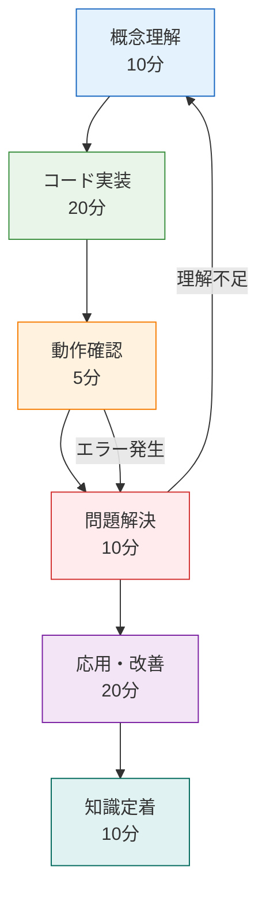

# 🎮 インタラクティブ学習ガイド - ハンズオンでマスターするゲーム開発

## 🎯 学習アプローチ

**実践重視の段階的習得**: コードを書きながら理解を深める



## 🚀 Section 1: 基本ブロック操作の実装（30分）

### Step 1: 概念理解（5分）

まず、Minecraftの基本要素である「ブロック操作」の仕組みを理解しましょう。

```typescript
// [CONCEPT] ブロック操作の核となる概念
interface BlockOperation {
  // 何を？
  readonly target: BlockPosition
  // どうする？
  readonly action: 'place' | 'break' | 'interact'
  // どんなブロック？
  readonly blockType?: BlockType
  // 誰が？
  readonly actor: Player
}

// Effect-TSで表現すると...
const performBlockOperation = (operation: BlockOperation) =>
  Effect.gen(function* () {
    // 1. 権限チェック
    yield* validatePermission(operation.actor, operation.target)

    // 2. ワールド状態確認
    const currentBlock = yield* getBlockAt(operation.target)

    // 3. 操作実行
    yield* executeOperation(operation, currentBlock)

    // 4. 状態更新
    yield* updateWorldState(operation.target)
  })
```

**🤔 理解チェック**: なぜEffect-TSを使うのでしょうか？

<details>
<summary>💡 答えを見る</summary>

- **副作用の明示化**: ファイルI/O、ネットワーク通信、DOM操作が型レベルで明確
- **エラーハンドリング**: 型安全なエラー処理が自動的に組み込まれる
- **テスタビリティ**: 副作用をモックしやすい構造
- **合成可能性**: 小さな操作を組み合わせて複雑な処理を構築

</details>

### Step 2: 実装体験（15分）

実際にブロック配置機能を実装してみましょう。

```typescript
// [HANDS_ON] あなたが書くコード
// src/domain/block/BlockOperations.ts

import { Effect, Schema } from 'effect'

// まず、基本的な型定義から
export const BlockType = Schema.Literal('air', 'stone', 'grass', 'dirt', 'wood')

export const BlockPosition = Schema.Struct({
  x: Schema.Number.pipe(Schema.int()),
  y: Schema.Number.pipe(Schema.int(), Schema.between(0, 255)),
  z: Schema.Number.pipe(Schema.int()),
})

export const Block = Schema.Struct({
  type: BlockType,
  position: BlockPosition,
  metadata: Schema.optional(Schema.Record(Schema.String, Schema.Unknown)),
})

// 🎯 YOUR TURN: ここからあなたが実装してください
export const placeBlock = (
  position: Schema.Schema.Type<typeof BlockPosition>,
  blockType: Schema.Schema.Type<typeof BlockType>
) =>
  Effect.gen(function* () {
    // TODO: 1. 現在のブロックを取得
    // const currentBlock = yield* ...
    // TODO: 2. 配置可能かチェック
    // if (currentBlock.type !== "air") {
    //   return yield* Effect.fail(...)
    // }
    // TODO: 3. 新しいブロックを作成
    // const newBlock = ...
    // TODO: 4. ワールドに配置
    // yield* setBlockAt(position, newBlock)
  })

// 🎯 実装のヒント
// - Effect.fail() でエラーを表現
// - yield* で副作用のある関数を呼び出し
// - Schema.decodeUnknown() でデータ検証
```

**📝 実装課題**: 上記のTODOを埋めて、動作するブロック配置機能を作成してください。

<details>
<summary>💡 実装例を見る</summary>

```typescript
export const placeBlock = (
  position: Schema.Schema.Type<typeof BlockPosition>,
  blockType: Schema.Schema.Type<typeof BlockType>
) =>
  Effect.gen(function* () {
    // 1. 現在のブロックを取得
    const currentBlock = yield* getBlockAt(position)

    // 2. 配置可能かチェック
    if (currentBlock.type !== 'air') {
      return yield* Effect.fail(
        new BlockPlacementError({
          reason: '位置が既に占有されています',
          position,
          existingBlock: currentBlock.type,
        })
      )
    }

    // 3. 新しいブロックを作成
    const newBlock = {
      type: blockType,
      position,
      metadata: {},
    }

    // 4. ワールドに配置
    yield* setBlockAt(position, newBlock)

    // 5. 成功ログ
    yield* Effect.log(`ブロック配置成功: ${blockType} at (${position.x}, ${position.y}, ${position.z})`)
  })
```

</details>

### Step 3: 動作確認（5分）

実装したコードをテストしてみましょう。

```typescript
// [VALIDATION] テストコード
import { Effect } from 'effect'
import { placeBlock } from './BlockOperations'

const testBlockPlacement = Effect.gen(function* () {
  console.log('🧪 ブロック配置テスト開始')

  // テストケース1: 正常な配置
  yield* placeBlock({ x: 0, y: 64, z: 0 }, 'stone')
  console.log('✅ テスト1: 正常配置 - 成功')

  // テストケース2: 同じ位置への重複配置
  try {
    yield* placeBlock({ x: 0, y: 64, z: 0 }, 'wood')
    console.log('❌ テスト2: 重複配置検出されず')
  } catch (error) {
    console.log('✅ テスト2: 重複配置エラー - 成功')
  }

  console.log('🎉 すべてのテストが完了しました')
})

// 実行
const runTest = testBlockPlacement.pipe(
  Effect.flatMap(() => Effect.log('テスト完了')),
  Effect.catchAll((error) =>
    Effect.gen(function* () {
      yield* Effect.logError(`テスト失敗: ${error}`)
      return Effect.fail(error)
    })
  )
)

Effect.runPromise(runTest)
```

**🔍 確認ポイント**:

- [ ] コンパイルエラーなし
- [ ] 正常な配置が成功する
- [ ] 重複配置でエラーが発生する
- [ ] ログが適切に表示される

### Step 4: よくある問題と解決法（5分）

**❌ 問題1**: `yield*` の使い方がわからない

```typescript
// 間違い
const result = getBlockAt(position) // Effect型のまま

// 正解
const result = yield * getBlockAt(position) // Effect型を展開
```

**❌ 問題2**: エラーハンドリングの方法

```typescript
// 間違い
throw new Error('エラーが発生しました')

// 正解
yield *
  Effect.fail(
    new BlockError({
      message: 'エラーが発生しました',
      position,
    })
  )
```

**❌ 問題3**: 型エラーが解決できない

```typescript
// 確認すべきポイント
// 1. Schema.decodeUnknown() を使用しているか？
// 2. ブランド型を正しく定義しているか？
// 3. import文が正しいか？

// デバッグ用の型確認
type PositionType = Schema.Schema.Type<typeof BlockPosition>
// → マウスホバーで実際の型を確認
```

## 🏗️ Section 2: Three.jsレンダリング統合（45分）

### Step 1: 3Dレンダリング基礎（10分）

Minecraftのようなブロックワールドをブラウザで表示するには、WebGL（Three.js）が必要です。

```typescript
// [CONCEPT] 3Dレンダリングの基本要素
interface RenderingConcepts {
  // 3D空間
  readonly scene: THREE.Scene // すべてのオブジェクトを含む3D空間

  // 視点
  readonly camera: THREE.Camera // プレイヤーの視点

  // 描画エンジン
  readonly renderer: THREE.WebGLRenderer // WebGLで描画

  // 3Dオブジェクト
  readonly meshes: THREE.Mesh[] // 表示される3Dオブジェクト群
}

// Effect-TSで管理すると...
const createRenderingSystem = Effect.gen(function* () {
  // 1. レンダラー作成
  const renderer = yield* createWebGLRenderer()

  // 2. シーン構築
  const scene = yield* createScene()

  // 3. カメラ設定
  const camera = yield* createCamera()

  // 4. レンダリングループ開始
  yield* startRenderLoop(renderer, scene, camera)
})
```

**💭 3Dレンダリングの核心**: ブロックワールド → メッシュ → 画面描画

### Step 2: ブロック表示実装（20分）

実際にブロックをThree.jsで表示する機能を実装します。

```typescript
// [HANDS_ON] 3Dブロック表示
// src/infrastructure/rendering/BlockRenderer.ts

import * as THREE from 'three'
import { Effect, Context } from 'effect'
import { Block } from '../../domain/block/Block'

// レンダリングサービスの定義
export interface BlockRenderService {
  readonly renderBlock: (block: Block) => Effect.Effect<THREE.Mesh, RenderError>
  readonly removeBlock: (position: BlockPosition) => Effect.Effect<void, RenderError>
  readonly updateBlockTexture: (mesh: THREE.Mesh, blockType: BlockType) => Effect.Effect<void, RenderError>
}

// 🎯 YOUR TURN: BlockRenderer実装
export const createBlockRenderer = Effect.gen(function* () {
  // 基本ジオメトリとマテリアル
  const geometry = new THREE.BoxGeometry(1, 1, 1)
  const materials = new Map<BlockType, THREE.Material>()

  // TODO: テクスチャローダーを作成
  // const textureLoader = new THREE.TextureLoader()

  // TODO: ブロックタイプ別のマテリアルを作成
  // materials.set("stone", new THREE.MeshLambertMaterial({
  //   map: textureLoader.load("/textures/stone.png")
  // }))

  return {
    renderBlock: (block: Block) =>
      Effect.gen(function* () {
        // TODO: 1. 適切なマテリアルを選択
        // const material = materials.get(block.type)
        // TODO: 2. メッシュを作成
        // const mesh = new THREE.Mesh(geometry, material)
        // TODO: 3. 位置を設定
        // mesh.position.set(block.position.x, block.position.y, block.position.z)
        // TODO: 4. メッシュを返す
        // return mesh
      }),

    removeBlock: (position: BlockPosition) =>
      Effect.gen(function* () {
        // TODO: シーンからメッシュを削除する処理
      }),
  }
})

// 🎯 実装課題
// 1. テクスチャローダーでブロック画像を読み込む
// 2. ブロックタイプに応じたマテリアルマップを作成
// 3. メッシュの位置設定を正しく行う
// 4. メモリリークを防ぐためのクリーンアップ処理
```

<details>
<summary>💡 実装例を見る</summary>

```typescript
export const createBlockRenderer = Effect.gen(function* () {
  const geometry = new THREE.BoxGeometry(1, 1, 1)
  const materials = new Map<BlockType, THREE.Material>()
  const textureLoader = new THREE.TextureLoader()

  // ブロックタイプ別マテリアル初期化
  materials.set(
    'stone',
    new THREE.MeshLambertMaterial({
      map: textureLoader.load('/textures/stone.png'),
    })
  )
  materials.set(
    'grass',
    new THREE.MeshLambertMaterial({
      map: textureLoader.load('/textures/grass.png'),
    })
  )
  materials.set(
    'dirt',
    new THREE.MeshLambertMaterial({
      map: textureLoader.load('/textures/dirt.png'),
    })
  )
  materials.set(
    'wood',
    new THREE.MeshLambertMaterial({
      map: textureLoader.load('/textures/wood.png'),
    })
  )

  return {
    renderBlock: (block: Block) =>
      Effect.gen(function* () {
        const material = materials.get(block.type)
        if (!material) {
          return yield* Effect.fail(
            new RenderError({
              reason: `未知のブロックタイプ: ${block.type}`,
            })
          )
        }

        const mesh = new THREE.Mesh(geometry, material)
        mesh.position.set(block.position.x, block.position.y, block.position.z)

        // メッシュにメタデータを付与（後でアクセス可能にするため）
        mesh.userData = { blockType: block.type, position: block.position }

        return mesh
      }),

    removeBlock: (position: BlockPosition) =>
      Effect.gen(function* () {
        // シーンから指定位置のメッシュを検索・削除
        const scene = yield* getScene()
        const meshToRemove = scene.children.find(
          (child) =>
            child instanceof THREE.Mesh &&
            child.userData.position &&
            child.userData.position.x === position.x &&
            child.userData.position.y === position.y &&
            child.userData.position.z === position.z
        ) as THREE.Mesh

        if (meshToRemove) {
          scene.remove(meshToRemove)
          // ジオメトリとマテリアルのメモリ解放
          meshToRemove.geometry.dispose()
          if (Array.isArray(meshToRemove.material)) {
            meshToRemove.material.forEach((mat) => mat.dispose())
          } else {
            meshToRemove.material.dispose()
          }
        }
      }),
  }
})
```

</details>

### Step 3: レンダリング統合テスト（10分）

```typescript
// [VALIDATION] レンダリングテスト
const testBlockRendering = Effect.gen(function* () {
  console.log('🎨 3Dレンダリングテスト開始')

  // 1. レンダラー初期化
  const renderer = yield* createBlockRenderer()
  const scene = new THREE.Scene()

  // 2. テストブロック作成
  const testBlock: Block = {
    type: 'stone',
    position: { x: 0, y: 0, z: 0 },
    metadata: {},
  }

  // 3. レンダリングテスト
  const mesh = yield* renderer.renderBlock(testBlock)
  scene.add(mesh)

  console.log('✅ ブロック表示成功')
  console.log(`📍 位置: (${mesh.position.x}, ${mesh.position.y}, ${mesh.position.z})`)
  console.log(`🎨 マテリアル: ${testBlock.type}`)

  // 4. 削除テスト
  yield* renderer.removeBlock(testBlock.position)
  console.log('✅ ブロック削除成功')
})

// レンダリングテスト実行
const runRenderingTest = testBlockRendering.pipe(
  Effect.flatMap(() => Effect.log('✅ レンダリングテスト完了')),
  Effect.catchAll((error) =>
    Effect.gen(function* () {
      yield* Effect.logError(`❌ レンダリングテスト失敗: ${error}`)
      return Effect.fail(error)
    })
  )
)

Effect.runPromise(runRenderingTest)
```

## 🎯 Section 3: 実践的統合開発（30分）

### 総合演習: ミニMinecraftワールド作成

これまで学んだ知識を統合して、小さなMinecraftワールドを作成します。

```typescript
// [FINAL_PROJECT] 統合演習
// src/examples/MiniMinecraftWorld.ts

export const createMiniWorld = Effect.gen(function* () {
  console.log('🌍 ミニワールド作成開始...')

  // Phase 1: 基盤初期化
  const worldSize = 10 // 10x10のミニワールド
  const renderer = yield* createBlockRenderer()
  const scene = new THREE.Scene()

  // Phase 2: 地形生成
  console.log('🏔️ 地形生成中...')
  for (let x = 0; x < worldSize; x++) {
    for (let z = 0; z < worldSize; z++) {
      // シンプルな平地＋ランダムな山
      const groundHeight = 0
      const hillHeight = Math.random() > 0.7 ? Math.floor(Math.random() * 3) + 1 : 0

      // 地面レイヤー
      const groundBlock: Block = {
        type: 'grass',
        position: { x, y: groundHeight, z },
      }

      const groundMesh = yield* renderer.renderBlock(groundBlock)
      scene.add(groundMesh)

      // 丘レイヤー
      for (let y = 1; y <= hillHeight; y++) {
        const hillBlock: Block = {
          type: y === hillHeight ? 'grass' : 'dirt',
          position: { x, y: groundHeight + y, z },
        }

        const hillMesh = yield* renderer.renderBlock(hillBlock)
        scene.add(hillMesh)
      }
    }
  }

  // Phase 3: 装飾追加
  console.log('🌲 装飾追加中...')
  // ランダムに木を配置
  for (let i = 0; i < 5; i++) {
    const treeX = Math.floor(Math.random() * worldSize)
    const treeZ = Math.floor(Math.random() * worldSize)

    // 木の幹
    const trunkBlock: Block = {
      type: 'wood',
      position: { x: treeX, y: 1, z: treeZ },
    }
    const trunkMesh = yield* renderer.renderBlock(trunkBlock)
    scene.add(trunkMesh)

    // 木の葉
    const leavesBlock: Block = {
      type: 'leaves' as BlockType, // 新しいブロックタイプ
      position: { x: treeX, y: 2, z: treeZ },
    }
    // ※ leaves用のマテリアルも追加が必要
  }

  console.log('🎉 ミニワールド完成！')
  return scene
})
```

## 🔧 トラブルシューティング & FAQ

### よくある質問

**Q: Effect-TSが複雑すぎて理解できません**
**A**: まずは以下の3つのパターンだけ覚えてください：

1. `Effect.gen(function* () { ... })` - 処理の流れを書く
2. `yield*` - 副作用のある処理を実行
3. `Effect.fail()` - エラーを表現

**Q: Three.jsでブロックが表示されません**
**A**: 以下をチェック：

1. カメラの位置と向きは正しいか？
2. ライティングは設定されているか？
3. メッシュはシーンに追加されているか？
4. レンダーループは動いているか？

**Q: パフォーマンスが悪いです**
**A**: 最適化のポイント：

1. インスタンスメッシュを使用
2. 不要なメッシュは即座に削除
3. テクスチャのサイズを最適化
4. 視錐台カリングを実装

### デバッグのコツ

```typescript
// デバッグ用ヘルパー関数
const debugLog =
  <T>(label: string) =>
  (value: T): Effect.Effect<T, never> =>
    Effect.gen(function* () {
      console.log(`🐛 [DEBUG] ${label}:`, value)
      return value
    })

// 使用例
const processBlock = Effect.gen(function* () {
  const block = yield* getBlock(position)
  yield* debugLog('取得したブロック')(block) // デバッグ出力

  const mesh = yield* renderer.renderBlock(block)
  yield* debugLog('生成されたメッシュ')(mesh) // デバッグ出力

  return mesh
})
```

## 🎖️ 学習達成度チェック

### 基礎レベル（必須）

- [ ] Effect-TSの基本パターン（gen、yield\*、fail）を理解
- [ ] ブロックの配置・削除ができる
- [ ] Three.jsでブロックを表示できる
- [ ] 基本的なエラーハンドリングができる

### 中級レベル（推奨）

- [ ] 複数ブロックの効率的な管理
- [ ] テクスチャとマテリアルの動的切り替え
- [ ] パフォーマンスを意識したレンダリング
- [ ] デバッグとトラブルシューティング

### 上級レベル（挑戦）

- [ ] チャンクベースの世界管理
- [ ] 動的レベル・オブ・ディテール（LOD）
- [ ] マルチスレッド対応（Web Workers）
- [ ] プロファイリングと最適化

## 🚀 次のステップ

このインタラクティブガイドを完了したら：

1. **[物理エンジン統合](../advanced-topics/physics-integration.md)** - リアルな物理挙動
2. **[マルチプレイヤー対応](../advanced-topics/multiplayer-basics.md)** - オンライン対戦
3. **[高度な最適化](../../how-to/development/performance-optimization.md)** - プロダクション品質

---

**🎯 Learning Outcome**: 実践的なゲーム開発スキルとEffect-TS習熟度を同時に獲得 ✅
