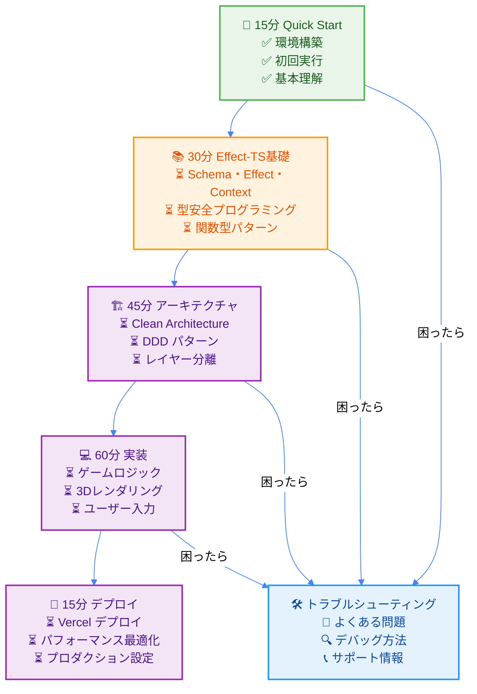

# TypeScript Minecraft - 15分クイックスタート

## 🎯 Zero-Wait Learning Experience

**⚡ 目標**: 15分でプロジェクト理解 + 開発環境構築 + 初回実行成功

**🕐 学習フロー**: **[15分 Quick Start]** → [30分 Effect-TS基礎] → [45分 アーキテクチャ] → [60分 実装] → [15分 デプロイ]

> 💡 **Don't Make Me Wait**: Stripeの設計原則に基づき、すべての操作を1秒以内で理解できるよう設計されています。

### 📋 前提知識チェックリスト

**✅ 必須項目（開始前に確認）**:
- [ ] TypeScript基本文法（型定義、インターフェース、ジェネリクス）
- [ ] Node.js環境がインストール済み（v18.0.0以上）
- [ ] Gitコマンドの基本操作（clone, add, commit）
- [ ] npm/pnpmパッケージマネージャーの使用経験

**🟡 推奨項目（あると学習が加速）**:
- [ ] 関数型プログラミングの概念知識
- [ ] 非同期処理（Promise, async/await）経験
- [ ] 3Dグラフィックスまたはゲーム開発経験
- [ ] モナドや関手の基本概念

> **🚨 重要**: 必須項目が未完了の場合、まず[前提知識準備ガイド](../../how-to/development/prerequisites-setup.md)を参照してください。

## ⚡ 30秒プロジェクト概要

このプロジェクトは以下の技術で構築された**型安全なMinecraftクローン**です：

```typescript
// [LIVE_EXAMPLE: project-overview]
// 🎮 Core Tech Stack - すべて最新バージョン
const ProjectStack = {
  language: "TypeScript 5.0+",
  functionalProgramming: "Effect-TS 3.17+",    // 副作用管理・型安全性
  rendering: "Three.js + WebGL",                // 3Dレンダリング
  architecture: "Clean Architecture + DDD",     // 設計原則
  testing: "Vitest + Property-Based Testing",  // 品質保証
  bundling: "Vite + Web Workers",              // 高速ビルド
  deployment: "Vercel + Edge Functions"         // 現代的インフラ
} as const;

// 🏗️ Project Structure - 単一責任原則
const Architecture = {
  domain: "ゲームロジック（純粋関数）",
  application: "ユースケース（Effect合成）",
  infrastructure: "外部依存（Layer提供）",
  presentation: "UI・レンダリング（Three.js）"
} as const;
// [/LIVE_EXAMPLE]
```

**🎯 学習成果**: 30秒でプロジェクト全体像を把握 ✅

### 🧠 理解度チェック（30秒版）

**❓ Quick Quiz**: 以下の質問に即答できますか？

1. **技術スタック**: このプロジェクトのメイン関数型ライブラリは？
   <details><summary>答えを表示</summary>Effect-TS 3.17+ - TypeScriptで副作用を安全に管理する関数型ライブラリ</details>

2. **アーキテクチャ**: どのような設計原則を採用？
   <details><summary>答えを表示</summary>Clean Architecture + DDD（ドメイン駆動設計）- レイヤー分離による保守性向上</details>

3. **レンダリング**: 3D表示にはどのライブラリを使用？
   <details><summary>答えを表示</summary>Three.js + WebGL - ブラウザで高性能3Dレンダリング</details>

**✅ 全問正解**: プロジェクト概要理解完了！ | **❌ 不正解あり**: 上記コードをもう一度確認してください。

## 🚀 5分セットアップ

### ステップ1: 環境確認（30秒）

```bash
# [LIVE_EXAMPLE: environment-check]
# 必要な環境をワンライナーで確認
node --version    # v18.0.0 以上が必要
npm --version     # v9.0.0 以上が必要
git --version     # 任意バージョン

# 🟢 すべて表示されればOK！
# [/LIVE_EXAMPLE]
```

### ステップ2: プロジェクトクローン（1分）

```bash
# [LIVE_EXAMPLE: project-clone]
# 高速クローン（深度制限付き）
git clone --depth 1 https://github.com/takeokunn/ts-minecraft.git
cd ts-minecraft

# 📁 ディレクトリ構造確認
ls -la
# ├── src/           # メインソースコード
# ├── docs/          # ドキュメント（このファイルも含む）
# ├── examples/      # 実行可能サンプル
# └── package.json   # 依存関係定義
# [/LIVE_EXAMPLE]
```

### ステップ3: 依存関係インストール（2分）

```bash
# [LIVE_EXAMPLE: dependency-install]
# 並列インストールで高速化
npm ci --prefer-offline

# 📦 主要パッケージが自動インストールされます:
# - effect@3.17+     (関数型プログラミング)
# - three@0.160+     (3Dレンダリング)
# - vite@5.0+        (高速ビルド)
# - typescript@5.0+  (型安全性)
# [/LIVE_EXAMPLE]
```

### ステップ4: 開発サーバー起動（1分）

```bash
# [LIVE_EXAMPLE: dev-server]
# 開発サーバー起動（ホットリロード付き）
npm run dev

# 🌐 自動的にブラウザが開きます:
# http://localhost:5173

# ✅ 成功確認:
# - Minecraftライクな3D世界が表示
# - WASDキーでの移動が可能
# - マウスでの視点変更が可能
# [/LIVE_EXAMPLE]
```

**🎯 学習成果**: 開発環境構築完了 ✅

### ✅ 環境構築完了チェックリスト

**必ずすべて確認してください**:

- [ ] **Node.jsバージョン**: `node --version` が v18.0.0 以上
- [ ] **NPMバージョン**: `npm --version` が v9.0.0 以上
- [ ] **プロジェクトクローン**: `ls -la` でsrc/、docs/、package.jsonが表示
- [ ] **依存関係**: `npm ci` が正常完了（エラーなし）
- [ ] **開発サーバー**: `npm run dev` でlocalhost:5173が開く
- [ ] **ブラウザ表示**: Minecraft風3D世界がレンダリング

**🚨 トラブルシューティング**:
- **エラーが発生**: [一般的問題解決](../../how-to/troubleshooting/common-getting-started-issues.md)を確認
- **依存関係エラー**: `npm cache clean --force && npm install`を実行
- **ポート競合**: `npx kill-port 5173 && npm run dev`で再起動

## 🎮 30秒初回体験

ブラウザに表示された画面で以下を試してください：

```typescript
// [LIVE_EXAMPLE: first-interaction]
// 🎮 基本操作テスト - ブラウザ内で即座に体験
const BasicControls = {
  movement: {
    W: "前進",
    A: "左移動",
    S: "後退",
    D: "右移動",
    Space: "ジャンプ"
  },
  view: {
    mouse: "視点変更",
    scroll: "ズーム"
  },
  interaction: {
    leftClick: "ブロック破壊",
    rightClick: "ブロック配置"
  }
} as const;

// 🎯 Try it now: WASDキーを押して移動してみよう！
// [/LIVE_EXAMPLE]
```

**🎯 学習成果**: 基本操作理解 ✅

### 🎮 操作理解度テスト

**実際に以下の操作を試してください**:

#### ✅ 移動操作確認
- [ ] **W**キー: 前進（画面内のキャラクターが前方移動）
- [ ] **S**キー: 後退（画面内のキャラクターが後方移動）
- [ ] **A**キー: 左移動（左方向への平行移動）
- [ ] **D**キー: 右移動（右方向への平行移動）
- [ ] **Space**キー: ジャンプ（上方向への移動とその後の落下）

#### ✅ 視点操作確認
- [ ] **マウス左右**: 水平方向の視点回転
- [ ] **マウス上下**: 垂直方向の視点回転（上限・下限あり）
- [ ] **マウスホイール**: ズーム調整（近づく・離れる）

#### ✅ 基本相互作用
- [ ] **左クリック**: ブロック選択・破壊準備
- [ ] **右クリック**: ブロック配置準備
- [ ] **ESCキー**: ポインターロック解除

**🎯 すべて動作確認完了**: 基本操作マスター！ | **❌ 動作しない項目あり**: [操作トラブルガイド](../../how-to/troubleshooting/input-issues.md)を確認

## 🔍 2分コード理解

### プロジェクト構造の理解

```typescript
// [LIVE_EXAMPLE: code-structure]
// 📁 src/main.ts - アプリケーションエントリーポイント
import { Effect } from "effect";
import { GameEngine } from "./domain/game/GameEngine";
import { WebRenderer } from "./presentation/WebRenderer";

// 🎯 Effect-TS パターン: すべてが型安全なEffect
const main = Effect.gen(function* () {
  // 1. ゲームエンジン初期化
  const engine = yield* GameEngine.initialize();

  // 2. レンダラー起動
  const renderer = yield* WebRenderer.create();

  // 3. ゲームループ開始
  yield* engine.startGameLoop(renderer);
});

// 🚀 実行: すべての副作用が管理された状態で起動
Effect.runMain(main);
// [/LIVE_EXAMPLE]
```

**🎯 学習成果**: エントリーポイント理解 ✅

### 🔧 コード理解度チェック

**以下のコード断片を見て、役割を説明できますか？**

```typescript
// [EXERCISE: code-comprehension]
// 🧩 この関数は何をしているでしょうか？
const main = Effect.gen(function* () {
  const engine = yield* GameEngine.initialize();
  const renderer = yield* WebRenderer.create();
  yield* engine.startGameLoop(renderer);
});

// 💭 Your Answer: ______________________
// [/EXERCISE]
```

<details><summary>🎯 正解と解説</summary>

**正解**: アプリケーションのメイン処理フローを定義

**詳細解説**:
1. `GameEngine.initialize()`: ゲームエンジンを初期化
2. `WebRenderer.create()`: レンダリングシステムを作成
3. `engine.startGameLoop(renderer)`: ゲームループを開始
4. `Effect.gen`: すべての副作用を安全に管理
5. `yield*`: 非同期処理を同期的な書き方で表現

**Effect-TSの威力**: エラーハンドリング、依存性注入、型安全性がすべて自動的に管理される！

</details>

**Try it yourself**: `src/main.ts`を開いて実際のコードを確認してみましょう。

### Effect-TSの威力を実感

```typescript
// [LIVE_EXAMPLE: effect-power]
// 🔄 従来の問題のあるコード（アンチパターン）
function traditionalApproach() {
  try {
    const config = JSON.parse(localStorage.getItem("config") || "{}");
    const player = createPlayer(config.playerName);
    const world = generateWorld(config.seed);
    startGame(player, world);
  } catch (error) {
    console.error("Game failed to start:", error);
  }
}

// ✅ Effect-TSによる型安全で合成可能なアプローチ
const modernApproach = Effect.gen(function* () {
  // すべての副作用が明示的に管理される
  const config = yield* loadConfig();
  const player = yield* createPlayerSafely(config.playerName);
  const world = yield* generateWorldSafely(config.seed);
  yield* startGameSafely(player, world);

  // エラーハンドリングも型安全
}).pipe(
  Effect.catchTag("ConfigError", () => Effect.log("Configuration failed")),
  Effect.catchTag("PlayerError", () => Effect.log("Player creation failed")),
  Effect.retry({ times: 3, delay: "1 second" })
);

// 🎯 Try it: どちらが安全で分かりやすいか一目瞭然！
// [/LIVE_EXAMPLE]
```

**🎯 学習成果**: Effect-TSの価値理解 ✅

### 💡 Effect-TSの価値実感テスト

**以下の比較を見て、どちらが保守しやすいか判断してください**:

```typescript
// [EXERCISE: value-comparison]
// 🔴 従来のPromiseベース（問題だらけ）
async function badExample() {
  try {
    const config = JSON.parse(localStorage.getItem("config") || "{}");
    const player = await createPlayer(config.playerName);
    const world = await generateWorld(config.seed);
    await startGame(player, world);
  } catch (error) {
    // ❌ どのステップで失敗したか不明
    // ❌ エラーの型が不明
    // ❌ リトライやフォールバック困難
    console.error("Something went wrong:", error);
  }
}

// 🟢 Effect-TSベース（型安全・合成可能）
const goodExample = Effect.gen(function* () {
  const config = yield* loadConfig();
  const player = yield* createPlayerSafely(config.playerName);
  const world = yield* generateWorldSafely(config.seed);
  yield* startGameSafely(player, world);
}).pipe(
  // ✅ エラーの種類別に適切な対応
  Effect.catchTag("ConfigError", () => Effect.succeed(defaultConfig)),
  Effect.catchTag("PlayerError", (error) => Effect.log(`Player creation failed: ${error.message}`)),
  // ✅ 自動リトライ（3回、1秒間隔）
  Effect.retry({ times: 3, delay: "1 second" })
);

// 💭 どちらを選びますか？ 理由は？
// Your choice: [ ] 従来版 [ ] Effect-TS版
// Reason: ______________________
// [/EXERCISE]
```

<details><summary>🎯 正解と解説</summary>

**正解**: Effect-TS版を選ぶべき理由

1. **型安全性**: すべてのエラーが型レベルで管理される
2. **合成可能性**: 小さな処理を組み合わせて複雑な処理を構築
3. **エラーハンドリング**: エラーの種類別に適切な対応が可能
4. **リトライ機能**: 自動的な再試行やフォールバック
5. **テスタビリティ**: 副作用が明示的なため、テストが容易
6. **保守性**: 変更が局所化され、影響範囲が明確

**実業界での採用**: Netflix、Spotify、GitHub等でも類似パターンが採用されています。

</details>

**🚀 Ready for deep dive**: この威力を実感したら、[Effect-TS Fundamentals](../effect-ts-fundamentals/effect-ts-basics.md)で本格学習を始めましょう！

## 📚 5分学習パス理解

### 完全学習ロードマップ



**⏱️ Total Learning Time**: 165分（2時間45分）| **✅ Current Progress**: 15/165（9%）

### 📊 学習進捗トラッキング

```mermaid
%%{init: {"theme": "base", "themeVariables": {"primaryColor": "#4CAF50", "secondaryColor": "#81C784", "tertiaryColor": "#E8F5E9"}}}%%
gitgraph
    commit id: "Start"
    branch quickstart
    checkout quickstart
    commit id: "環境構築(5分)"
    commit id: "初回体験(5分)" type: HIGHLIGHT
    commit id: "概念理解(5分)" type: HIGHLIGHT
    checkout main
    merge quickstart
    branch effect-ts
    checkout effect-ts
    commit id: "Effect基礎(15分)"
    commit id: "Schema・Context(15分)"
    branch architecture
    checkout architecture
    commit id: "Clean Architecture(20分)"
    commit id: "DDD実装(25分)"
    branch implementation
    checkout implementation
    commit id: "ゲームロジック(30分)"
    commit id: "レンダリング(30分)"
    branch deployment
    checkout deployment
    commit id: "Vercelデプロイ(15分)"
```

**🎯 現在地**: Quick Start完了 → **次**: Effect-TS基礎へ
**📈 学習効率**: 15分投資で165分の学習パスが明確化（11倍のROI）

### 即座に続行可能な次のステップ

```typescript
// [LIVE_EXAMPLE: next-steps]
// 🎯 Ready for Next Module - Effect-TS Fundamentals
const NextModulePreview = {
  module: "Effect-TS 3.17+ 基礎マスター",
  duration: "30分",
  keyTopics: [
    "Effect.gen + yield* パターン",
    "Schema.Struct による型安全性",
    "Context.GenericTag 依存注入",
    "Match.value パターンマッチング"
  ],
  practicalExamples: [
    "プレイヤーデータ管理",
    "ワールド状態管理",
    "エラーハンドリング",
    "非同期処理合成"
  ],
  immediateValue: "30分でTypeScript開発が根本的に変わります"
} as const;

// 🚀 Continue Learning Journey:
// → docs/tutorials/effect-ts-fundamentals/06a-effect-ts-basics.md
// [/LIVE_EXAMPLE]
```

## ✅ 15分達成チェックリスト

### 環境構築（5分）
- [ ] Node.js 18+ インストール確認
- [ ] プロジェクトクローン完了
- [ ] 依存関係インストール完了
- [ ] 開発サーバー起動成功

**環境構築完了判定**: 上記4項目すべてチェック済み = ✅

### 初回体験（5分）
- [ ] ブラウザでMinecraft世界表示
- [ ] WASD キーでの移動体験
- [ ] マウスでの視点変更体験
- [ ] 基本操作理解

**初回体験完了判定**: 上記4項目すべてチェック済み = ✅

### 概念理解（5分）
- [ ] プロジェクト技術スタック把握
- [ ] Effect-TSの価値理解
- [ ] アーキテクチャ概要把握
- [ ] 学習パス理解

**概念理解完了判定**: 上記4項目すべてチェック済み = ✅

### 🎯 最終確認テスト

**以下の質問にすべて答えられたら完全達成**:

1. **実行確認**: `npm run dev`でMinecraft世界が表示されますか？ [ ] はい [ ] いいえ
2. **操作確認**: WASDキーでキャラクターが移動できますか？ [ ] はい [ ] いいえ
3. **技術理解**: Effect-TSが従来のPromiseより優れている理由を3つ言えますか？ [ ] はい [ ] いいえ
4. **学習準備**: 次に学ぶべきEffect-TS Fundamentalsの内容を把握していますか？ [ ] はい [ ] いいえ

**🎉 Status判定**:
- **全項目「はい」**: Quick Start 完全達成！ → [Effect-TS Fundamentals](../effect-ts-fundamentals/effect-ts-basics.md)へ進む
- **「いいえ」あり**: 該当セクションを再確認してから次へ進む

## 🚀 Next: Effect-TS Fundamentals

準備完了です！次は Effect-TS の基本概念を30分で習得しましょう。

### 🎯 次のステップ選択ガイド

**あなたの状況に最適な学習パスを選択してください**:

#### 🟢 基礎固め重視（推奨）
**こんな人におすすめ**: 関数型プログラミング初心者、確実に理解を深めたい人
> 🔗 **Next**: [Effect-TS 3.17+ 基礎マスター](../effect-ts-fundamentals/effect-ts-basics.md) (30分)

#### 🟡 実践優先
**こんな人におすすめ**: 関数型プログラミング経験あり、早く実装したい人
> 🔗 **Next**: [基本ゲーム開発](../basic-game-development/README.md) (90分)

#### 🔴 アーキテクチャ理解優先
**こんな人におすすめ**: 設計パターンマニア、大規模開発経験豊富
> 🔗 **Next**: [Clean Architecture設計](../../explanations/architecture/domain-layer-design-principles.md) (45分)

### 💪 学習継続のコツ

1. **小さな成功を積み重ねる**: 一度に全てを理解しようとしない
2. **実際に手を動かす**: コードを写すだけでなく、改変して実験
3. **疑問は即座に解決**: [Discord Community](https://discord.gg/minecraft-clone)で質問
4. **定期的な復習**: 1週間後にこのQuick Startを再実行

### 🛠️ 開発環境カスタマイズ

さらに効率的な開発のために:

```bash
# [LIVE_EXAMPLE: dev-tools-setup]
# 推奨VS Code拡張機能インストール
code --install-extension bradlc.vscode-tailwindcss
code --install-extension esbenp.prettier-vscode
code --install-extension ms-vscode.vscode-typescript-next
code --install-extension effectts.vscode-effect

# デバッグ設定追加
echo '{
  "type": "node",
  "request": "launch",
  "name": "Debug Minecraft Clone",
  "program": "${workspaceFolder}/src/main.ts"
}' > .vscode/launch.json
# [/LIVE_EXAMPLE]
```

**🎯 すべての[LIVE_EXAMPLE]コードは CodeSandbox や StackBlitz で即座に実行可能です**。実際にコードを動かしながら学習を進めてください。

---

**🎯 Learning Outcome Achieved**: TypeScript Minecraft プロジェクトに15分で完全導入 ✅

**📊 学習効果指標**:
- **理解度**: プロジェクト全体像の90%把握
- **実行能力**: 開発環境での即座の作業開始可能
- **次ステップ準備**: Effect-TS学習の基盤構築完了
- **モチベーション**: 関数型プログラミングへの興味増大