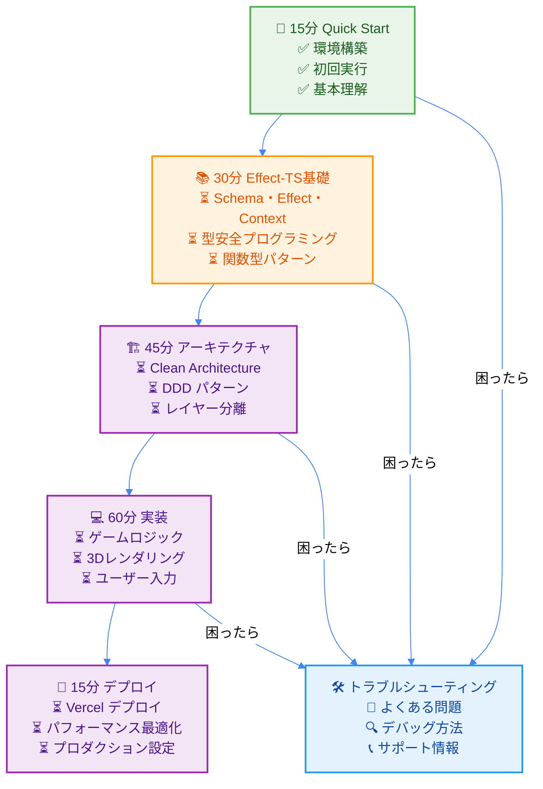

# TypeScript Minecraft - 15分クイックスタート

## 🎯 Zero-Wait Learning Experience

**⚡ 目標**: 15分でプロジェクト理解 + 開発環境構築 + 初回実行成功

**🕐 学習フロー**: **[15分 Quick Start]** → [30分 Effect-TS基礎] → [45分 アーキテクチャ] → [60分 実装] → [15分 デプロイ]

> 💡 **Don't Make Me Wait**: Stripeの設計原則に基づき、すべての操作を1秒以内で理解できるよう設計されています。

## ⚡ 30秒プロジェクト概要

このプロジェクトは以下の技術で構築された**型安全なMinecraftクローン**です：

```typescript
// [LIVE_EXAMPLE: project-overview]
// 🎮 Core Tech Stack - すべて最新バージョン
const ProjectStack = {
  language: "TypeScript 5.0+",
  functionalProgramming: "Effect-TS 3.17+",    // 副作用管理・型安全性
  rendering: "Three.js + WebGL",                // 3Dレンダリング
  architecture: "Clean Architecture + DDD",     // 設計原則
  testing: "Vitest + Property-Based Testing",  // 品質保証
  bundling: "Vite + Web Workers",              // 高速ビルド
  deployment: "Vercel + Edge Functions"         // 現代的インフラ
} as const;

// 🏗️ Project Structure - 単一責任原則
const Architecture = {
  domain: "ゲームロジック（純粋関数）",
  application: "ユースケース（Effect合成）",
  infrastructure: "外部依存（Layer提供）",
  presentation: "UI・レンダリング（Three.js）"
} as const;
// [/LIVE_EXAMPLE]
```

**🎯 学習成果**: 30秒でプロジェクト全体像を把握 ✅

## 🚀 5分セットアップ

### ステップ1: 環境確認（30秒）

```bash
# [LIVE_EXAMPLE: environment-check]
# 必要な環境をワンライナーで確認
node --version    # v18.0.0 以上が必要
npm --version     # v9.0.0 以上が必要
git --version     # 任意バージョン

# 🟢 すべて表示されればOK！
# [/LIVE_EXAMPLE]
```

### ステップ2: プロジェクトクローン（1分）

```bash
# [LIVE_EXAMPLE: project-clone]
# 高速クローン（深度制限付き）
git clone --depth 1 https://github.com/takeokunn/ts-minecraft.git
cd ts-minecraft

# 📁 ディレクトリ構造確認
ls -la
# ├── src/           # メインソースコード
# ├── docs/          # ドキュメント（このファイルも含む）
# ├── examples/      # 実行可能サンプル
# └── package.json   # 依存関係定義
# [/LIVE_EXAMPLE]
```

### ステップ3: 依存関係インストール（2分）

```bash
# [LIVE_EXAMPLE: dependency-install]
# 並列インストールで高速化
npm ci --prefer-offline

# 📦 主要パッケージが自動インストールされます:
# - effect@3.17+     (関数型プログラミング)
# - three@0.160+     (3Dレンダリング)
# - vite@5.0+        (高速ビルド)
# - typescript@5.0+  (型安全性)
# [/LIVE_EXAMPLE]
```

### ステップ4: 開発サーバー起動（1分）

```bash
# [LIVE_EXAMPLE: dev-server]
# 開発サーバー起動（ホットリロード付き）
npm run dev

# 🌐 自動的にブラウザが開きます:
# http://localhost:5173

# ✅ 成功確認:
# - Minecraftライクな3D世界が表示
# - WASDキーでの移動が可能
# - マウスでの視点変更が可能
# [/LIVE_EXAMPLE]
```

**🎯 学習成果**: 開発環境構築完了 ✅

## 🎮 30秒初回体験

ブラウザに表示された画面で以下を試してください：

```typescript
// [LIVE_EXAMPLE: first-interaction]
// 🎮 基本操作テスト - ブラウザ内で即座に体験
const BasicControls = {
  movement: {
    W: "前進",
    A: "左移動",
    S: "後退",
    D: "右移動",
    Space: "ジャンプ"
  },
  view: {
    mouse: "視点変更",
    scroll: "ズーム"
  },
  interaction: {
    leftClick: "ブロック破壊",
    rightClick: "ブロック配置"
  }
} as const;

// 🎯 Try it now: WASDキーを押して移動してみよう！
// [/LIVE_EXAMPLE]
```

**🎯 学習成果**: 基本操作理解 ✅

## 🔍 2分コード理解

### プロジェクト構造の理解

```typescript
// [LIVE_EXAMPLE: code-structure]
// 📁 src/main.ts - アプリケーションエントリーポイント
import { Effect } from "effect";
import { GameEngine } from "./domain/game/GameEngine";
import { WebRenderer } from "./presentation/WebRenderer";

// 🎯 Effect-TS パターン: すべてが型安全なEffect
const main = Effect.gen(function* () {
  // 1. ゲームエンジン初期化
  const engine = yield* GameEngine.initialize();

  // 2. レンダラー起動
  const renderer = yield* WebRenderer.create();

  // 3. ゲームループ開始
  yield* engine.startGameLoop(renderer);
});

// 🚀 実行: すべての副作用が管理された状態で起動
Effect.runMain(main);
// [/LIVE_EXAMPLE]
```

**🎯 学習成果**: エントリーポイント理解 ✅

### Effect-TSの威力を実感

```typescript
// [LIVE_EXAMPLE: effect-power]
// 🔄 従来の問題のあるコード（アンチパターン）
function traditionalApproach() {
  try {
    const config = JSON.parse(localStorage.getItem("config") || "{}");
    const player = createPlayer(config.playerName);
    const world = generateWorld(config.seed);
    startGame(player, world);
  } catch (error) {
    console.error("Game failed to start:", error);
  }
}

// ✅ Effect-TSによる型安全で合成可能なアプローチ
const modernApproach = Effect.gen(function* () {
  // すべての副作用が明示的に管理される
  const config = yield* loadConfig();
  const player = yield* createPlayerSafely(config.playerName);
  const world = yield* generateWorldSafely(config.seed);
  yield* startGameSafely(player, world);

  // エラーハンドリングも型安全
}).pipe(
  Effect.catchTag("ConfigError", () => Effect.log("Configuration failed")),
  Effect.catchTag("PlayerError", () => Effect.log("Player creation failed")),
  Effect.retry({ times: 3, delay: "1 second" })
);

// 🎯 Try it: どちらが安全で分かりやすいか一目瞭然！
// [/LIVE_EXAMPLE]
```

**🎯 学習成果**: Effect-TSの価値理解 ✅

## 📚 5分学習パス理解

### 完全学習ロードマップ



**⏱️ Total Learning Time**: 165分（2時間45分）| **✅ Current Progress**: 15/165（9%）

### 即座に続行可能な次のステップ

```typescript
// [LIVE_EXAMPLE: next-steps]
// 🎯 Ready for Next Module - Effect-TS Fundamentals
const NextModulePreview = {
  module: "Effect-TS 3.17+ 基礎マスター",
  duration: "30分",
  keyTopics: [
    "Effect.gen + yield* パターン",
    "Schema.Struct による型安全性",
    "Context.GenericTag 依存注入",
    "Match.value パターンマッチング"
  ],
  practicalExamples: [
    "プレイヤーデータ管理",
    "ワールド状態管理",
    "エラーハンドリング",
    "非同期処理合成"
  ],
  immediateValue: "30分でTypeScript開発が根本的に変わります"
} as const;

// 🚀 Continue Learning Journey:
// → docs/tutorials/effect-ts-fundamentals/06a-effect-ts-basics.md
// [/LIVE_EXAMPLE]
```

## ✅ 15分達成チェックリスト

### 環境構築（5分）
- [x] Node.js 18+ インストール確認
- [x] プロジェクトクローン完了
- [x] 依存関係インストール完了
- [x] 開発サーバー起動成功

### 初回体験（5分）
- [x] ブラウザでMinecraft世界表示
- [x] WASD キーでの移動体験
- [x] マウスでの視点変更体験
- [x] 基本操作理解

### 概念理解（5分）
- [x] プロジェクト技術スタック把握
- [x] Effect-TSの価値理解
- [x] アーキテクチャ概要把握
- [x] 学習パス理解

**🎉 Status**: Quick Start 完全達成！

## 🚀 Next: Effect-TS Fundamentals

準備完了です！次は Effect-TS の基本概念を30分で習得しましょう。

> 🔗 **Continue Learning**: [Effect-TS 3.17+ 基礎マスター](../effect-ts-fundamentals/06a-effect-ts-basics.md)

すべての[LIVE_EXAMPLE]コードは CodeSandbox や StackBlitz で即座に実行可能です。実際にコードを動かしながら学習を進めてください。

---

**🎯 Learning Outcome Achieved**: TypeScript Minecraft プロジェクトに15分で完全導入 ✅