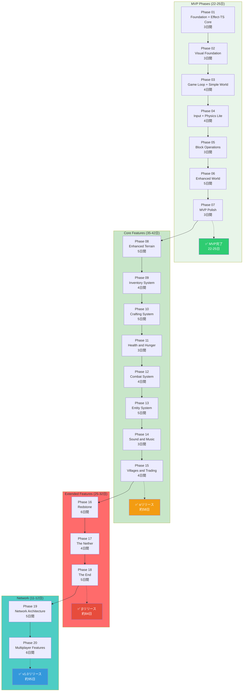

# Accelerated Development Schedule

**画面で確認できる単位での開発フェーズです。合計20フェーズで完全なゲームを構築します。**

## 概要

この開発スケジュールは**高速アプローチ**を採用しており、初めての視覚的出力を**6日目**に、完全にプレイ可能なMVPを**22-25日間**で、完全なゲームを**約95-120日間**で達成します。

従来の計画と比較して、**視覚的フィードバックを優先**しながら、全ての機能を網羅しています。

## 📋 フェーズ一覧

### 🏗️ MVPフェーズ (Phases 01-07) - 22-25日

**[Phase 01 - Foundation + Effect-TS Core](./01-foundation.md)**
- 環境構築（pnpm, TypeScript, Vite）
- Effect-TSパターンの確立（Context.GenericTag, Schema, Ref）
- Three.js基本設定
- **達成**: ブラウザで空白のキャンバスが表示される

**[Phase 02 - Visual Foundation - Three.js](./02-visual-foundation.md)**
- ブロックドメインモデル
- ブロックメッシュ生成
- 基本的なシーンとカメラ
- **達成**: **初めての3Dブロックが表示される！** 🎉

**[Phase 03 - Game Loop + Simple World](./03-game-loop.md)**
- プレイヤーエンティティ
- ゲームループ（Effect.gen）
- Refベースのステート管理
- 平坦な地形
- **達成**: アニメーションするシーン、カメラ追従

**[Phase 04 - Input + Physics Lite](./04-input-physics.md)**
- InputService（キーボード/マウス）
- WASD移動
- 重力と衝突判定（AABB）
- レイキャスティング
- **達成**: WASDで移動できる、ジャンプできる

**[Phase 05 - Block Operations](./05-block-operations.md)**
- BlockService（配置/破壊）
- ホットバーUI
- マウスハンドラー
- **達成**: ブロックを配置・破壊できる！ **コアゲームプレイ実装**

**[Phase 06 - Enhanced World](./06-enhanced-world.md)**
- チャンクシステム（16x16x384）
- ChunkManager with LRUキャッシュ
- シンプルな地形生成
- 貪欲メッシュ化
- フラスタムカリング
- **達成**: 大きな探索可能なワールド、30 FPS以上

**[Phase 07 - MVP Polish](./07-mvp-polish.md)**
- セーブ/ロード（localStorage）
- 設定管理
- 完全なUI（ホットバー、HUD）
- ドキュメント
- **達成**: **完全にプレイ可能なMVP完成！** 🎮

---

### 🎮 コア機能フェーズ (Phases 08-14) - 35-42日

**[Phase 08 - Enhanced Terrain Generation](./08-enhanced-terrain.md)** - 5日間
- Perlinノイズによる地形生成
- バイオームシステム（平原、森、山地、砂漠、雪原）
- 洞窟と地質構造
- 水域生成
- 木や岩の生成
- **達成**: 多様なバイオームと地形特徴

**[Phase 09 - Inventory System](./09-inventory.md)** - 4日間
- アイテムとItemStack定義
- インベントリデータ構造
- メインインベントリUI（27スロット）
- ドラッグ＆ドロップ
- アイテムドロップと拾集
- **達成**: 完全なインベントリシステム

**[Phase 10 - Crafting System](./10-crafting.md)** - 5日間
- レシピ定義
- レシピマッチング（パターン回転）
- 3x3クラフトテーブルUI
- クラフト実行
- **達成**: クラフトシステム、10+レシピ

**[Phase 11 - Health and Hunger](./11-health-hunger.md)** - 3日間
- 体力システムとHUD（ハート）
- 空腹システムとHUD（ドロップ）
- 食料アイテム
- 死亡とリスポーン
- **達成**: 体力・空腹管理

**[Phase 12 - Combat System](./12-combat.md)** - 4日間
- 攻撃判定とアニメーション
- ダメージ計算（クリティカル）
- ノックバック
- 武器と耐久度
- **達成**: 戦闘システム

**[Phase 13 - Entity System](./13-entity-system.md)** - 5日間
- エンティティシステム基盤
- モブスポーン（昼夜サイクル）
- AIステートマシン
- 基本的なモブ（ゾンビ、牛、豚、羊）
- **達成**: モブシステムとAI

**[Phase 14 - Sound and Music](./14-sound-music.md)** - 3日間
- 効果音システム
- 3D空間オーディオ
- 背景音楽マネージャー
- 環境別BGM
- **達成**: 音楽と効果音

**[Phase 15 - Villages and Trading](./15-villages.md)** - 4日間
- 村の生成（家屋、道路、井戸）
- 村人AI（農夫、司書）
- 取引システム
- エメラルド通貨
- **達成**: 村と取引

---

### 🌟 拡張機能フェーズ (Phases 16-18) - 25-32日

**[Phase 16 - Redstone](./16-redstone.md)** - 6日間
- レッドストーン基盤
- 信号伝播と強度
- レッドストーンコンポーネント（トーチ、レバー、ボタン）
- ピストンと粘着ピストン
- リピーター、比較器、Tフリップフロップ
- **達成**: レッドストーン回路システム

**[Phase 17 - The Nether](./17-nether.md)** - 4日間
- 次元システム
- ポータル（オブシディアン、起動）
- 座標変換（オーバーワールド↔ネザー: x/8, z/8）
- ネザー生成（地形、バイオーム）
- ネザー固有ブロックとモブ
- **達成**: ネザー次元

**[Phase 18 - The End](./18-end.md)** - 5日間
- エンド入り口（エンドポータル、エンドパール）
- エンド生成（空中島、エンドシティ）
- エンダードラゴン（飛行AI、攻撃AI）
- エンディング（クレジット、リスポーン）
- **達成**: エンド次元とボス

---

### 🌐 ネットワークフェーズ (Phases 19-20) - 11-12日

**[Phase 19 - Network Architecture](./19-network-architecture.md)** - 5日間
- メッセージプロトコル
- WebSocketサーバー
- WebSocketクライアント
- サーバー/クライアント接続管理
- シリアライズ/デシリアライズ
- **達成**: ネットワークアーキテクチャ

**[Phase 20 - Multiplayer Features](./20-multiplayer.md)** - 6日間
- プレイヤースポーン
- チャットシステム
- 完全な同期（位置、ブロック、モブ）
- 補間（クライアント側）
- サーバー/クライアント完成
- **達成**: **完全なマルチプレイヤー** 🌐

---

## 📊 マイルストーンとタイムライン

### ビジュアルマイルストーン

| フェーズ | 日数 | 視覚的出力 | 検証方法 |
|---------|------|------------|-----------|
| 01 | 3 | なし | コンソールテスト |
| **02** | **6** | **3Dブロック** | ブラウザでレンダリング |
| 03 | 10 | アニメーション | プレイヤー/カメラが動く |
| 04 | 14 | プレイヤー操作 | WASDで移動 |
| 05 | 17 | ワールド操作 | ブロック配置/破壊 |
| 06 | 22 | 大きなワールド | 地形を探索 |
| 07 | 25 | 完全なMVP | 完全なゲームセッション |
| 08 | 30 | 多様な地形 | バイオーム、洞窟 |
| 09 | 34 | インベントリUI | アイテム操作 |
| 10 | 39 | クラフトUI | レシピ作成 |
| 11 | 42 | HUD表示 | 体力・空腹バー |
| 12 | 46 | 戦闘 | 攻撃、ダメージ |
| 13 | 51 | モブAI | AI行動 |
| 14 | 54 | 音楽・効果音 | BGM、SFX |
| 15 | 58 | 村 | 家屋、村人 |
| 16 | 64 | レッドストーン | 信号、回路 |
| 17 | 68 | ネザー | 異次元 |
| 18 | 73 | エンド | ドラゴン、エンディング |
| 19 | 78 | ネットワーク | 接続、通信 |
| 20 | 84 | マルチプレイ | 他プレイヤー、チャット |

### 機能マイルストーン

#### MVP（最小実行可能製品）
- **完了時期**: Phase 01-07完了後（22-25日間）
- **機能**:
  - ✅ 開発環境
  - ✅ Three.jsレンダリング
  - ✅ プレイヤー移動（WASD + ジャンプ）
  - ✅ ブロック操作（配置・破壊）
  - ✅ ホットバーUI
  - ✅ チャンクシステム
  - ✅ 地形生成
  - ✅ セーブ/ロード
  - ✅ 設定

#### αリリース
- **完了時期**: Phase 08-14完了後（約58日間）
- **機能**:
  - ✅ MVP + 高度な地形生成
  - ✅ インベントリシステム
  - ✅ クラフトシステム
  - ✅ 体力・空腹
  - ✅ 戦闘システム
  - ✅ モブとAI
  - ✅ 村と取引
  - ✅ 音楽と効果音

#### βリリース
- **完了時期**: Phase 15-18完了後（約84日間）
- **機能**:
  - ✅ α + レッドストーン回路
  - ✅ ネザー次元
  - ✅ エンド次元

#### v1.0リリース
- **完了時期**: Phase 19-20完了後（約95日間）
- **機能**:
  - ✅ β + マルチプレイヤー
  - ✅ ネットワーク同期
  - ✅ チャットシステム

---

## 🔗 完全な依存関係グラフ



---

## 📁 アーカイブされたフェーズ

元のフェーズは以下の目的で `docs/archived/phases/` に保存されています：

- [Phase 01 - 環境セットアップ](../docs/archived/phases/01.md)
- [Phase 02 - ドメインモデル](../docs/archived/phases/02.md)
- [Phase 03 - Effect-TS統合](../docs/archived/phases/03.md)
- [Phase 04 - インベントリシステム](../docs/archived/phases/04.md)
- [Phase 05 - 物理システム](../docs/archived/phases/05.md)
- [Phase 06 - チャンクシステム](../docs/archived/phases/06.md)
- [Phase 07 - 地形生成](../docs/archived/phases/07.md)
- [Phase 08 - プレイヤー操作](../docs/archived/phases/08.md)
- [Phase 09 - Three.jsレンダリング](../docs/archived/phases/09.md)
- [Phase 10 - UIとHUD](../docs/archived/phases/10.md)
- [Phase 11 - クラフトシステム](../docs/archived/phases/11.md)
- [Phase 12 - 体力・空腹システム](../docs/archived/phases/12.md)
- [Phase 13 - 戦闘システム](../docs/archived/phases/13.md)
- [Phase 14 - エンティティシステム](../docs/archived/phases/14.md)
- [Phase 15 - レッドストーン](../docs/archived/phases/15.md)
- [Phase 16 - ネザー](../docs/archived/phases/16.md)
- [Phase 17 - エンド](../docs/archived/phases/17.md)
- [Phase 18 - サウンドと音楽](../docs/archived/phases/18.md)
- [Phase 19 - 村と取引](../docs/archived/phases/19.md)
- [Phase 20 - ネットワーク](../docs/archived/phases/20.md)

これらのドキュメントは実装の参考として使用できます。

---

## 🎯 開発方針

### 高速開発の原則

1. **視覚的フィードバック優先**
   - 最初にThree.jsを導入し、すぐに画面上で確認できるようにする
   - 各フェーズで検証可能な出力を提供

2. **Effect-TSパターンの早期確立**
   - Phase 01からEffect-TSパターンを使用
   - Context.GenericTag、Ref、Effect.genを一貫して使用
   - 後でリファクタリング不要

3. **MVPスコープの維持**
   - 必要最小限の機能に集中
   - 高度な機能を後回し
   - まず「遊べる」状態を目標

4. **漸進的な複雑性**
   - シンプルな実装から始めて、必要に応じて最適化
   - 例: Naiveメッシュ化 → 貪欲メッシュ化（Phase 06）

### アーキテクチャ

- **DDD Lite**: ドメイン中心設計（簡易版）
- **Effect-TS**: 関数型プログラミングとサービスコンポジション
- **Three.js**: WebGLによる3Dレンダリング
- **ECS準備**: 後の拡張に向けてエンティティ指向設計

---

## 🚀 クイックスタート

### 開発環境のセットアップ（Phase 01）

```bash
# 依存関係のインストール
pnpm install

# 型チェック
pnpm tsc --noEmit

# テスト実行
pnpm vitest run

# 開発サーバー起動
pnpm dev
```

### 最初の3日間の目標（Phase 01）

1. **Day 1**: 環境構築とEffect-TS Core
   - package.jsonの作成
   - Effect-TS共通カーネルの実装
   - 基本的なレイヤー定義

2. **Day 2**: Three.js基本設定
   - RendererServiceの実装
   - シーンとカメラの初期化
   - エントリーポイントの作成

3. **Day 3**: テストとCI
   - ユニットテストの作成
   - GitHub Actionsの設定
   - 最終検証

### 初めての視覚的出力（Phase 02）

```bash
# Day 4-6で実装
# ブラウザで http://localhost:5173 を開く
# 3Dブロックが表示される！
```

---

## 🔗 関連ドキュメント

- [README](../README.md)
- [プロジェクトドキュメント](../docs/README.md)
- [アーカイブされたフェーズ](../docs/archived/phases/)
- [コア機能概要](../docs/explanations/game-mechanics/core-features/overview.md)
- [Vite設定](../docs/reference/configuration/vite-config.md)
- [TypeScript設定](../docs/reference/configuration/typescript-config-practical.md)

---

## 📈 全体的な機能ロードマップ

```
MVP (Phase 01-07)
├── レンダリング ✅
├── プレイヤー移動 ✅
├── ブロック操作 ✅
├── チャンクシステム ✅
├── 地形生成 ✅
├── 物理 ✅
└── セーブ/ロード ✅

コア機能 (Phase 08-14)
├── 高度な地形生成 ✅
├── バイオーム ✅
├── インベントリ ✅
├── クラフト ✅
├── 体力・空腹 ✅
├── 戦闘 ✅
├── モブシステム ✅
├── AI ✅
├── 村 ✅
├── 取引 ✅
└── 音楽・効果音 ✅

拡張機能 (Phase 15-18)
├── レッドストーン ✅
├── ネザー次元 ✅
└── エンド次元 ✅

ネットワーク (Phase 19-20)
├── WebSocketサーバー ✅
├── WebSocketクライアント ✅
├── チャット ✅
└── 完全な同期 ✅
```

---

**Happy Coding! 🎮✨**
